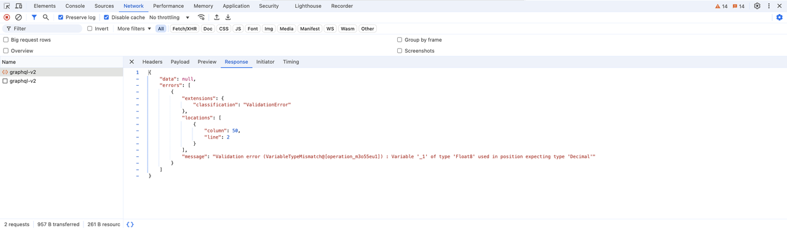
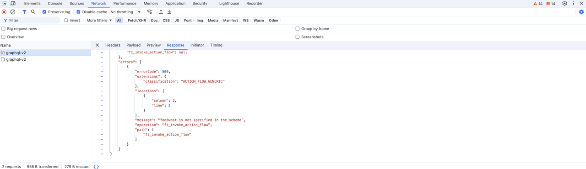

# How to Debug in Momen

Debugging is a critical aspect of application development. Learning to observe issues, pinpoint errors, and resolve problems is a fundamental skill for developers. Observation is the most crucial step, serving as the foundation for subsequent actions. This document focuses on how to observe and extract necessary information in Momen.

Momen categorizes errors into three types: **Editing Errors**, **Deployment and Publishing Errors**, and **Runtime Errors**. This guide explains how to debug each type.

## Editing Errors

### Symptoms

- The error icon in the top-right corner of the editor displays a number.

### Solution

- Click the icon to navigate to the error and modify the issue based on the error message.
- See the examples below:

**Example 1: Type Error**

- Type mismatch in a component, action, or bound data.
  - Expected type: `(Null | Nothing | Int)`
  - Actual type: `String`
- **Analysis & Solution:** Entering "$1" in a price field triggers a type error since the field requires an integer. Remove the "$" symbol to resolve the issue.

.png)

**Example 2: Missing Required Field**

- The system detects that a required field is not provided.
- Modify the field according to the error message.

.png)

---

## Deployment and Publishing Errors

### Symptoms

1. Error during preview update.
2. Backend deployment failure.

### Solution

1. Check the error message (if available).
2. Fix the issue based on the provided error details. If unclear, ask AI for assistance.
3. Report the issue to our team.

%20(1).png)

**Example: Backend Update Failure**

- Solution: Click "Report Issue" and the support team will handle it.


## UI Display Issues in Production

### Symptoms

- Components that appear aligned in the editor may be misaligned in the preview.
- Components that fit within the editor may exceed the screen width on mobile devices.

### Solution

1. **Check UI Design Configurations**

Example 1: Two components appear left-aligned in the editor, but one uses relative positioning while the other uses absolute positioning. This causes misalignment on different screen widths.

<figure><figcaption>UI alignment issue: relative vs absolute positioning</figcaption></figure>

<figure><figcaption>UI misalignment in preview</figcaption></figure>

Example 2: A text component inside a view component overflows. To fix this, change the view’s overflow setting from "visible" to "hidden" or "scroll."

<figure><figcaption>Text overflow: set overflow to hidden or scroll</figcaption></figure>

2. **Report Possible Bugs**

If no configuration errors are found, report the issue to our team.

---

## Request Errors

### Quick Error Handling

When a request error occurs, the frontend page or request log usually displays an error message.

- Use the [request-error-reference.md](request-error-reference.md "mention") to diagnose and resolve common errors.
- Alternatively, AI can help analyze errors based on logs and request data.

### Identifying Faulty Requests

Find errors in the browser using developer tools or in Momen's Log.

- **Browser:** Press `F12` or right-click > "Inspect" > Open debugging mode > Click `Network` > Find `graphql-v2` requests.

<figure><figcaption>Find request errors in browser developer tools</figcaption></figure>

- **Momen Logs:** Click "Logs" in the editor for [more detailed logs](https://docs.momen.app/release-and-growth/log_service).

<figure><figcaption>View detailed logs in Momen</figcaption></figure>

### Analyze Request & Response Data

In a request, focus on:

- **Request Body:** Contains critical information about the query structure and parameters. Find detailed information in "payload".

Example:

```json
{
    "query": "query blogArticleList_82df5ec2($where: blog_article_bool_exp!, $orderBy: [blog_article_order_by!]!) {blog_article ( where: $where order_by: $orderBy  limit: 2) { id \n title}\n\n}",
    "variables": {
        "where": {
            "title": {
                "_like": "%AI%"
            }
        },
        "orderBy": [
            {
                "created_at": "asc_nulls_last"
            }
        ]
    }
}
```

The **query** section contains the query statement, which defines the structure of the requested data. From this example, the query targets the **blog\_article** table and is limited to retrieving **two records** (`limit: 2`). The **variables** section contains the parameters for this query, corresponding to the filter conditions, sorting, and deduplication settings configured in the editor. Here, the `"where"` condition filters records where the **title contains "AI"**, and the `"orderBy"` condition sorts the results in **ascending order by "created\_at"**.

- **Response Body:** Displays results and errors. Look for `errors` in the response when debugging.

<figure><figcaption>Response body showing error details</figcaption></figure>

Example: Permission Error Response:

```json
{
   "data": null,
   "errors": [
      {
         "errorCode": 403,
         "extensions": { "classification": "TABLE_ACCESS" },
         "message": "User 1 has no permission for SELECT on order"
      }
   ]
}
```

### Error Investigation & Fixes

- By examining the request body, check whether the query statements and parameters match the configurations in the editor.
- By analyzing the response body, check for any errors and verify if the results meet expectations.
- Once enough information is gathered, make an educated guess about the possible cause of the issue and attempt to fix it.
- If the cause of the error cannot be determined, provide the collected information to AI and refer to the prompt in Step 1 for assistance.

### Case Studies

1. **Payment/Refund Error:**
   * If a refund action fails, check the logs. If it's a permission issue, verify the project’s permission settings.

<figure><figcaption>Refund action permission error</figcaption></figure>

2. **API Execution Error:**
   * Check request logs to find required fields that are missing values.

<figure><figcaption>API execution error: missing required fields</figcaption></figure>

3. **Actionflow Execution Failure:**
   * If an error occurs due to a missing field (e.g., `foodwcost` instead of `foodcost`), correct the field name.

<figure><figcaption>Actionflow error: incorrect field name</figcaption></figure>

4. **Database Constraint Violations:**
   * Ensure unique values are not duplicated when inserting data.

<figure><figcaption>Database constraint violation</figcaption></figure>

5. **Conditional Component Display Issue:**
   * If a component’s visibility depends on a data source (e.g., status should be "false" but is actually "true"), check the request to ensure data accuracy.

<figure><figcaption>Component display issue: data mismatch</figcaption></figure>

## Debugging Best Practices

1. **Clearly Define the Issue and Reproduce It**
   * Document error behavior, including triggers and error messages.
   * Attempt to reproduce the issue under the same conditions.
2. **Check Configurations by Module**
   * Check the configuration logic of each functional module one by one. For example:
     * **Form**: Ensure that field types, required rules, and data validation conditions are reasonable.
     * **Actionflow**: Verify the step sequence, conditional branches, and permission assignments.
     * **Data Relationships**: Check whether related fields between tables match.
3. **Incremental Fixes & Testing**
   * Modify one variable at a time to isolate the root cause.

---

## Technical Support & Resources

1. **Official Documentation:** Check our documentation for more details.
2. **Community Support:** Post questions on [forum.momen.app](https://forum.momen.app) or email us at [hello@momen.app](mailto:hello@momen.app).
   * Provide detailed descriptions, including:
     * Expected action
     * Steps attempted
     * Error details (screenshots/logs preferred)
   * **Example of a good question:** "I'm expecting X, but getting Y. I tried A and B. The issue appears on page C, component D. Here’s the error message: [screenshot]."
   * **Example of a bad question:** "Why is my preview broken?"
