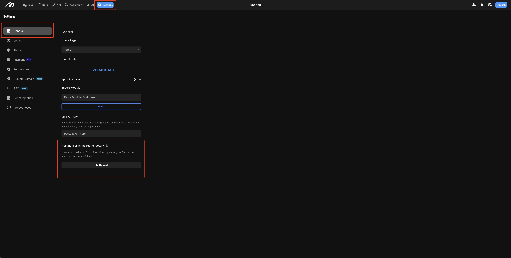

# Hosting Files in the Root Directory

Momen allows users to upload `.txt` files to the root directory for validation purposes.

## Scenario

Some services or platforms (such as Google Search Console or website hosting providers) may require you to upload a specific `.txt` file to your website’s root directory to verify domain or site ownership. This file typically contains a unique code or token.

## File Upload

Upload the required `.txt` validation file via **Project Settings > Global > Upload File to Root Directory**.

<figure><figcaption>Upload verification file in Momen</figcaption></figure>

## Notes

1. The validation file size must not exceed 1 KB.
2. Only `.txt` format is supported.
3. You can upload up to 5 validation files. Typically, these files are used for one-time verification; after verification, you may delete the uploaded file.
4. For newly created projects, upload the validation file after the project has been published.