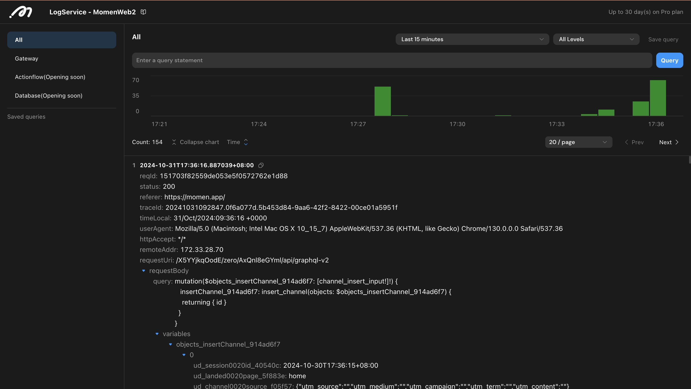

# Log Service

**Scope:** The log service aims to capture all key information within the system. Currently, gateway logs are included, with plans to expand coverage to Actionflows, database operations, deployment releases, and more in the future.

**Storage Capacity:** The log service offers varying storage capacities based on the project version, measured in days:

* Free Plan: 1 day
* Basic Plan: 7 days
* Pro Plan: 30 days


### **Getting Started**

1. Access the log service from the "Log Service" section on the project details page.

<figure><figcaption></figcaption></figure>

2. Utilize the following features for convenient log viewing:

* **Log Classification:** Quickly view logs by category.
* **Query Statement Settings:** Define time ranges and levels, and customize query syntax for precise log retrieval.
* **Bar Chart:** Visual representation of log statistics; click the chart to set time ranges.
* **Log Details:** Access detailed information; click on field values to add them to your query.

<figure><figcaption></figcaption></figure>

### **Query Syntax**

The log service offers efficient query syntax for flexible and rapid log searches.

1. **Keyword Query:** Enter a keyword to find logs containing that term.
   *   Example: To find all requests related to the "account" table:

       ```
       account
       ```
2.  **Field Query:** Specify field values for targeted queries.

    *   Example: To find logs where requestMethod is POST:

        ```
        requestMethod: POST
        ```

    For text fields, wildcards (\*) enable fuzzy searches.

    *   Example: To find logs with traceId including 20241024:

        ```
        traceId: 20241024*
        ```

    Numeric fields can support range queries.

    *   Example: To find logs with responseSize between 5000 and 10000:

        ```
        responseSize: [5000 to 10000]
        ```
3. **Combined Conditional Queries:** Use operators like 'and, or' to create complex queries.
   *   Example: To find all logs related to account with status 200:

       ```
       account and status: 200
       ```
4. **Multi-Level Queries:** For fields that exist at multiple levels, provide the complete path.
   *   Example: To find logs where the field query in requestBody contains mutation:

       ```
       requestBody.query: mutation*
       ```

### **Log Classification Overview**

#### **Gateway**&#x20;

The gateway serves as a connection point between different networks, facilitating data forwarding for seamless communication. In the Momen platform, the following requests pass through the gateway:

* Requests from frontend to backend.
* Requests received via Callback.

Logs in this category encompass most requests, including CRUD operations on databases, APIs, and AI. However, due to system limitations, only outbound requests can be viewed; their results are not accessible.

<figure><figcaption></figcaption></figure>

#### **Actionflow (Coming Soon)**&#x20;

The log service will capture detailed execution processes of Actionflows, including:

* Execution time, status, input, and output.
* Input, output, and status for each node.
* Content printed with context.log() in code blocks.

#### **Database Operations (Coming Soon)**&#x20;

This category will log all database operations (CRUD), detailing:

* Trigger methods (frontend requests, Actionflows, AI, etc.).
* Detailed operation content.

#### **Deployment Records (Coming Soon)**&#x20;

The project deployment and release process consists of various steps, and the log service will log information for each step, including:

* Type of deployment (web, backend).
* Status, start, and end times for each step.&#x20;

Monitoring this information will aid in quickly resolving issues during deployment.


**About Momen​​​​​**

[Momen](https://momen.app/?channel=blog-about) is a no-code web app builder, allows users to build fully customizable web apps, marketplaces, Social Networks, AI Apps, Enterprise SaaS, and much more. You can iterate and refine your projects in real-time, ensuring a seamless creation process. Meanwhile, Momen offers powerful API integration capabilities, allowing you to connect your projects to any service you need. With Momen, you can bring your ideas to life and build remarkable digital solutions and get your web app products to market faster than ever before.​​
