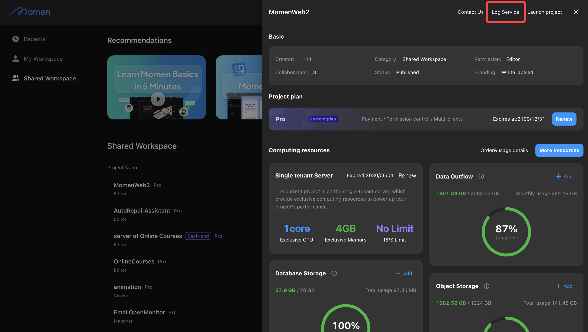
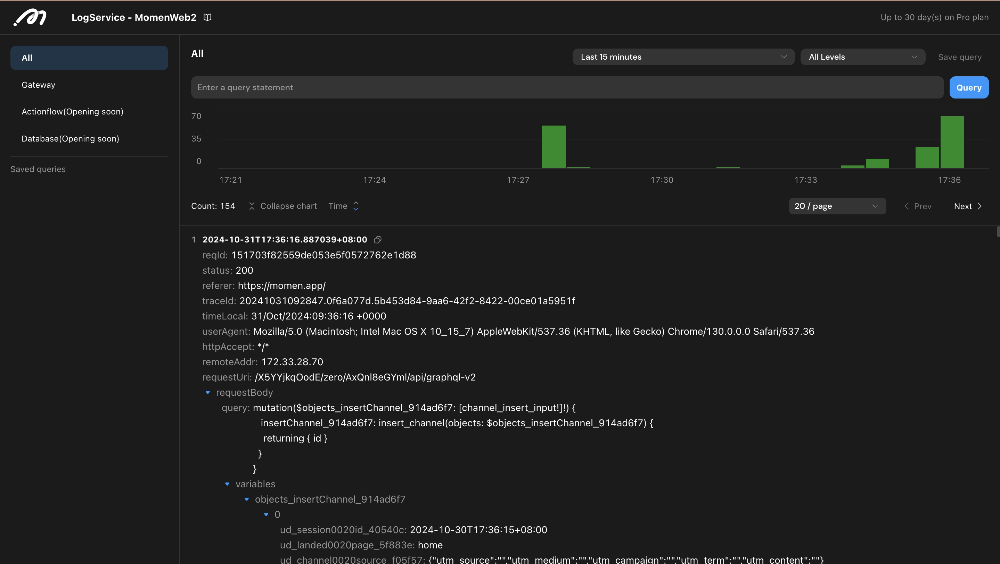
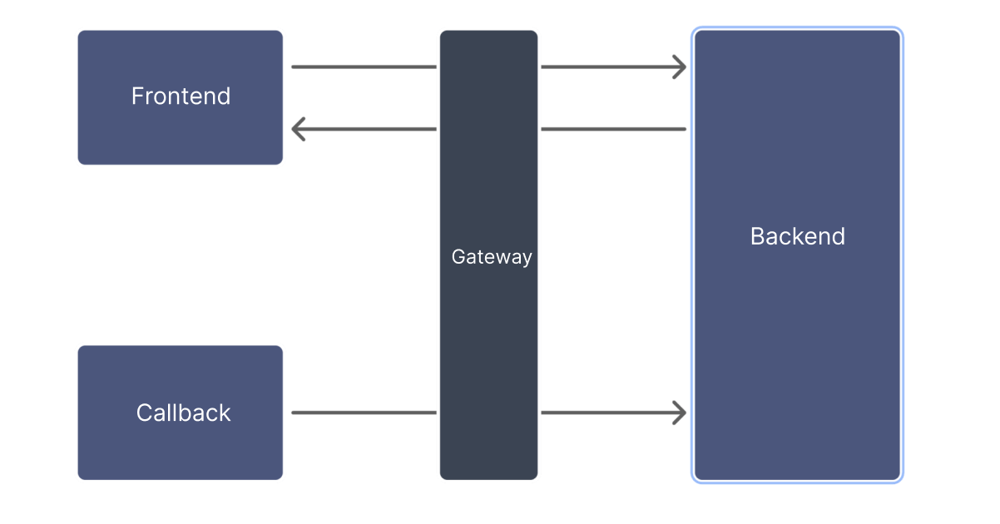

--- 
description: >-
  The log service improves system observability, allowing developers to quickly
  identify issues and enhance their development efficiency.
---

# Log Service

**Scope:** The log service captures all key information within the system. Currently, it covers actionflow, database access, AI, API, trigger, gateway, deployment, publishing, and GraphQL-related records.

**Storage Capacity:** Log retention varies by project plan (measured in days):

- Free Plan: 1 day
- Basic Plan: 7 days
- Pro Plan: 30 days

## Accessing the Log Service

1. Access the log service from the "Log Service" section on the project details page.



2. Use the following features for efficient log viewing:

- **Log Classification:** Filter logs by category.
- **Query Statement Settings:** Set time ranges, levels, and customize query syntax for precise retrieval.
- **Bar Chart:** Visualize log statistics; click the chart to set time ranges.
- **Log Details:** View detailed information; click field values to add them to your query.



## Query Syntax

The log service provides efficient query syntax for flexible and rapid log searches.

1. **Keyword Query:** Enter a keyword to find logs containing that term.  
   *Example: Find all requests related to the "account" table:*
   ```
   account
   ```
2. **Field Query:** Specify field values for targeted queries.  
   *Example: Find logs where `requestMethod` is POST:*
   ```
   requestMethod: POST
   ```
   For text fields, use wildcards (`*`) for fuzzy searches.  
   *Example: Find logs with `traceId` including 20241024:*
   ```
   traceId: 20241024*
   ```
   Numeric fields support range queries.  
   *Example: Find logs with `responseSize` between 5000 and 10000:*
   ```
   responseSize: [5000 to 10000]
   ```
3. **Combined Conditional Queries:** Use operators like `and`, `or` for complex queries.  
   *Example: Find logs related to `account` with `status` 200:*
   ```
   account and status: 200
   ```
4. **Multi-Level Queries:** For nested fields, provide the full path.  
   *Example: Find logs where `requestBody.query` contains `mutation`:*
   ```
   requestBody.query: mutation*
   ```

## Log Classification Overview

#### Actionflow

The log service records the status of each node in the actionflow:

- Each node generates two logs: one at start and one at end.
- A log is generated when `Context.log()` is called in a code block.
- Node log fields:

| Field    | Description                                 |
|----------|---------------------------------------------|
| traceId  | Used for event tracking queries             |
| nodeType | Type of the node                            |
| nodeName | Name of the node                            |
| version  | Version of the actionflow                   |
| input    | Node input, including all referenceable data|
| output   | Node execution result                       |
| startAt  | Node start time                             |
| endAt    | Node end time                               |

- Node types in logs:

| Node                | Type in Logs                |
|---------------------|----------------------------|
| Input               | FLOW_START                 |
| Query Record        | QUERY_RECORD               |
| Update Record       | UPDATE_RECORD              |
| Insert Record       | INSERT_RECORD              |
| Delete Record       | DELETE_RECORD              |
| Code Block          | CUSTOM_CODE                |
| Add Role            | ADD_ROLE_TO_ACCOUNT        |
| Remove Role         | REMOVE_ROLE_FROM_ACCOUNT   |
| Update Global Vars  | UPDATE_GLOBAL_VARIABLES    |
| Branch Start        | BRANCH_SEPARATION          |
| Branch End          | BRANCH_MERGE               |

#### Database Operations

Records all database operations (add, delete, modify), including:

1. Trigger method (frontend request, actionflow, AI, etc.)
2. Operation details

#### AI

Records the full process of AI conversations, including model type and message details.

#### API

Records API request details, including headers and body.

#### Trigger

Records trigger activation time, type, and related information.

#### Gateway

A gateway connects different networks and forwards data. In Momen, the following requests pass through the gateway:
1. Requests from the frontend to the backend.
2. Requests received via Callback.

Logs in this category include most requests (database CRUD, API, AI, etc.).  
**Note:** Only outgoing requests are visible in gateway logs; request results are not shown.



#### Deployment and Release

Records details of each backend release, pre-release, and deployment.

#### GraphQL

All backend requests use GraphQL. For more information, see [GraphQL | A query language for your API](https://graphql.org/).
