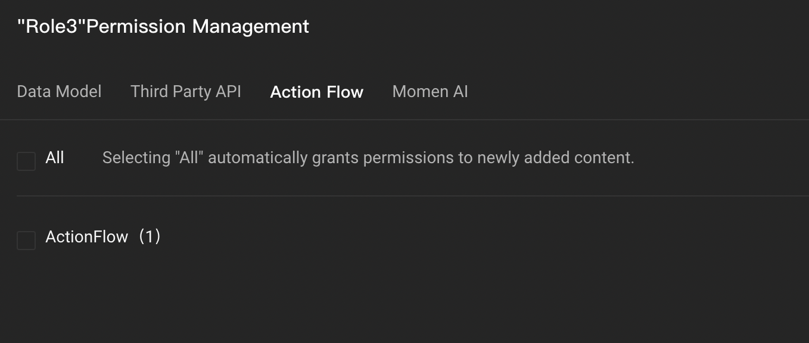
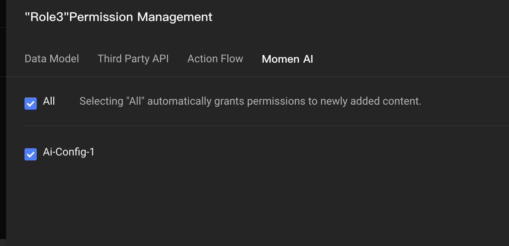
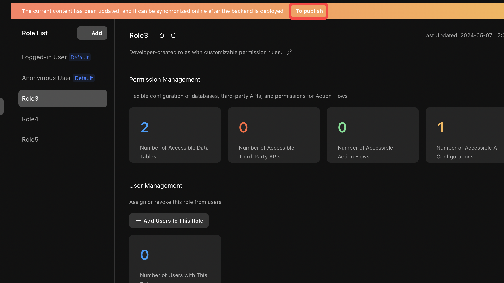
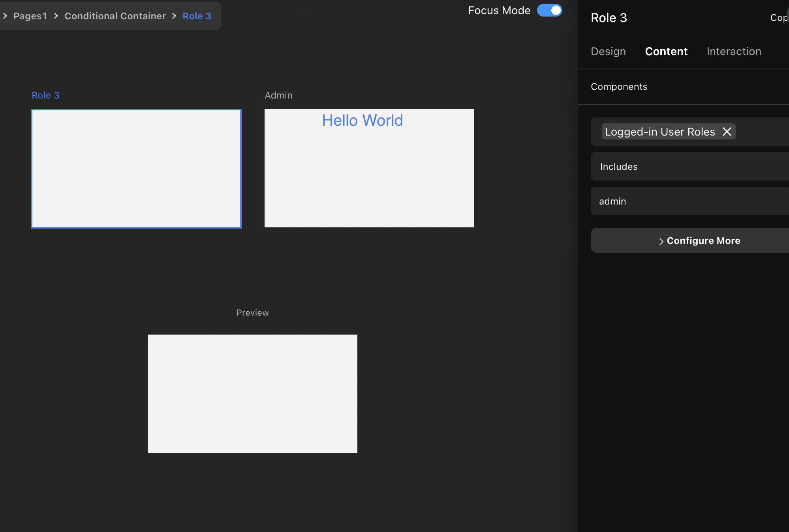

# Permission Management

### **What is RBAC Permission Management**

RBAC: Role-Based Access Control.

The basic idea: the various permissions for system operations are not directly granted to specific users, but to establish a set of roles between the set of users and the set of permissions. Each role corresponds to a set of corresponding permissions. Once a user is assigned an appropriate role, the user has all the permissions for this role.

.png>)

The benefits of this approach are to enhance the scalability of system management. For bulk changes in user access, it is only necessary to modify the permissions associated with the roles of that batch of users without the need to change the permissions for each user in the batch individually.

This model involves three key terms: users, roles, and access.

* User: a person who uses the system, a user can have multiple roles at the same time, e.g., section head, sales, HR.
* Role: a collection of authorizations, a role can have multiple authorizations. For example, the person in charge of a section can view and modify product information and perform refund operations.
* Permission: Data authority or business authority, for example, modifying product table field information, invoking refund action flow.

#### **Why Role-Based Permission Management is Needed**

In general, in the enterprise backend management system, in addition to the administrator, different accounts usually need to set different system permissions according to the position and responsibility—for example, department head, sales, and HR.

Momen can be triggered by the action of the front-end page or component to operate the database directly, but some of the fields should only be allowed to system calculations or administrator settings, such as the number of articles read, the number of favorites and whether or not to add the top of the fine, these fields should not allow ordinary users to modify the front-end directly, at this time, you also need to pass the authority control to ensure the security and stability of the system.

### **Important Tips**

* The access control system can accurately control the access rights of each user to each data model, API, and action flow. Once the permission configuration is modified and updated, it may directly affect the online users and projects that are already online. Please read the following instructions carefully.

Permission differences among different plans:

\[Free]: Only allows you to modify the permission of 2 default roles

\[Basic]: Allows you to add 1 new custom role

\[Pro]: Allows you to add 10 new custom roles

\[Enterprise]: Unlimited

**Permission Configuration Instructions**

**Step 1: Enable the permissions function**

>Note:
  Once permissions are turned on, they cannot be turned off and should be used with caution for projects already online!
  Do not easily modify the permission configuration of \[logged-in users] without adding new roles, which may have a direct impact on online users.

1. In the upper left corner of the Settings-Permission Management, click Enable Permission System.
2. Two default roles (not removable) will be created automatically after the permission is enabled, they will be granted/removed to users automatically and cannot be managed manually, they are special roles.

Logged-in Users:     
Users who have successfully executed User Events -> User Login -> XXX Login on Momen will be automatically assigned this role. The permissions of this role can be customized, and the current user data in Momen can only be retrieved after the login has been completed.

Anonymous User:      
Visitors who enter the project directly without logging in will be automatically assigned this role. The permissions for this role can be customized.

.png>)

#### **Step 2: Configure the Permissions of Each Role**

1. New Role

Click the \[Add] button to add a new role. You can change the name of the role before updating the permission configuration, and you can only copy and delete the role after updating the permission configuration.

.png>)

2. Configuring Role Permissions/Adding Role Users

Click the tab under " Permission Management" to set the operation privileges of the data table, API, and action flow, and click "Add Users to This Role" to set which users have the privileges of the role.

Click the button under "User Management" to view the users under this role and add/delete users for this role.

.png>)

3. Configure Data Model Permissions

Operation permissions: there are four operations: select, create, update and delete. Only by checking the corresponding operation, the role can operate on the corresponding data table.

For example, an ordinary user can only view the data of the active table, that is, he can only perform query operations, but he cannot add, modify or delete the data of the active table.

.png>)

3. Field permissions: After adding operation permissions, you can further configure the role's permissions for a column (field) in this data table.

For example, the personal information table has a username, ID, and other information; general users can only query the personal information table name field, and the administrator can view the filed data of ID.

.png>)

4. Advanced Filtering: When you open the configuration privileges of an operation, you can further configure advanced filtering for this operation, i.e., configure further judgment conditions under this operation for this role, so that the operation is allowed to be performed only if the conditions are met.

* For example, a user can only modify the data in his/her personal information table.

|  |  |
| ----------------------------------------------------------------------- | ----------------------------------------------------------------------- |

Data sources that can be selected with advanced filtering

* Logged-in users: Fields in the default account table.
* Current Row Data: Fields in this data table.
* Constant data: current time, current date, and timestamp.

Configuring API, Action Flow and Momen AI Operation Permissions

Check the checkboxes in APIs to set which APIs the role can call.

.png>)

Check the checkboxes in Action Flow to set which action flows the role can call.

Check the checkboxes in Momen AI to set which Momen AI the role can call.

3. Cautions

The permission configuration of the data model is not effective in the Action Flow; it is only effective for the direct data model addition, deletion, modification, and checking requests, and the same for the API.

For the existing roles, the API, Action Flow, and Momen AI added in the project are closed by default and need to be opened and updated in the corresponding roles' permissions to be accessed normally.

For existing roles, when adding new data tables/columns in the project, the default status is "Publicly accessible"; that is, the permissions are open to all roles; you can turn off "Publicly accessible" when creating or modifying the permissions configuration in the permissions configuration according to the business requirements.

When a user has multiple roles: When a user has multiple roles (A, B, and C roles), the data model returns results filtered by roles that contain all of the user's request fields and then returns all of the data that meets the criteria of the row filter.

1. A: Column 1, Column 2; B: Column 2, Column 3; C: Column 1, Column 2, Column 3; D: Column 1, Column 2, Column 3, Column 4; 2. request Column 1, Column 2, Column 3, Column 4.
2. When requesting Column 1, Column 2, Column 3, only C and D are matched, and then the request is summarized and returned according to the row filter conditions of C and D respectively.

#### **Step 3: Update the configuration to enable it to take effect**

After the permission configuration is changed, the system will automatically pop up the \[Update Configuration] prompt, click Update Configuration to make the latest configuration take effect.

### **Using User Roles As Conditions in Page Configuration**

**Scenario**: In conditional containers, conditional actions, conditional data, and other places where conditions can be configured, different content is displayed, or different actions are performed according to different roles.

For example, in the conditional container, there are conditional sub-containers for "Admin" and " General User" respectively, and only people with administrator privileges can see the content in the sub-container for "Admin", so we can configure the "Administrator" sub-container with the condition of "Includes" \[Admin].

### **Cautions**

**When a role does not have enough permissions for some fields**

List class component: the component binding of the list subcontainer \[Data/List/item/ID] within the component, for the field ID, Role A has view permission, and Role B does not have view permission. If a user in authorized role A opens the page, the list returns data and displays normally; if a user in authorized role B opens the page, the list does not load a single piece of data and a Permission check failed error occurs.

Remote data on the page. Remote data on the page: Bind \[remote data/name] and \[remote data/description] to the component. For the field name, role A has view permission, role B does not have view permission, and for the field description, roles A and B both have view permission. When a user authorized in role A opens the page, the data of name and description will be displayed; when a user authorized in role B opens the page, the data of name and description will not be displayed. That is, if you don't have permission for any of the fields, all the fields in the same request will not be displayed, and the same applies if the list has more than one field.

To add/modify/delete actions, APIs, and action flows, when the user authorized by the user does not have permissions, the operation will fail when clicked, and there is no error message on the web site.

**Modifying the permissions of a logged-in user**

For projects already online, you need to add a role to replace the \[Logged In User] role first to prevent affecting some of the operations of online users. Procedure ⬇️

Replicate the privileges of the \[Logged-in User] role to the new role;

Authorize the new role for registered users (existing users);

Finally, modify the privileges of the logged-in user.

**"Invocation of xxxx is not allowed xxx" error**

**Reason**: The permission system is turned on in the background, and the new field is not given permission.

**Solution**: Go to Permission Configuration and add the corresponding operation privileges for the user's role.

**About Momen​​​​​**

[Momen](https://momen.app/?channel=blog-about) is a no-code web app builder, allows users to build fully customizable web apps, marketplaces, Social Networks, AI Apps, Enterprise SaaS, and much more. You can iterate and refine your projects in real-time, ensuring a seamless creation process. Meanwhile, Momen offers powerful API integration capabilities, allowing you to connect your projects to any service you need. With Momen, you can bring your ideas to life and build remarkable digital solutions and get your web app products to market faster than ever before.​​
