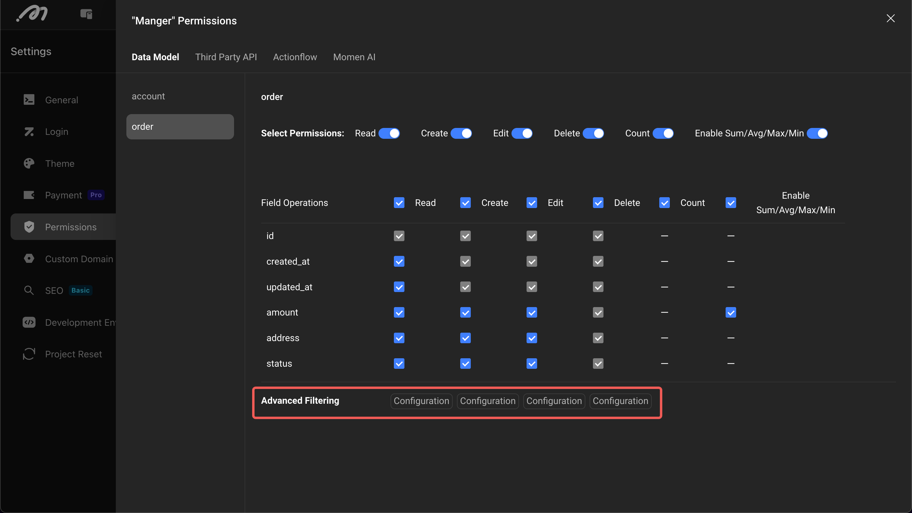

# Permission

The permission system is the foundation of commercial software. Through refined permission control, it can effectively prevent data leakage, unauthorized access, and other security risks, ensuring the integrity and confidentiality of the system and data. Momen provides a permission management system that combines Role-Based Access Control (RBAC) and Attribute-Based Access Control (ABAC). While ensuring data security, it also allows for flexible and precise permission control.

## Basic Concepts

* **Role**: A collection of a type of users; user permission control is achieved by granting users roles, where roles are bound with multiple permissions.
* **Data Permission**: Precisely controls the data content that a role can access or modify.
* **Action Permission**: Controls the actions a role can perform, such as Actionflow, APIs, payment actions, refund actions, etc.

.png>)

## Permission Configuration Guide

### 1. Enable Permissions


### 2. Role Management

The system has two built-in roles:

* **Logged-in User**: Any user who logs in (via username and password, phone number and password, etc.) is automatically granted this role.
* **Anonymous User**: Unlogged visitors are assigned this role.

In addition to the system's built-in roles, developers can create their own roles. The number of roles that can be created varies with different Project versions:

* Free Plan: 0 roles
* Basic Plan: 1 role
* Pro Plan: 10 roles

Click "Add" to create a role with a default name. **Once the backend update activates the role, the name will be unchangeable.**


When a user has multiple roles, their permissions are the union of all role permissions (for example, if a user has two roles, one role has payment permission, and the other does not, the user ultimately has payment permission).

If you need to retrieve a user's roles on the front-end page, you can find the "Role List" in the "Current User Data". It's a list of role names: `['Logged-in user', 'vip user']`.

### 3. Set Up Permissions

#### Data Permission

1. **Operation Permission**: Manage permissions for adding, deleting, modifying, and querying data.


2. **Field Permission**: Further configure the operation permissions for a specific column in the data table.


3. **Advanced Filtering**: Configure attribute-based and refined operation permissions through row filtering (e.g., users can only modify their own data).




#### Action Permission

Control the permissions for user actions, including API, Actionflow, AI, and Payment. Advanced filters provide detailed control (e.g., time-based access) for all actions except payment.


### 4. Assign Roles to Users

After configuring the roles, you can assign them to a user. There are two ways to do this:

1. **Manually Manage in the Permission Management System**  
   Click the button under "User Management" to view which users are under this role and add/remove users for this role.

   

2. **Automatically Manage in Actionflow**  
   Use the permission node in Actionflow to grant and remove roles for certain users, achieving some automated scenarios. For example, grant a VIP role after a user successfully purchases a product.

   

### 5. Make Permissions Effective

After changing the permission configuration, you need to update the backend for it to take effect. Automated authorization Actionflow also needs to be saved and deployed before it takes effect.

Once the permissions are effective, if a user lacks permission to access a resource, an error will occur. The error message appears on the page, such as: `User 1 has no permission for SELECT on order`. It is also present in the request:

```json
{
    "data": null,
    "errors": [
        {
            "errorCode": 403,
            "extensions": {
                "classification": "TABLE_ACCESS"
            },
            "locations": [
                {
                    "column": 3,
                    "line": 2
                }
            ],
            "message": "User 1 has no permission for SELECT on order",
            "operation": "order",
            "path": [
                "order"
            ]
        }
    ]
}
```

In this case, "User 1" refers to the user with ID `1000000000000001`, and "has no permission for SELECT on order" means the user does not have permission to query the "order" table.


