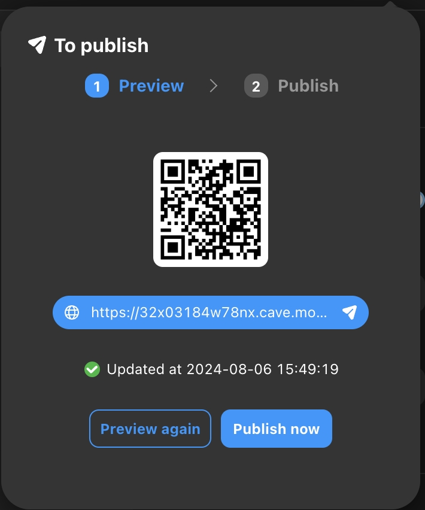
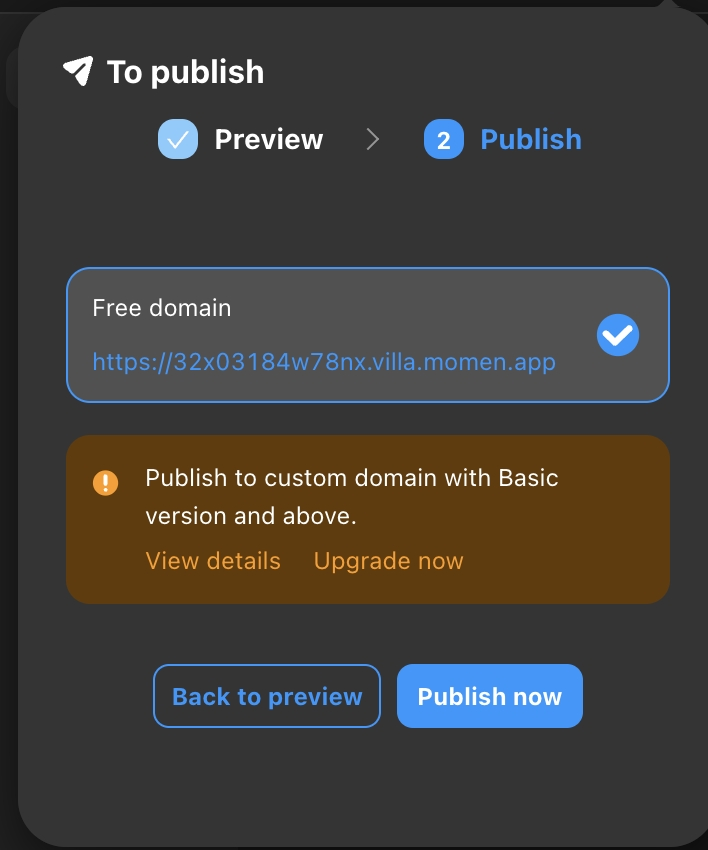
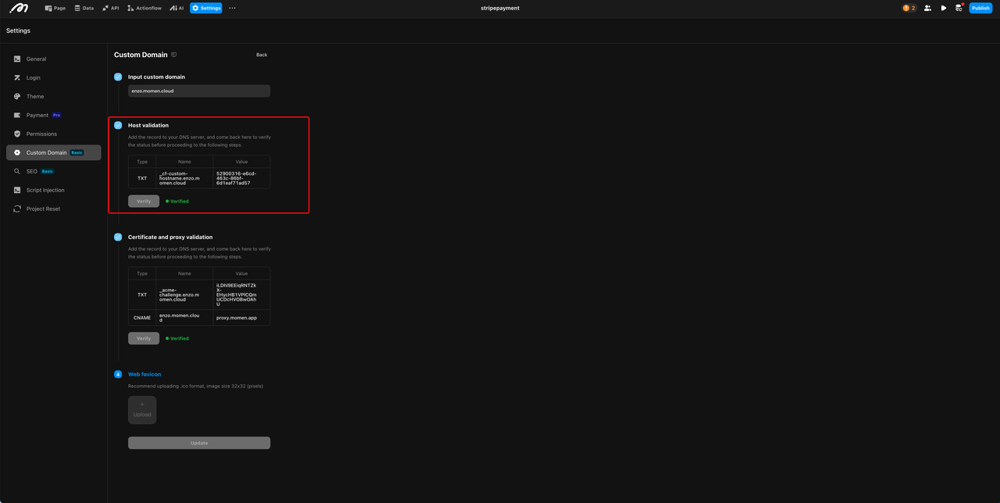
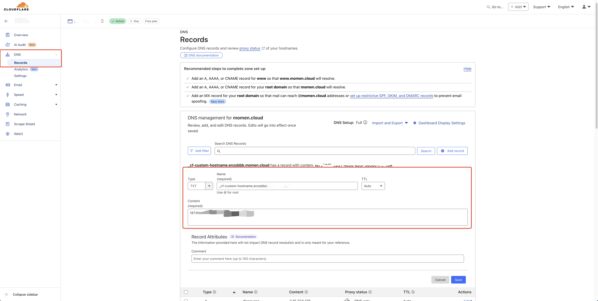
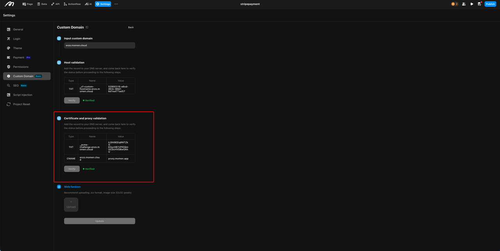
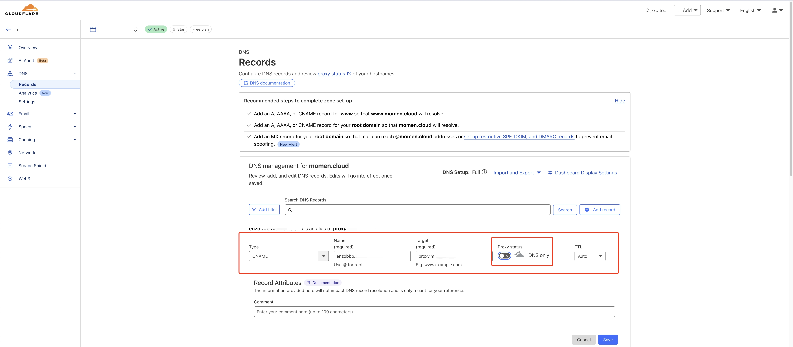
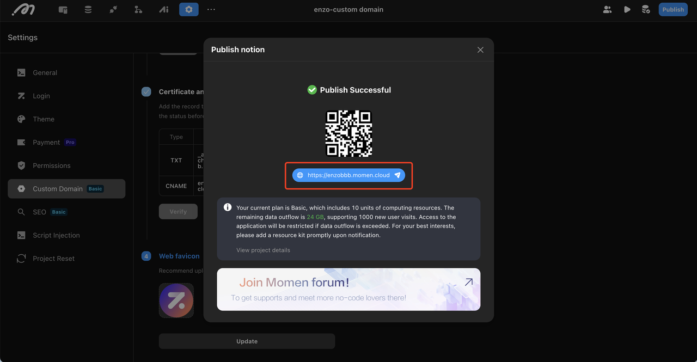

# Publish Application

Once the web application is built, you can click the **[Publish]** button at the top right corner of the Editor to deploy and publish your application with one click.

## Preview

For web applications, you need to use **[Preview]** to generate the latest version of the web application. A QR Code and a test version web link will be generated in the publish interface. You can scan the QR Code with your mobile phone or click the link to experience and debug your application in a real web environment.

## Publish

Once debugging is complete, you can click the **[Go to Publish]** button to directly publish your web page online. At this point, a new official QR Code and an online version web link will be generated.

## Publish with Custom Domain

Momen supports publishing with a custom domain for Basic Plan and above Projects.

### Value

1. **Enhancing Brand Identity**: Binding a custom domain helps businesses present a more professional image. It makes the website more memorable and trustworthy, especially when the domain reflects the brand identity.  
2. **SEO Benefits**: Using a custom domain can improve search engine trust, which in turn helps boost the website's search ranking.

### When to Use

1. **Corporate Website**: Ideal for businesses that quickly build their official website using no-code tools. It enhances brand credibility and improves SEO performance.  
2. **User Portal**: Suitable for companies integrating custom domains with their existing systems, providing users with a unified and branded portal.

### How to Use

1. **Input Your Domain**  
   Input the domain that you own. Please make sure that the domain has not been used in other applications.

2. **Domain Verification**  
   After inputting your domain, Momen will automatically generate records based on your domain information. You will need to add these records to your DNS provider. For instance, if you are using Cloudflare as your DNS provider, follow these steps:
   - Add a TXT record as instructed by the platform.
   - Once the TXT record is added, return to the custom domain page on the platform and initiate the domain check status process. If the verification is successful, proceed to the next step.

     
   

3. **Certificate and Proxy Verification**  
   In this step, you need to configure TXT and CNAME records to validate the certificate and point your custom domain to Momen's proxy server. For instance, if you are using Cloudflare, follow these steps:
   - Add TXT and CNAME records as instructed. **For some DNS providers such as Cloudflare, when adding the CNAME record, it is mandatory to turn off proxy to use DNS only in order to successfully access your domain.**
   - Return to the settings page and initiate the certificate and proxy verification process. Upon successful verification, proceed to the final step.

     
   

4. **Web Favicon**  
   You can upload a custom icon (favicon) to your website. Once uploaded, save and publish the project again for the custom domain to take effect.

   

#### Notes

1. **Default Custom Domain**: When multiple custom domains exist, you can set one domain as the default. All other domains will automatically redirect to the default domain when accessed.  
2. **Editing a Custom Domain**: If a custom domain configuration is not saved, the platform will retain it for 24 hours. After 24 hours, unsaved configurations will be cleared. Once a domain is saved, only the website icon can be modified later.  
3. **Deleting a Custom Domain**: If all custom domains are deleted, the app will revert to being published via the Momen domain.  
4. **Adding Records**: For some DNS providers such as Cloudflare, when adding the CNAME record, it is mandatory to turn off proxy to use DNS only in order to successfully access your domain.  
5. **Reconfigure Custom Domain**: Projects that have been configured with a custom domain before January 17, 2025, must delete it and reconfigure it again. After that, the project must be published for the custom domain to take effect.
