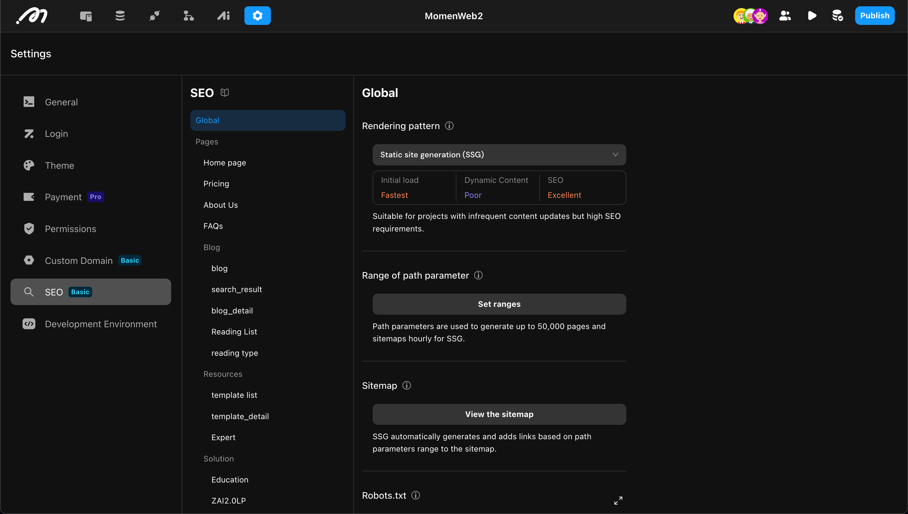

# SEO

SEO (Search Engine Optimization) is the process of optimizing your website’s structure and content to improve keyword rankings in search engines, attract more users, and increase data outflow.

SEO is an ongoing process. Momen provides a comprehensive set of configuration tools, including:

- Rendering Pattern
- Sitemap
- robots.txt
- Custom header/body
- H tags
- ...

> **Note:** Before using SEO features, ensure you have a basic understanding of SEO. Refer to online resources for more information.

## Configuration Guide

Open **Settings** and go to **SEO**. All configurations here take effect only after the **Project is Published**.

### Global Settings

These settings affect all pages in the project.

#### 1. Rendering Pattern

Rendering patterns determine when and how pages are rendered, directly impacting performance and SEO. Momen supports:

- **Client-Side Rendering (CSR):** Pages are rendered in the browser. Slower initial load and poor SEO.
- **Server-Side Rendering (SSR):** Pages are rendered on the server and sent to the browser. Faster initial load and better SEO.
- **Static Site Generation (SSG):** Pages are pre-rendered and saved on the server at publication. Fastest load and best SEO.

|        | CSR | SSR | SSG |
|--------|-----|-----|-----|
| When rendered | Browser | Server | At publication, saved on server |
| Initial load speed | Slow | Fast | Very fast |
| Content dynamism | High | High | Low |
| SEO performance | Poor | Strong | Strong |
| Suitable scenarios | Internal tools, low SEO | E-commerce, news, high SEO | Blogs, docs, landing pages, high SEO |

You can check the rendering method in the HTML `<head>`.

For more details, refer to online resources.

#### 2. Range of Path Parameters

Path parameters determine webpage addresses (see [Parameter](https://docs.momen.app/data/parameter)) and affect:

- **Sitemap:** Links are generated using path parameters.
- **Page Generation:** In SSG, pages are pre-generated based on these parameters.

Sources:

- **Static Data:** Manually entered values.
- **Database:** Dynamically fetched from the database.

Both are used together for sitemap and page generation.

#### 3. Sitemap

A sitemap helps search engines understand your site structure.

- **Real-time update:** URLs are added after user visits.
  - *Advantage:* Dynamic.
  - *Disadvantage:* May miss unvisited pages.
- **Pre-generation:** Fixed sitemap generated at publication.
  - *Advantage:* Complete if parameters are set correctly.
  - *Disadvantage:* Requires re-publication after data changes.

#### 4. robots.txt

The `robots.txt` file controls which pages search engines can crawl.

#### 5. Custom header/body

Add extra tags (`<meta />`, `<canonical />`, etc.) to the HTML header/body for SEO or code injection (e.g., analytics).

### Page Settings

These settings apply to individual pages.

#### 1. SEO TDK

Set the Title, Description, and Keywords for a page.

#### 2. Social Media Content

Configure how your page appears when shared on social media. Momen supports:

- **Open Graph:** For most platforms.
- **X Cards:** For the X platform.

Both can be enabled.

#### 3. H tags

H tags define page structure and hierarchy for search engines.

#### 4. Image ALT Attributes

The `alt` attribute helps search engines understand images.

### Publishing

All SEO configurations take effect only after the **Project is Published**.

## Feature Availability

SEO features depend on the rendering mode supported by your plan:

| Plan                   | Supported Rendering Patterns |
|------------------------|-----------------------------|
| Free Version           | CSR                         |
| Basic Plan             | CSR, SSG                    |
| Pro Plan               | CSR, SSG                    |
| Single Tenant Server   | CSR, SSR, SSG               |

> In CSR mode, page-level configurations (TDK, social media, etc.) are not available.