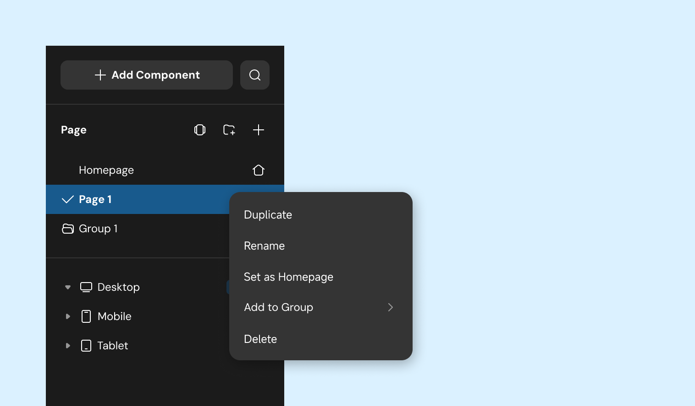
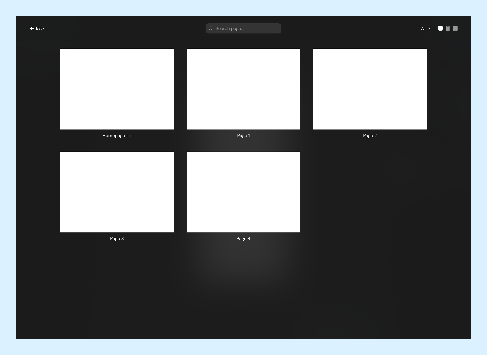
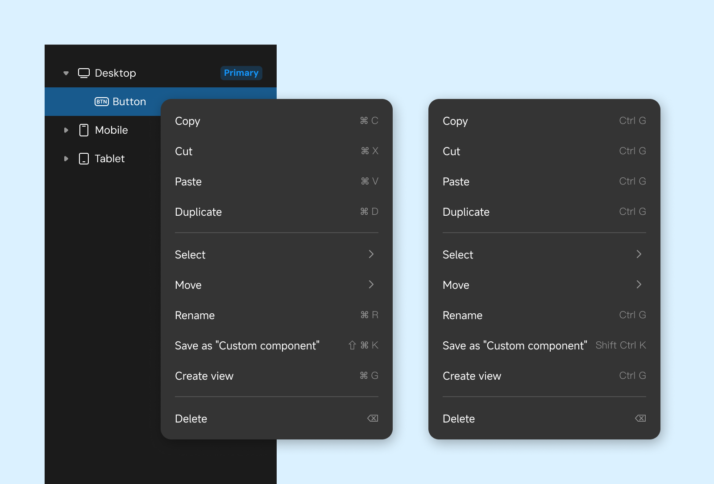

# Managing Components & Pages

The left sidebar serves as the primary panel for adding and managing components and pages. Below is a detailed explanation of its contents and functionality.

## Adding Components

Components are the foundational elements of a page. Click the "Add Component" button in the left sidebar to open the component list. You can also quickly access this list using the shortcut key **(⌥ C丨Alt C)**.

Currently, the Editor provides three types of component resources:

1. System Components

2. Custom Components

3. Code Components

You can add components in two ways:

1. Select the target container and double-click the component to add it.

2. Drag the desired component into the target container.

    
    

  

If the component list is extensive, use the search button in the top-right corner to locate a specific component within the selected category.

    
    

Use the following shortcuts to add frequently used components to a page or container-type component:

**Text** — **T**

**Button** — **B**

**Image** — **I**

**View** — **F**

## Adding Pages

To add a new page to your project, click the icon shown in the image below.

To create a group for organizing pages, click the group icon as shown below:

    
    

   
  

After creating a group, you can directly add pages to it.

## Managing Pages and Components

### **Page Operations**

Right-click a page to open a management menu with the following options:

1. **Copy**: Copy the selected page (including its components).

2. **Rename**: Change the page name (double-clicking the name also allows renaming).

3. **Set as Home Page**: Designate this page as the default opening page for the application or website.

4. **Add to Group**: Move the selected page into an existing group.

5. **Delete**: Remove the page and its contents.

To preview all pages in the project, open the page tiled mode using (**⌘ P** 丨**Ctrl P**).

### Page Grouping

Groups do not have a selectable state but support right-click menu options, including:

1. **Rename**: Modify the group name (also achievable by double-clicking).

2. **Ungroup**: Disband the group, leaving its pages ungrouped.

3. **Delete**: Remove the group and all its pages.

### Component Management

Right-click a component to access the management menu with these options:

1. **Copy**: Copy the component (**⌘ C丨Ctrl C**).

2. **Cut**: Cut the component (**⌘ X丨Ctrl X**).

3. **Paste**: Place the copied or cut component into the target container  (**⌘ V丨Ctrl V**).

4. **Duplicate**: Create a copy of the component at the same level (**⌘ D丨Ctrl D**).

5. **Select**: Use the selected component as a reference to select other content on the same page.

6. **Move**: Change the component's hierarchical position.

7. **Rename**: Modify the component name (shortcut **⌘ R丨Ctrl R**).

8. **Save as "Custom Component"**: Save the selected component to the "Custom Component" list (**⇧ ⌘ K**丨**Shift Ctrl K**).

9. **Create View**: Wrap the selected content into a View (**⌘ G**丨**Ctrl G**).

10. **Delete**: Remove the component.

## Search Content

When working with many pages or components, use the search functionality to locate items by name or ID quickly.

> The same component might appear across multiple breakpoints.

    
    

