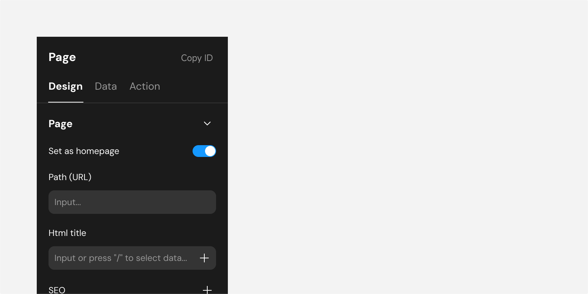
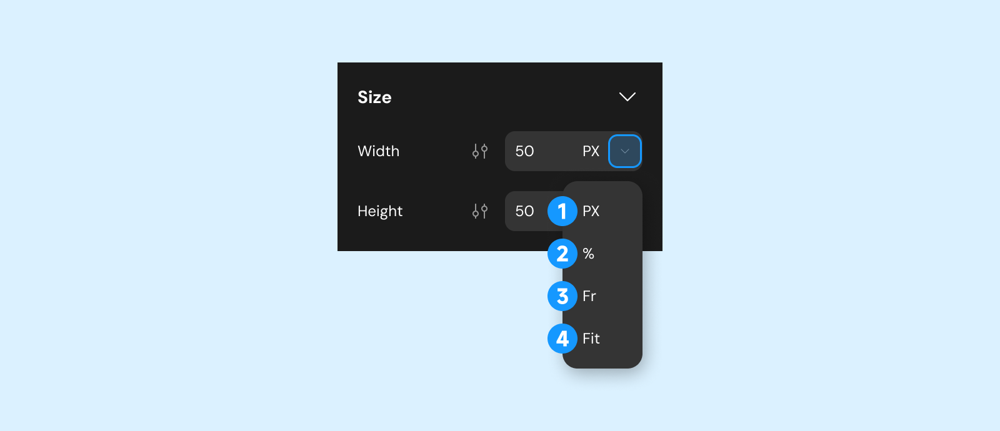
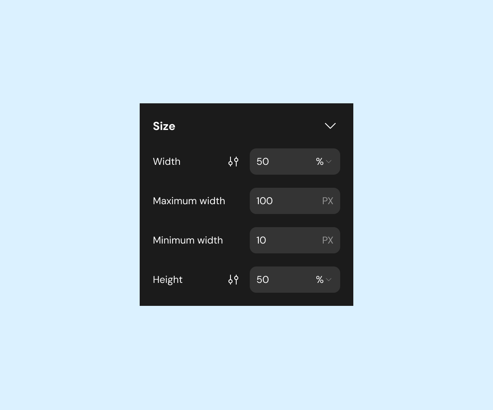
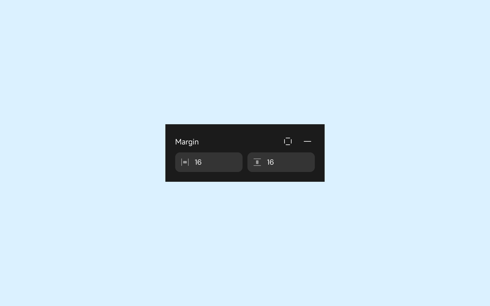
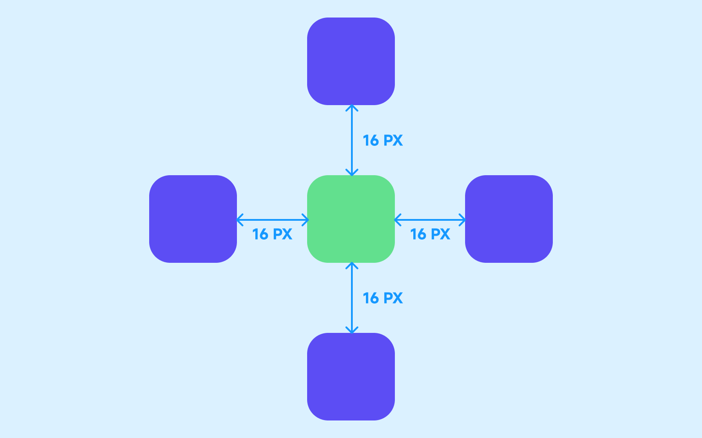
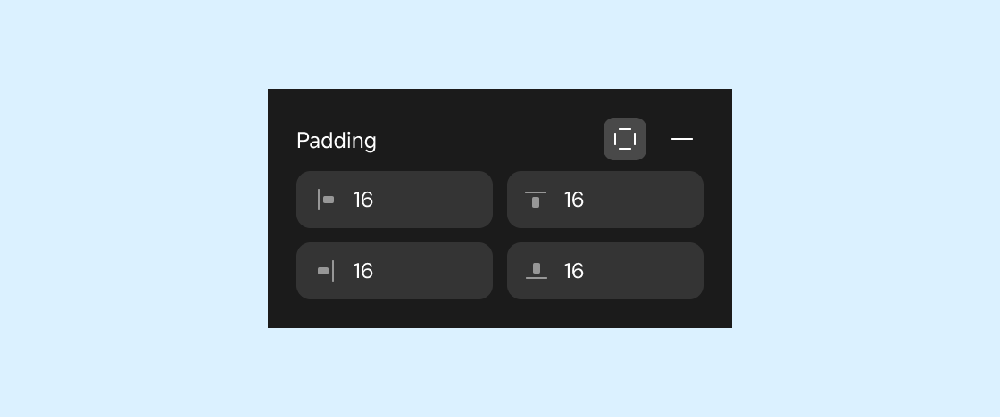
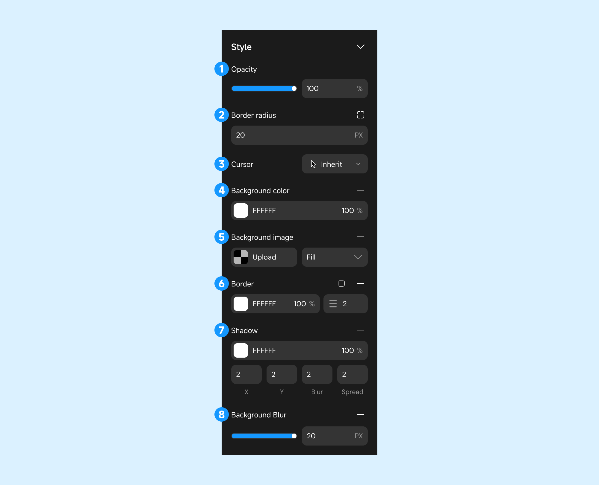

# Configure Components—Design, Data, Action

When a component or page is selected, detailed configurations can be made in the right sidebar. You can manage different aspects of the selected component or page by navigating through the "Design," "Data," and "Action" tabs.

This document focuses on the "Design" tab, while the configurations for "Data" and "Action" are discussed at the end.

## Title and ID

**Title**: The title in the right sidebar defaults to the component/page name. Hover over the title to rename it.

**Copy ID**: Each page and component has a unique ID. Use the "Copy ID" option in the right sidebar to share component information for locating and debugging purposes.

## Design

### Alignment and Distribution

> Components with a "relative" layout mode adhere to their parent’s layout rules and are not affected during alignment and distribution.

Alignment options help arrange components on a page. Effects vary depending on whether a single component or multiple components are selected.

**Select Single**: Align the component relative to its parent container or page.

**Select Multiple**: Align components relative to each other.

1. Align Left

2. Align Center Horizontally

3. Align Right

4. Align Top

5. Align Center Vertically

6. Align Bottom

7. Distribute Horizontally (requires multiple selections): Outer components remain fixed while inner components are evenly distributed horizontally.

8. Distribute Vertically (requires multiple selections): Top and bottom components remain fixed while inner components are evenly distributed vertically.

### Custom Configuration

The first section under "Design" provides configurations unique to the selected component, labeled accordingly. For instance, selecting a List component displays settings such as headers or carousels that are specific to Lists.

Most configuration items in the image apply only to the List component, such as headers, carousels, etc. These configurations do not have general formatting properties and are thus considered "Custom Configuration."

### Position

This section configures the component's position on the page. For detailed guidance, refer to [Layout and position](../design/layout_and_position.md).

### Size

**Width & Height**

Choose from different calculation methods to define the component's size:

1. **PX**: Fixed size.

2. **%**: Percentage of the parent container’s size.

3. **Fraction (fr)**: Proportional allocation of remaining space in CSS Grid layouts.

   > Depends on the parent's layout direction (e.g., vertical for height, horizontal for width).

   
4. **Fit**: Automatically adjusts size based on internal content.

For percentage or fraction-based dimensions, you can specify minimum and maximum constraints:

    
    
    

**Margin & Padding**

Margin: Adjusts the space between a component and its surroundings.

    
    

Padding: Adjusts the space between the component's content and its edges.

    
    

By default, margins can be configured simultaneously for all sides. To configure individual sides, click the style icon.

    
    

### Layout

> Applies only to container-type components and pages.

Configures the arrangement of components inside a container or page. For more details, see [Layout and Position](../design/layout_and_position.md).

### Style

Configures component styles and visual effects.

1. **Opacity**: Adjust transparency.

2. **Border Radius**: Set corner curvature.

3. **Cursor Style: Change pointer style on hover.

4. **Background Color**: Set background color.

5. **Background Image**: Use local or remote images.

6. **Border**: Configure border color and thickness.

7. **Shadow**: Add shadow effects.

   1. X (Horizontal Offset): The position of the shadow in the horizontal direction.

   2. Y (Vertical Offset): The position of the shadow in the vertical direction.

   3. Blur: Control the degree of shadow blur.

   4. Spread: Control the size of the shadow (expand or contract).

8. **Background Blur**: Apply blur effects to the background.

### Animation

Add animations triggered by specific user interactions.

There are currently four trigger methods for animations.

1. **On Hover**: Triggered when hovered over.

2. **On Click**: Triggered when clicked.

3. **On Scroll to Component**: Triggered when scrolled into view.

4. **On Scroll**: Dynamically triggered based on scroll position.

### Text

If the selected component contains text, configure text properties in this section.

## Data
Configure the data source for components and pages. Supported for pages, Lists, Select Views, tables, etc.

For details, see [Data](../data/readme.md).

## Action
Define actions triggered by user interactions or events:

Components: Configure actions like clicks, refreshes, or List scroll events.

Pages: Configure actions like load, unload, or scheduled events.

For details, see [Action Configuration](../actions/readme.md).