# Editor Overview

### Introduction

Learn to edit your interface effortlessly using Momen. This tutorial covers the basic operations in Momen editor, including adding and organizing pages, components, and groups, configuring settings, managing data models and APIs, leveraging advanced features, and deploying applications.

### Editor Left Sidebar

Building an application starts with a page or component. The left sidebar offers essential features like adding pages, page groups, components, and viewing the component tree. You can quickly search for components and drag them into the page to build or modify your application interface.

#### Component and Page Search

Click the search button in the left sidebar to find components and pages quickly. You can search for components to add or find existing pages and their components for viewing and modification.

* Enter the component name when adding components.

<figure>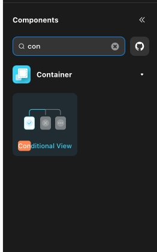<figcaption></figcaption></figure>

\- Search pages and components by name.

<figure>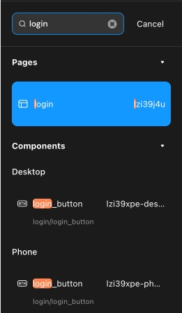<figcaption></figcaption></figure>

\- Search pages and components by page ID or component ID, usually for troubleshooting errors based on the component or page ID.

<figure>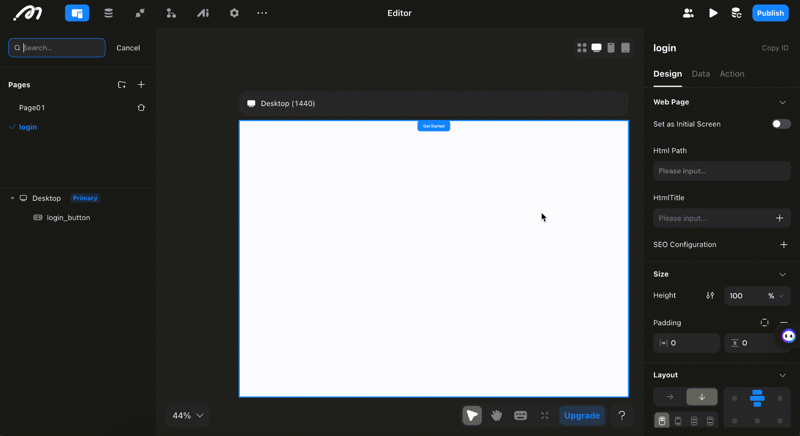<figcaption></figcaption></figure>

#### Configuration Code Components

Extend custom components by writing React code, leveraging the Momen platform's capabilities. Create dynamic forms, data-driven charts, complex animations, transitions, interactive maps, and data visualizations.

<figure>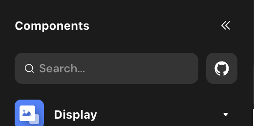<figcaption></figcaption></figure>

#### Adding Pages

Use the add page button \[+] in the left sidebar to add new pages.

<figure>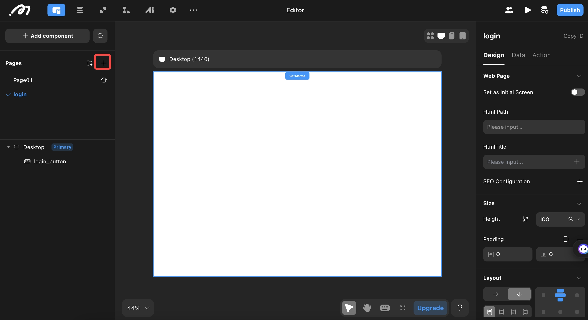<figcaption></figcaption></figure>

#### Page Groups

Create page groups for better management when you have many pages. Click \[Add Page Group] in the left sidebar.

<figure>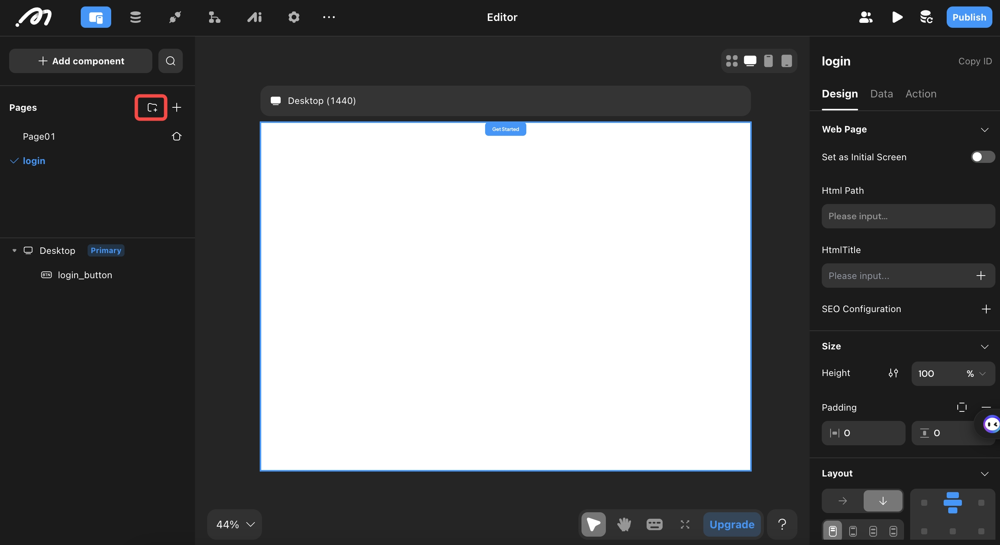<figcaption></figcaption></figure>

*   Add pages to groups: Right-click in the page list to open the settings popup, then click \[Add to Group].

    <figure>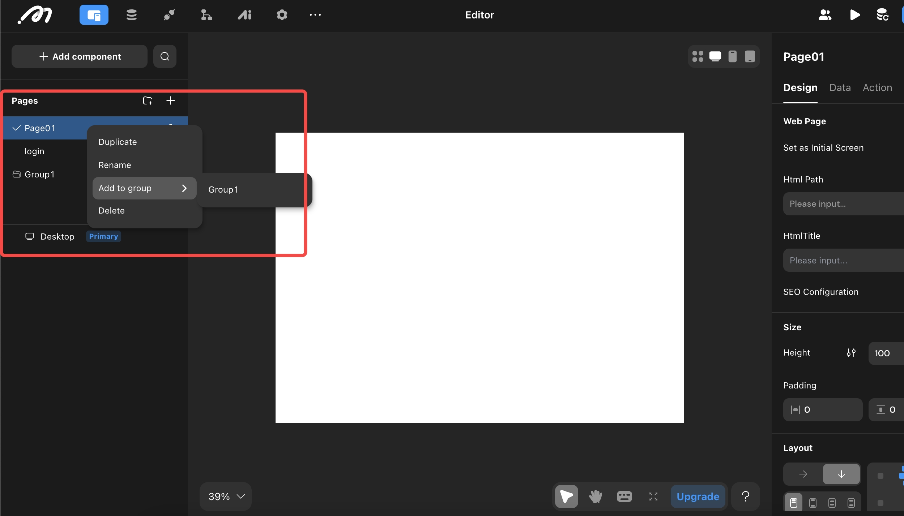<figcaption></figcaption></figure>
*   Expand/Collapse/Modify Group: Click the icon to expand or collapse pages under the group. Right-click to modify, cancel, or delete the group.

    <figure>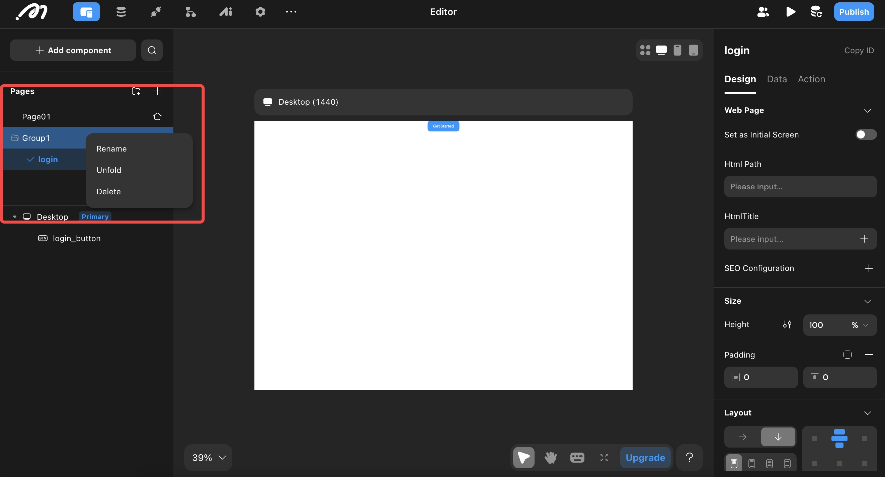<figcaption></figcaption></figure>

#### Multi-end Pages and Breakpoints

Develop for Desktop, Phone, and Tablet within the same web project. Display all ports in the top right corner of the editor, or select a specific port.

* New components added to any port will appear in all three ports, with interactions synced across ports.
* Modify the layout and style for specific ports without affecting others due to different port widths.

<figure>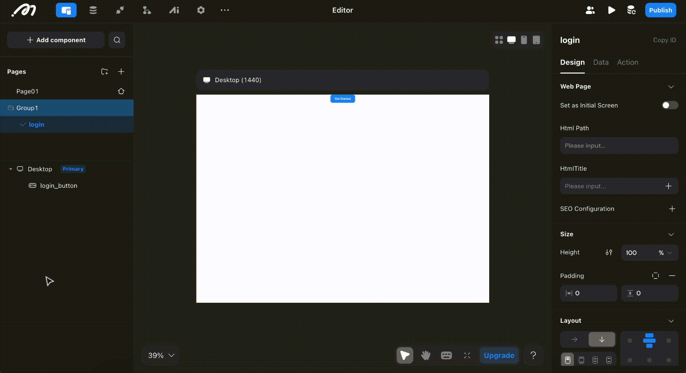<figcaption></figcaption></figure>

#### Adjust Page Order

Drag and drop pages in the left sidebar to reorder them.

<figure>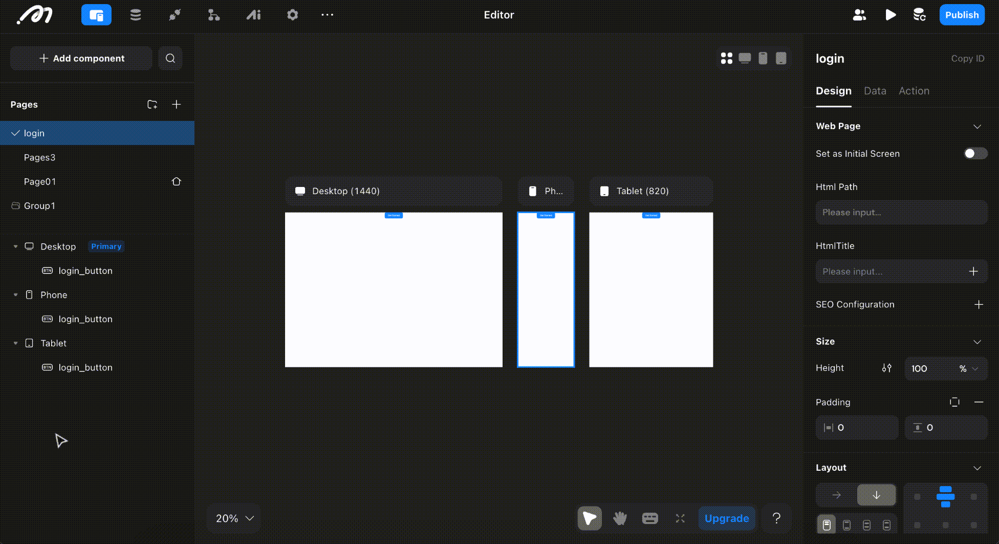<figcaption></figcaption></figure>

#### Adding Components to Pages

Select a page, click \[Add Component] in the left sidebar, switch to the component selection interface, and double-click or drag the component to add it.

<figure>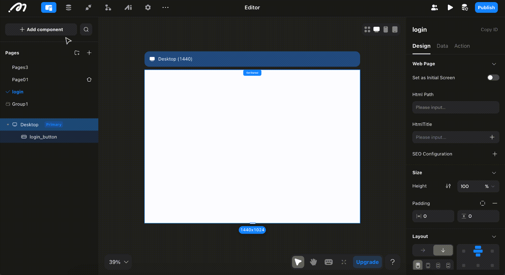<figcaption></figcaption></figure>

#### Adding Components to Container Components

Container components can hold other components, including \[View], \[List], \[Horizontal List], \[Select View], \[Tab Bar], and \[Conditional Container]. Drag container components into the page, click the child container with "Add Component Here," and drag or double-click other components to add them inside.

<figure>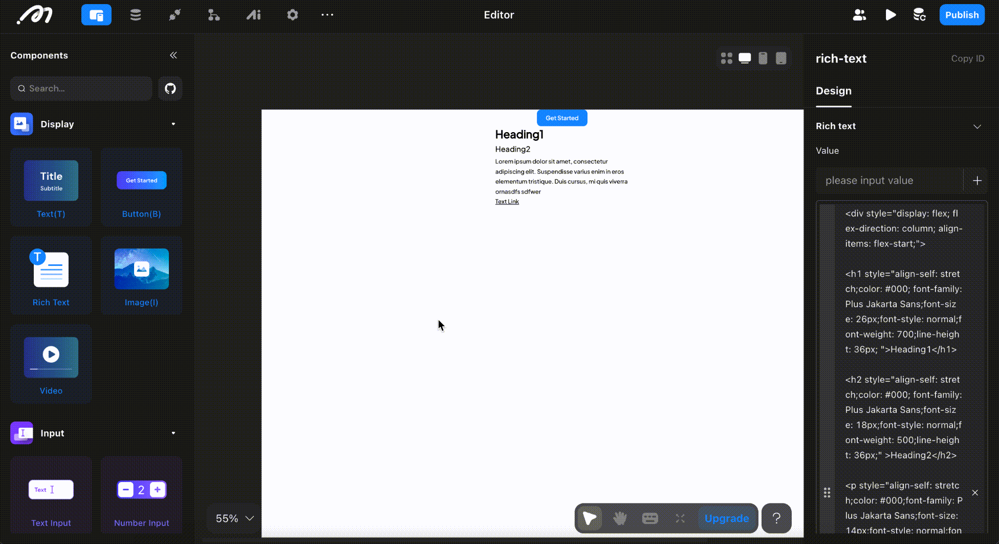<figcaption></figcaption></figure>

#### Adjusting Component Order

**Relative Positioning**

Adjusting the order in the left sidebar will sync the order of components on the page.

<figure>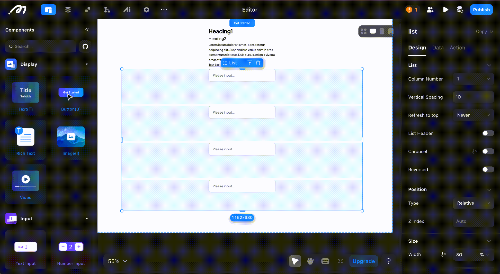<figcaption></figcaption></figure>

**Absolute & Fixed Positioning**

In absolute & fixed positioning, new components overlapping old ones will visually form an "upper and lower layer" relationship. Drag components up or down in the left sidebar to adjust this relationship. You can only adjust the hierarchy of "same level" components, not move components inside a container to the outside.

<figure>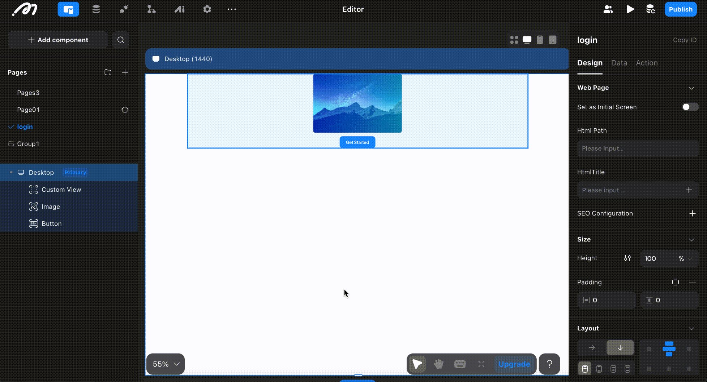<figcaption></figcaption></figure>

### Editor Right Sidebar Configuration

Select a page to display the attribute panel on the right for configuring page names, design, data, and interactive behavior. For details, see \[Configuration Guide].

#### Web Page Right Sidebar

Configure the web page's path, title, size, layout, and style.

<figure>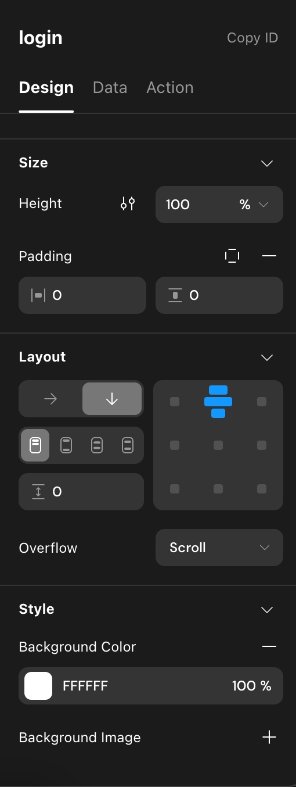<figcaption></figcaption></figure>

#### Component Right Sidebar

The right sidebar configuration varies slightly for different components. For details, see specific component right sidebar configurations in \[Configuration Guide].

### Top Toolbar

The top toolbar includes entries for advanced functions of Momen, project settings, project preview, and release operations.

#### Data Models and Database Operations

Click \[Data] in the top left corner to open the data operation interface. Select "Data Model" to add or modify the data table structure. Select "Database" to add, import, or modify data. Perform \[Backend Update] to make the data table effective after adding it. For details, see \[Database Operation].

<figure><figcaption></figcaption></figure>

#### Third-party API Configuration

Click \[Third-party API] in the top left corner to open the API configuration interface. Click \[Add] in the top right corner to add and debug third-party APIs. For details, see \[API Configuration].

<figure>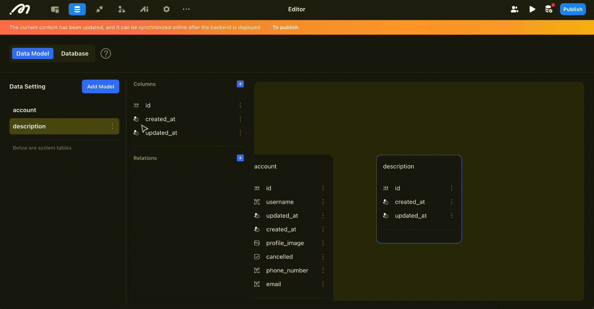<figcaption></figcaption></figure>

#### Actionflow

Click \[Actionflow] in the top left corner to open the behavior flow configuration interface. Click \[Create] in the top right corner to create a behavior flow. Configure "input parameters," call methods to get or update database data, write JS code blocks, and call third-party APIs for complex behavior logic. Save the Actionflow and click \[Backend deployment] for it to take effect. Configure "callbacks" and "timed triggers" in the trigger configuration interface. For details, see \[Actionflow].

<figure>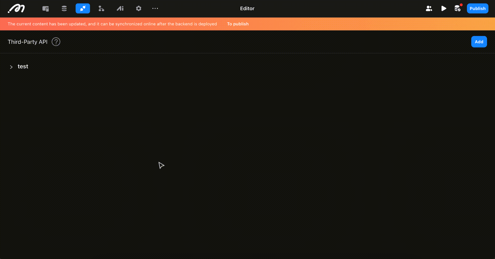<figcaption></figcaption></figure>

#### AI

Click \[Z AI] in the top left corner to create AI requests. Click \[Start Creating] to add a new AI request. For details, see \[AI Configuration].

<figure>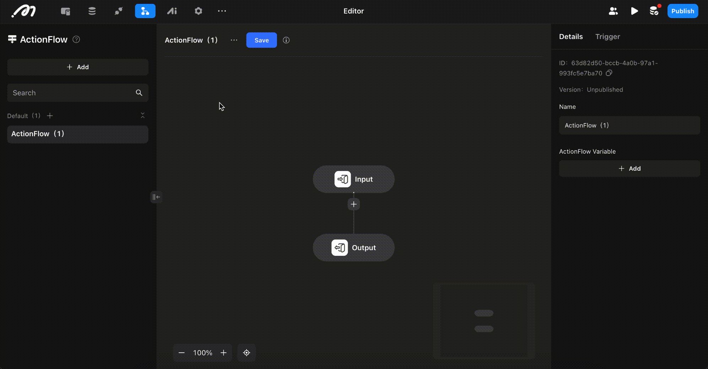<figcaption></figcaption></figure>

#### Project Settings

Click \[Settings] in the top left corner to open project settings. Configure:

* **Global Settings:** Set the homepage, background color, global data, and behavior when the application is loaded.
* **Login Settings:** Configure login methods:
  * Username and password
  * Email
  * Single sign-on (SSO)
* **Theme Color Configuration:** Configure common colors (RGB/hexadecimal).
* **Payment Settings:** Configure Stripe.
* **Permission Management**
* **Custom Domain Settings**

#### Issues Finding

The issue-finding function in the top right corner can "automatically" find configuration errors. It also triggers \[Intelligent Verification] every time you click \[Preview] to ensure project correctness. When errors occur, the \[Alert Area] at the bottom of the screen will prompt errors, and an "!" will appear next to the erroneous component. Expand it and click the fix to locate the error point and correct it.

<figure>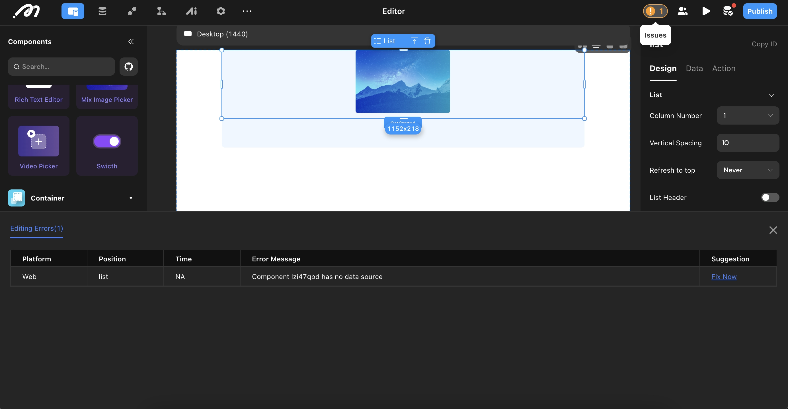<figcaption></figcaption></figure>

#### Sharing and Collaboration

**Tips:**

Only premium plans support sharing and collaboration features. Sending the URLs cannot share the project.

<figure>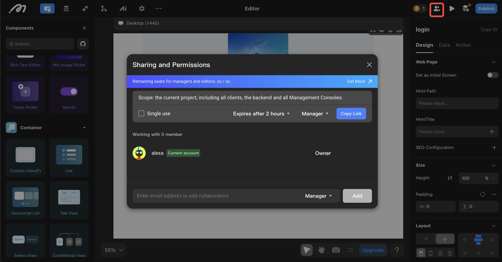<figcaption></figcaption></figure>

Hover over the \[Invite Collaborators] button in the top right to generate a sharing link and set permissions (\[Editor], \[Viewer], \[Manager]). Share the link to collaborate on your project. Added members will display below the sharing link, and you can modify or remove collaborator permissions.

#### Real-time Preview

Real-time preview generates the created application pages and interactions in real-time for operation and debugging.

<figure>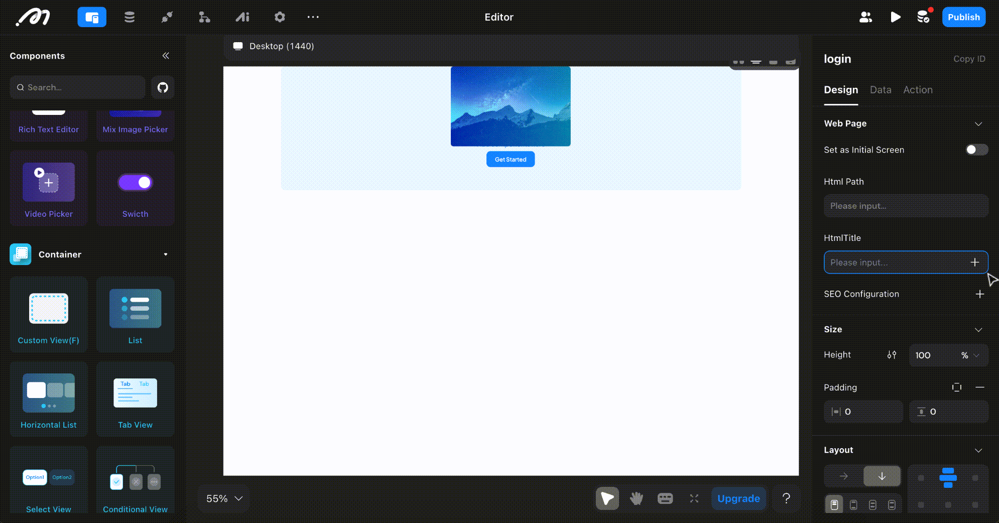<figcaption></figcaption></figure>

#### Backend Deployment

After creating or modifying data models, APIs, Actionflows, and AI, click the \[Backend Deployment] button in the top right to make changes effective. For online projects, if you only modify database data, API, behavior flow, or ZAI configuration without changing page styles or local data, click \[Backend Deployment] to update the backend. This process takes less than 5 seconds, improving development efficiency.

<figure>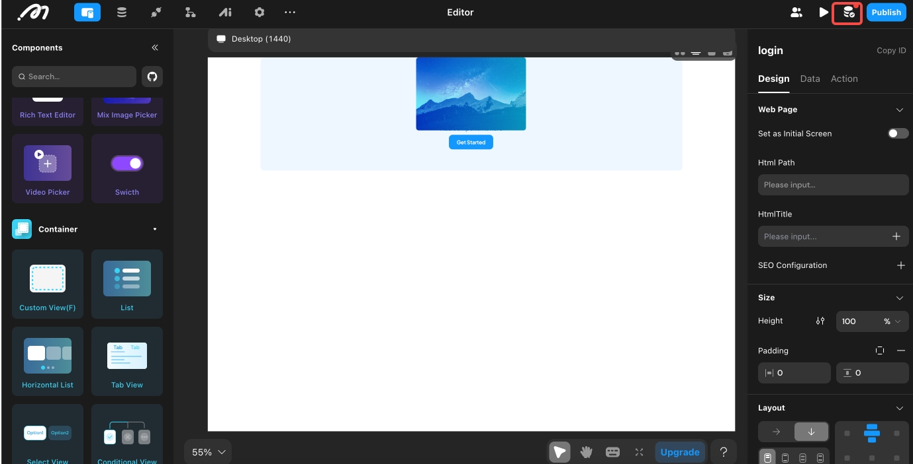<figcaption></figcaption></figure>

#### Publish

**Web Publish**

Complete the web application, click \[Publish] in the top right to deploy and release. Use \[Preview] to generate the latest web application. A QR code and web link will be generated in the release interface. Scan the code or click the link for real-time debugging. When correct, click \[Publish Now] to publish. A new official QR code and web link will be generated. To configure a custom domain name, click \[Settings].

<figure>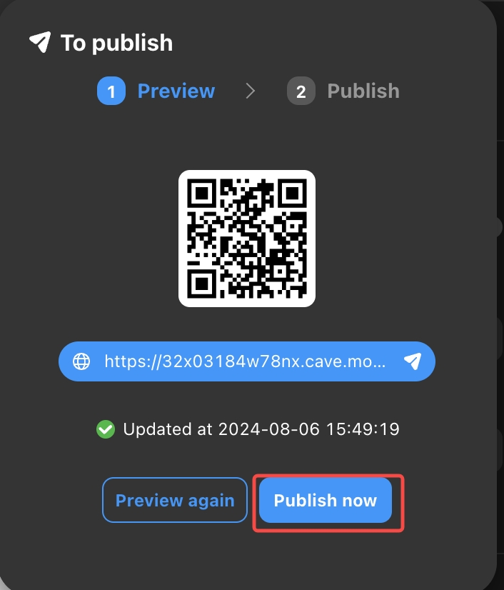<figcaption></figcaption></figure>

<figure>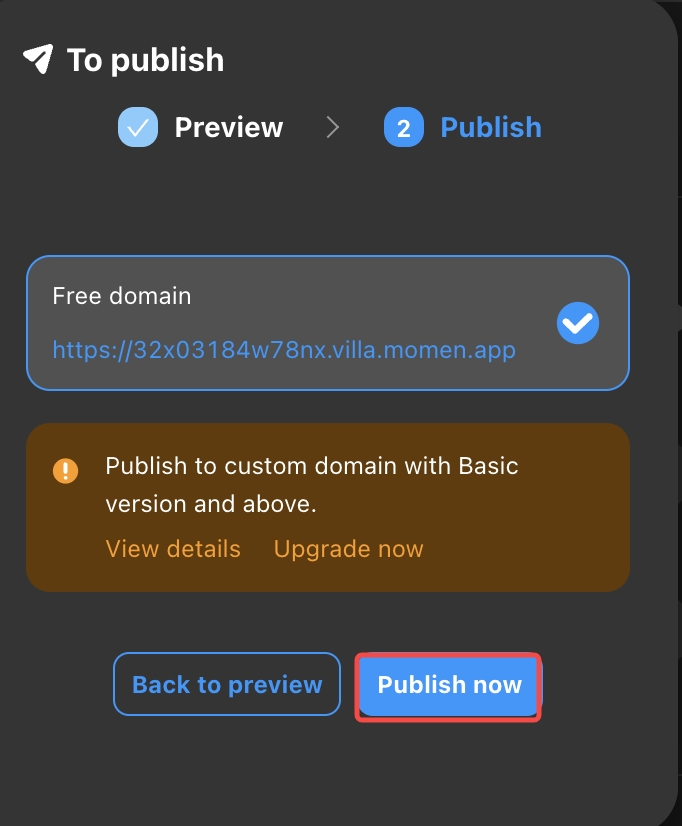<figcaption></figcaption></figure>

### Personal Center Settings

#### Project Settings

Click the logo to enter \[Personal Center], right-click to select and modify the project name.

* Modify project name
* View project details
* Share and permissions
* Clone project
* Delete project

<figure><figcaption></figcaption></figure>

#### Personal Preferences Settings

Click the logo in the top left to enter Personal Center. Hover over the avatar in the top right to select personal preferences.

* Language settings (Chinese/English)
* Dynamic data display full path
* Show simulated materials

<figure><figcaption></figcaption></figure>

### About Momen

[Momen](https://momen.app/?channel=blog-about) is a no-code web app builder, allows users to build fully customizable web apps, marketplaces, Social Networks, AI Apps, Enterprise SaaS, and much more. You can iterate and refine your projects in real-time, ensuring a seamless creation process. Meanwhile, Momen offers powerful API integration capabilities, allowing you to connect your projects to any service you need. With Momen, you can bring your ideas to life and build remarkable digital solutions and get your web app products to market faster than ever before.
