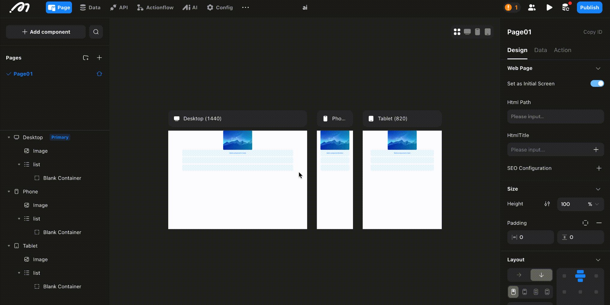
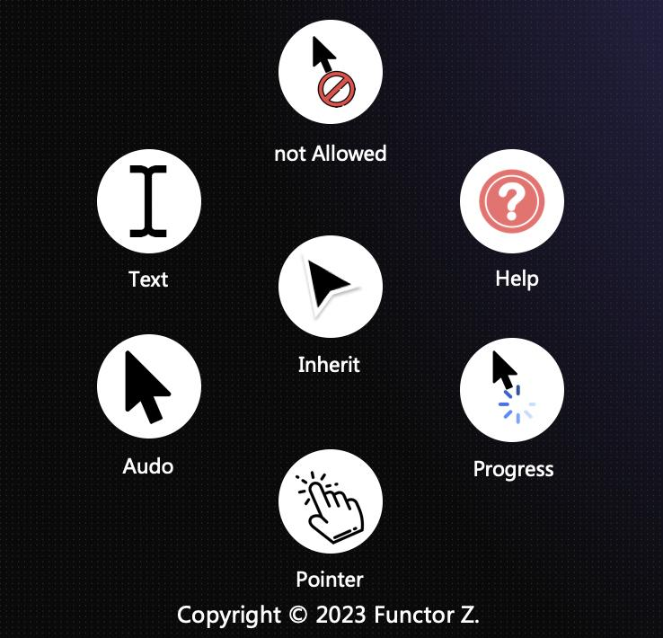

# Layout

### Introduction

In this tutorial, you'll learn how to build responsive websites using Momen, and as part of that, we also introduce webpage layout design principles. We'll cover key concepts like relative and absolute positioning, flexible layouts, and more, helping you design pages that work across different platforms.\\

### Multi-Platform Development

After creating a project on the Momen editor, you can design web pages for desktop, tablet and mobile platforms concurrently. Please adjust your designs for different page sizes.

### Separate Configuration for Desktop, Tablet and Mobile Layouts

Desktop, tablet and mobile interfaces have different page sizes, resulting in distinct layouts for each platform.

When you drag a component on the page, it'll appear on three interfaces. You can adjust the size and position on different interfaces.

<figure><figcaption></figcaption></figure>

When you drag in a component on the desktop, and then change the position or size of a component on the mobile, there will be a "Layout Breakpoint" between the mobile and desktop, at which time you can adjust the page layout according to the page size on the mobile.

For the same component, you can modify the component position, size, inner margins, outer margins, and rounded corners on different interfaces, and other properties and actions will take effect at all ends.

### Position

Type: Configure how the list component is positioned in its parent component.

* Relative: Positioning in relation to the position type of the parent component
* ABsolute: Positioned according to the set distance from the parent component
* Fixed: Positioned according to the set distance from the parent component, the component will float in a fixed position when scrolling the page

<figure><figcaption></figcaption></figure>

There are four positioning directions for the absolute and fixed positioning: top left, top right, bottom left, bottom right, and the image below shows the top left positioning method. Click on the coordinate lines in different directions (the lines next to T, L, R, B) to switch the positioning coordinate direction.

<figure><figcaption></figcaption></figure>

Z Index: This controls the stacking order of overlapping elements on a page. The component first dragged in has a lower z-index level. In absolute or fixed position, when the two components coincide, the component with a higher z-index level will appear in front of the component with a lower value. When the z-index value is defined, the component with a higher value will cover the component with a lower value.

<figure><figcaption></figcaption></figure>

### Size

You can set the width and height of the component, in the following three length units:

* px: Fixed width/height in pixel values.
* %/fraction: A percentage of the parent component or a fraction of the whole, changing with the size variations of the parent component.
* Adaptive: Adjusts the width/height according to the amount of content within the component.

Maximum/Minimum, Width/Height: When setting a component's width or height as "percentage," "fraction," or "adaptive," you can also define the maximum/minimum width/height. Ensures the child component maintains a specific value in extreme situations (e.g., large or small pages).

#### Size Setting Example

Percentage refers to the relative length compared to the parent component's width or height, ranging from 0% to 100%. For instance, if a button's height is set to 50% and the parent component's height is 500px, the button's height will be 250px.

<figure><figcaption></figcaption></figure>

#### Padding/ Margins

【Padding】: Sets the spacing between the child component and the parent component.【Margin】: Sets the spacing between the component itself and its sibling components.

<figure><figcaption></figcaption></figure>

### Layout

#### Parent and Child Components

If Component A contains Component B, then A is the parent component, and B is the child component. In the illustration below, a view contains three buttons. Thus, the view is the parent component, and the three buttons are its child components. The three buttons are sibling components to one another.

In a flexible layout, you can modify the child components' positions through the right sidebar properties of the parent component.

<figure><figcaption></figcaption></figure>

Tips:

In relative positioning, components cannot be arbitrarily adjusted; consideration must be given to the positions of their parent and sibling components. Although this limits freedom, it offers a more convenient layout and ensures good performance across pages of different sizes.

### Layout Mode

> When a component's positioning method is set to "relative," the following layout modes can be utilized for quick layout operations on the page content:

<figure><figcaption></figcaption></figure>

**Overflow**

When the child components placed within the parent component exceed the parent component's width, the parent component's "overflow" mode can be adjusted according to business requirements.

<figure><figcaption></figcaption></figure>

**Spacing**

When the distribution mode of the 【parent component】 is set to "start," custom spacing distances can be set for the 【child components】.

<figure><figcaption></figcaption></figure>

### Cursor Styles

As depicted in the illustration below ⬇️, in various interactive contexts, we can show to the users that a particular component possesses specific interactive behavior through the style of the cursor:

<figure><figcaption></figcaption></figure>

* Inherit: Based on the OS (e.g., Mac, Windows default cursors)
* Auto: Basic arrow cursor
* No Cursor: Hides cursor
* Pointer: Hand-shaped, indicating clickable elements
* Help: Question mark, for assistance
* Not-allowed: Prohibits clicking
* Text: Indicates text input

### About Momen

[Momen](https://momen.app/?channel=blog-about) is a no-code web app builder, allows users to build fully customizable web apps, marketplaces, Social Networks, AI Apps, Enterprise SaaS, and much more. You can iterate and refine your projects in real-time, ensuring a seamless creation process. Meanwhile, Momen offers powerful API integration capabilities, allowing you to connect your projects to any service you need. With Momen, you can bring your ideas to life and build remarkable digital solutions and get your web app products to market faster than ever before.
