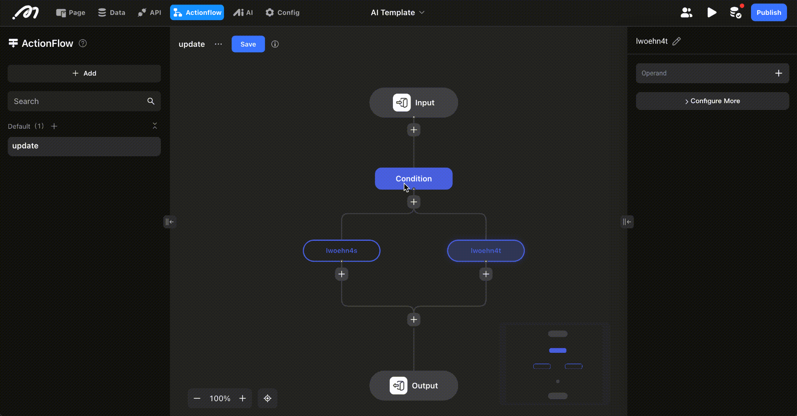

# Calling APIs in Actionflows

### **Introduction**

Before reading this, it is recommended to familiarize yourself with the [API Configuration Operation](https://docs.momen.app/advanced-competence/api/api-configuration-operation).

### **Application Scenarios**

Executing the API in an Action Flow to get or modify external data

### **Configuring APIs**

Add an API, select the desired API, and configure the parameters inside, after which the node can use the resultant data.

.png>)

### **Attention**

The API with paging enabled configuration is not supported for the time being because it does not perform the action of loading more, so there is no need to set up paging.

<figure><figcaption></figcaption></figure>

The data in case of API failure is not supported yet.

<figure><figcaption></figcaption></figure>

### **About Momen​​​​​**

[Momen](https://momen.app/?channel=blog-about) is a no-code web app builder, allows users to build fully customizable web apps, marketplaces, Social Networks, AI Apps, Enterprise SaaS, and much more. You can iterate and refine your projects in real-time, ensuring a seamless creation process. Meanwhile, Momen offers powerful API integration capabilities, allowing you to connect your projects to any service you need. With Momen, you can bring your ideas to life and build remarkable digital solutions and get your web app products to market faster than ever before.​​
