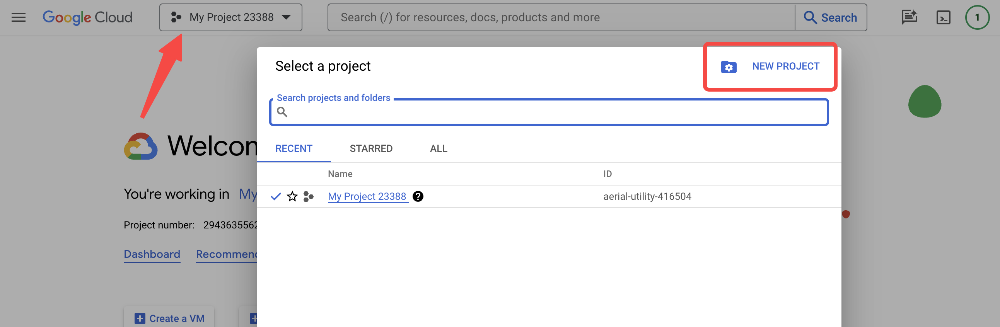
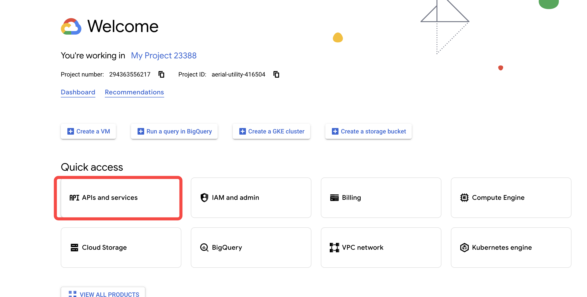
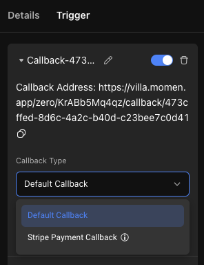
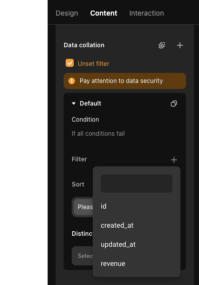
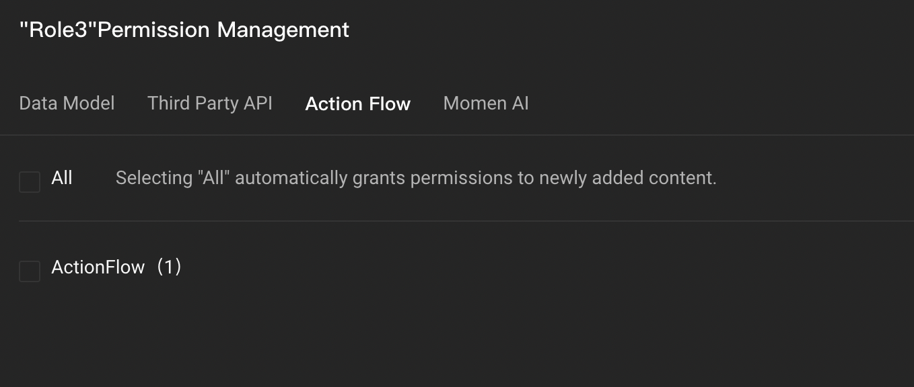
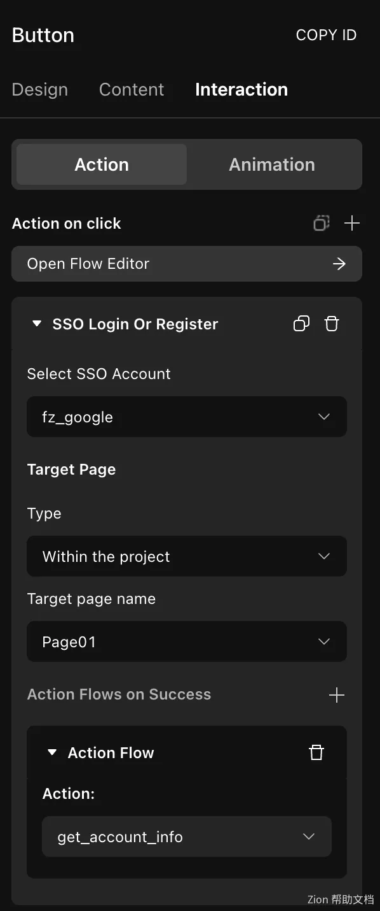

# SSO

### Introduction

Single Sign-On (SSO) is a system that enables users to access multiple accounts with a single set of credentials. Once configured, new users can effortlessly register and log in to your website using their existing accounts, such as Google or Facebook. SSO has the following advantages:

* Improved User Experience: Users can access multiple applications with a single login, reducing the need for repetitive logins and enhancing the overall user experience.
* Enhanced Security: SSO allows for controlled access to applications, offering greater security compared to traditional username and password authentication.
* Reduced Administrative Burden: SSO significantly reduces the workload for administrators managing multiple applications and systems.

### Configuration Steps

Configuring SSO involves the following key steps:

1. Create a new SSO configuration in Momen and get the callback address.
2. Register your application with the identity provider and provide the callback address.
3. Return to Momen and input your application details (clientId, clientSecret, etc.).
4. Configure the appropriate actions on your web pages.

#### Create a New SSO Configuration in Momen

Begin by creating a new project, opening the project settings, and locating "Single Sign-On Method," then click "Add."

<figure><figcaption></figcaption></figure>

You'll notice that the callback address is automatically generated. The SSO process works as follows:

* Users click "Login" on your website, which redirects them to the provider's authorization page (e.g., Google login page).
* Users enter their information (email, password, etc.) on the authorization page to complete the authorization.
* After successful authorization, users are redirected back to your website via the callback address.

<figure><figcaption></figcaption></figure>

#### Go to Identity Provider to Register Application

Using Google as an example, you'll need to register your app and provide the callback address obtained in the previous step (the process may vary between providers).

1. Register as a Google developer: [https://console.cloud.google.com/](https://console.cloud.google.com/). After registering, click on Create a new project.

<figure><figcaption></figcaption></figure>

2. Create a new project. Select API and Services.

<figure><figcaption></figcaption></figure>

3. Select External user type in OAuth consent screen. Hit create.

<figure><figcaption></figcaption></figure>

4. Back to your project. Create a "Private Policy" page. Modify the HTML path into privacy. Complete the privacy content. And design the button in your website that could direct to privacy page.

<figure><figcaption></figcaption></figure>

5. Complete the configuration of OAuth content.

<figure><figcaption></figcaption></figure>

6. Set scopes Add /auth/userinfo.email and /auth/userinfo.profile to obtain user's basic information

<figure><figcaption></figcaption></figure>

7. Complete the following configurations. Save and continue.
8. Create credentials. Create client ID for web application.
9. Fill in the OAuth client ID information, the application type is Web, and the name is customizable.

Authorized JavaScript Origin: The link after your project has been successfully published.&#x20;

Authorized Redirect URLs: The callback address under the SSO configuration added to your project, click on the address to copy.\


<figure><figcaption></figcaption></figure>

10. Obtain the Client Id and Client Secret for your application.

<figure><figcaption></figcaption></figure>

#### Fill in Application Information in Momen

* Choose an SSO name that does not start with "fz" or repeat existing names.
* Copy the Client Id and Client Secret obtained earlier.
* The scope option determines which account information (e.g., username, avatar) can be accessed. The available scope options vary among providers, so be sure to check the available options when configuring.

<figure><figcaption></figcaption></figure>

There is also information about the authorization method, type, and more, which must be filled out according to the specific requirements of your chosen provider.

<figure><figcaption></figcaption></figure>

Once your configuration is complete, save the settings and turn on the SSO switch.

<figure><figcaption></figcaption></figure>

#### Configuring Page Action

Next, you can configure the corresponding actions on the page. There are three actions related to SSO:

* Register/Login: After SSO authorization, if the SSO information exists in the account table, the user logs in with this account. Otherwise, a new user is registered and linked to the SSO.
* Bind: After SSO authorization, the user binds their account to the currently logged-in account. If there is no active session or other accounts are already linked to the SSO, binding will fail.
* Unbind: Allows users to unlink their current account from SSO.

<figure><figcaption></figcaption></figure>

For instance, let's consider the registration/login action. The configuration involves connecting SSO and the corresponding web page. Note that after successful SSO authorization, users are redirected to another page, making it impossible to utilize the data and actions of the original page. Thus, most actions cannot be configured upon successful SSO authorization, except for custom actions that run in the background.

<figure><figcaption></figcaption></figure>

### Obtain SSO User Information


 Add the following code block in ActionFlow. After adding, save and update the backend.

<figure><figcaption></figcaption></figure>

```javascript
function updateAccount(variables) {
    const gql = `mutation updateAccount(
          $accountId: bigint
          $email: String
          $name: String
        ) {
          update_account(
            _set: { fz_email: $email, username: $name }
            where: { id: { _eq: $accountId } }
          ) {
            returning {
              id
              username
            }
          }
        }
        `;
    return context.runGql("updateAccount", gql, variables, {
      role: "admin",
    }).update_account;
  }
  function queryAccount(variables) {
    const gql = `query queryAccount($accountId: bigint) {
          account(where: { id: { _eq: $accountId } }, limit: 1) {
            id
            username
          }
        }
          `;
    return context.runGql("queryAccount", gql, variables, {
      role: "admin",
    }).account[0];
  }

  const accountId = context.getSsoAccountId();

  const queryAccountResult = queryAccount({ accountId });

  if (queryAccountResult.username === null) {
    const userInfo = context.getSsoUserInfo();
    const userInfoJson = JSON.parse(userInfo);
    const name = userInfoJson.username;
    const email = userInfoJson.email;
    const updateAccountVariables = {
      accountId,
      email,
      name,
    };

    const updateAccountResult = updateAccount(updateAccountVariables);
  }

```

3. Request the ActionFlow when SSO is successful to obtain and update the user information.

<figure><figcaption></figcaption></figure>


The effect of successful configuration

<figure><figcaption></figcaption></figure>


### About Momen

[Momen](https://momen.app/?channel=blog-about) is a no-code web app builder, allows users to build fully customizable web apps, marketplaces, Social Networks, AI Apps, Enterprise SaaS, and much more. You can iterate and refine your projects in real-time, ensuring a seamless creation process. Meanwhile, Momen offers powerful API integration capabilities, allowing you to connect your projects to any service you need. With Momen, you can bring your ideas to life and build remarkable digital solutions and get your web app products to market faster than ever before.
