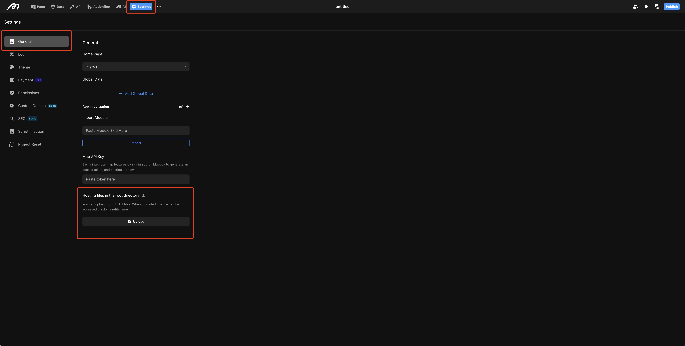

# Hosting files in the root directory

Support users to upload .txt files to the root directory for validation purpose.

## Scenario
For instance, some services or systems (e.g., Google Search Console, website hosting platforms) require you to upload a specific .txt file to verify ownership of a website or domain. The file usually contains a unique code or token.

## File Upload

Upload the required .txt validation file via Project Settings > Global > Hosting files in the root directory.
<figure><figcaption></figcaption></figure>

##  Notes
1. The validation file size cannot exceed 1KB.
2. Only .txt format is supported.
3. A maximum of 5 validation files can be uploaded. Generally, the file is only used for one-time verification; once verified, you can delete the uploaded file.
4. For a newly create projects, please upload the validation file after publishing.
