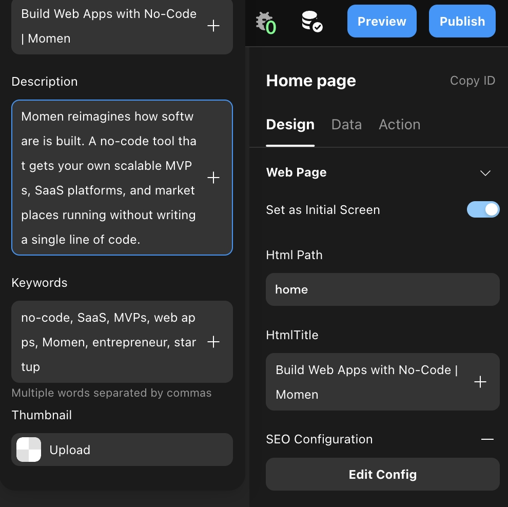
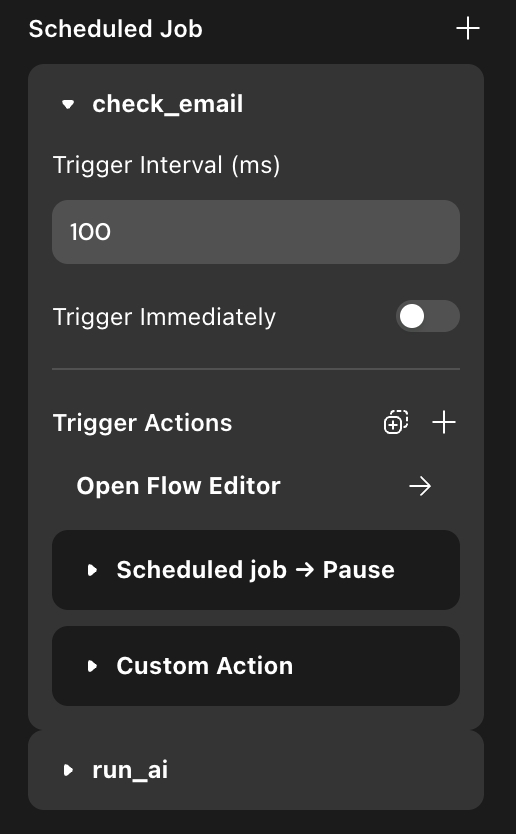
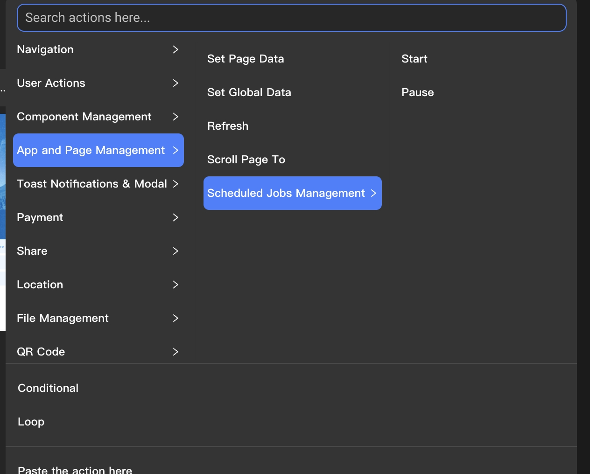

# Configuration Guide

### Introduction

In this article, you'll learn how to configure your webpage.

### Web Page Configuration

After selecting a web page by clicking on it, you can configure the following in the "Design" section of the rightside bar:

* **Initial Screen:** Set this page as the first one displayed when entering the web application through a link.
* **Web Path:** Displayed in the browser tab after entering the web page.
*   **Web Title:** The path appended to the web link in the browser's address bar after entering the web page.

    <figure><figcaption></figcaption></figure>
* **SEO Settings:** Expand to set the TDK (title, description, keywords) for the web page and configure the thumbnail for sharing the web link.

<figure><figcaption></figcaption></figure>

\- \*\*Size and Style:\*\* Refer to \[Layout] for configurations related to size and style.

### Loading Order of Data and Behavior

When opening a new page, the contents configured on the page load in a specific order. Understanding this order helps in correctly invoking actions and using data. The loading order is as follows:

1. **Link Data:** Receives link data from other pages if configured.
2. **Page Data:** Creates a page data object with an empty value, awaiting assignment.
3. **Page Load Action :** Executes configured actionss for when the page is loaded.
4. **Remote Data:** Starts reading remote data content. (There is no specific order for loading remote data on components and pages.)
5. **Component Data:** Displays local data or default values of each component.

### Lifecycle

The lifecycle of a page spans from when it is opened and starts loading content to when it is closed and unloaded.

#### Page Lifecycle Actions

You can configure actions for when the page is loaded and when it is unloaded:

<figure><figcaption></figcaption></figure>

* **Page Loaded Actions:** For example, display a splash screen ad with a countdown by configuring the countdown action.
* **Set Page Data:** Configure the behavior to set page data for the current page.

#### Trigger Conditions

* **Page Loaded:** Triggered when entering the application homepage for the first time.
* **Page Unloaded:** Triggered when navigating away from the page:
  * If page A navigates to page B, page A is unloaded and will reload upon re-entry.
  * If the behavior is set to close all pages and open a new one, the previous page unloads and reloads upon re-entry.

### Scheduled Jobs

Scheduled tasks are behaviors triggered at set time intervals until manually paused or the page is closed.

* **Trigger Interval:** The time interval in milliseconds at which the behavior is triggered.
* **Immediate Trigger:** Starts the scheduled task automatically when entering the page if enabled.

<figure><figcaption></figcaption></figure>

#### Manual Control

You can add a "Control Scheduled Task" behavior to a component to manually start or pause a scheduled task.

<figure><figcaption></figcaption></figure>

<figure><figcaption></figcaption></figure>

### About Momen

[Momen](https://momen.app/?channel=blog-about) is a no-code web app builder, allows users to build fully customizable web apps, marketplaces, Social Networks, AI Apps, Enterprise SaaS, and much more. You can iterate and refine your projects in real-time, ensuring a seamless creation process. Meanwhile, Momen offers powerful API integration capabilities, allowing you to connect your projects to any service you need. With Momen, you can bring your ideas to life and build remarkable digital solutions and get your web app products to market faster than ever before.
