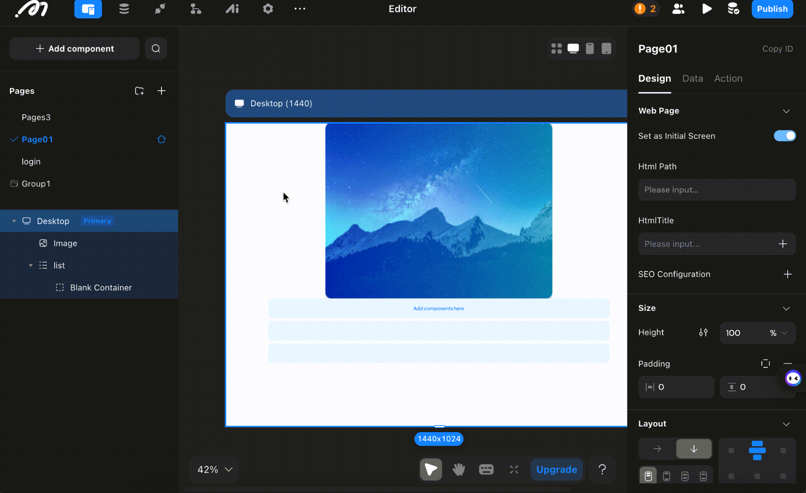
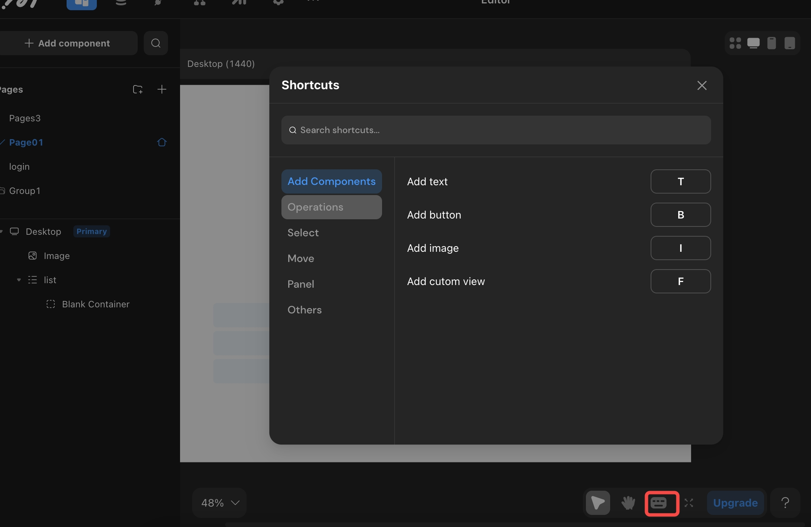
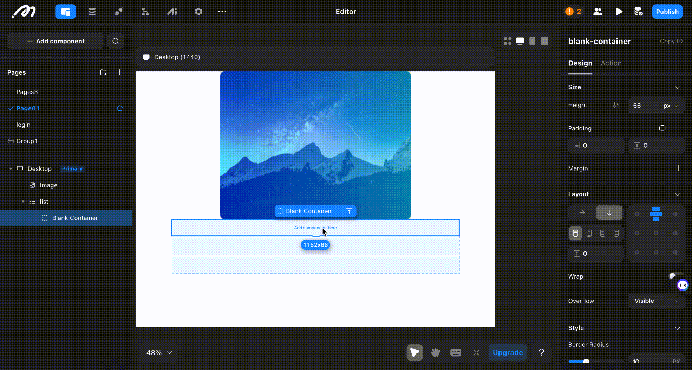

# Shortcut Actions

## Introduction

By using Momen's shortcuts, you can shave time off your development processes and unlock your full creative potential on the platform. Our guide will walk you through each shortcut key and provide detailed explanations

## Copy/Cut

Pages and components within pages can be copied.

### Component Copy/Cut

After successfully copying, a prompt "Copied to clipboard" will appear at the top of the screen.

* **Windows:**
  * **Copy:** Select the component and press `control + c`, or right-click and select copy.
  * **Cut:** Select the component and press `control + x`, or right-click and select cut.
* **Mac:**
  * **Copy:** Select the component and press `command + c`, or use a two-finger tap on the trackpad to copy.
  * **Cut:** Select the component and press `command + x`, or use a two-finger tap on the trackpad to cut.

### Page Copy

Only supported by right-clicking to copy after selecting a page in the left sidebar.

⚠️ **Note:** If prompted "Clipboard has been disabled by the browser," go to the browser's \[Privacy and Security] settings to enable "Clipboard."

## Paste

After successfully copying or cutting, select the container (such as a page or list item) where you want to paste.

* **Windows:** Select the page or container component and press `control + v`, or right-click and select paste.
* **Mac:** Select the page or container component and press `command + v`, or right-click and select paste.

⚠️ **Note:** Currently, it only supports pasting pages and components within the current project, not across projects.

## Multi-Select and Batch Operations

Sometimes you may need to "batch move" or "batch copy" components, which can be done by selecting multiple components.

* **Method 1:** Windows + Mac, hold down the left mouse button and drag the selection box to select the components.
*   **Method 2:** Windows + Mac, hold down the `shift` key, and click the left mouse button to select the components/pages.

    <figure><figcaption></figcaption></figure>

## Undo and Redo

If you make an error, you can use the undo shortcut to "revert" the action.

💡 **Tips:** You can undo up to the last save. If you don't save for a long time, the system will auto-save, preventing further undos.

* **Windows:**
  * **Undo:** Press `control + z`, or click the \[Undo] button at the bottom of the screen.
  * **Redo:** Press `control + y`, or click the \[Redo] button at the bottom of the screen.
* **Mac:**
  * **Undo:** Press `command + z`, or click the \[Undo] button at the bottom of the screen.
  * **Redo:** Press `command + y`, or click the \[Redo] button at the bottom of the screen.

## More Shortcuts

Click the \[Shortcuts] button in the bottom right corner of the editor to find more shortcut usage methods.

<figure><figcaption></figcaption></figure>

### Add Components

1. Open the left sidebar to add components interface: `Option/Alt + C`

### Measure Distance

1.  Measure distance: `Option/Alt`

    <figure><figcaption></figcaption></figure>

### Scale Components Proportionally

1. Scale components proportionally: `Shift + drag`

### Select Container Child/Parent

1. Select child: `Return/Enter`
2. Select parent: `Shift + Return/Enter`

### Select Previous/Next Component at the Same Level

1. Select the previous component at the same level: `Shift + Tab` (according to the left sidebar order)
2. Select the next component at the same level: `Tab`

### Bring Component to Front/Back

1. Bring to front: `]`
2. Send to back: `[`

### Move Component Up/Down One Layer

Only supports same-level movement.

1. Move up one layer: `Cmd/Ctrl + ]`
2. Move down one layer: `Cmd/Ctrl + [`

### Move Components

Move components in any direction using the arrow keys.

💡 **Tips:** In relative layout, adjust the component order according to the layout direction.

## About Momen

[Momen](https://momen.app/?channel=blog-about) is a no-code web app builder, allows users to build fully customizable web apps, marketplaces, Social Networks, AI Apps, Enterprise SaaS, and much more. You can iterate and refine your projects in real-time, ensuring a seamless creation process. Meanwhile, Momen offers powerful API integration capabilities, allowing you to connect your projects to any service you need. With Momen, you can bring your ideas to life and build remarkable digital solutions and get your web app products to market faster than ever before.
