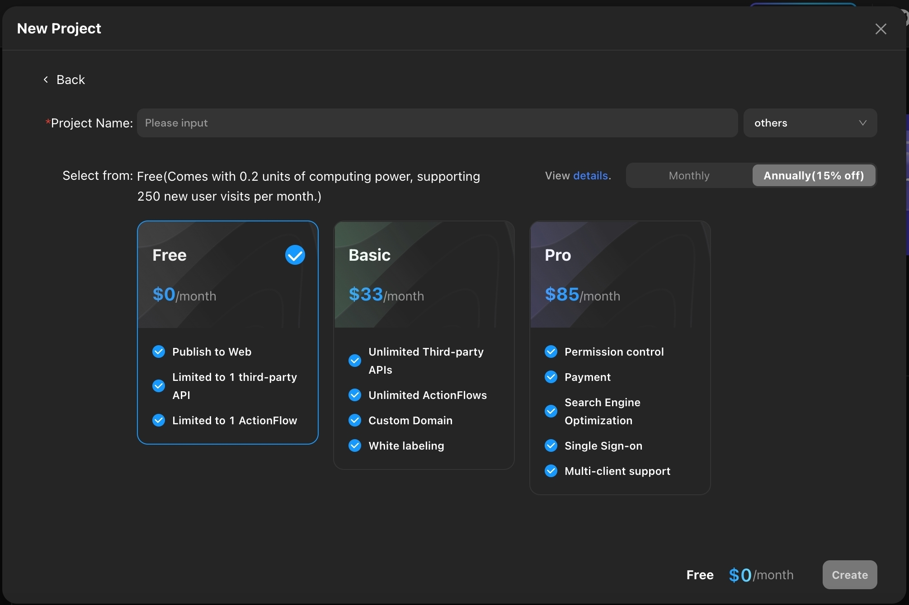
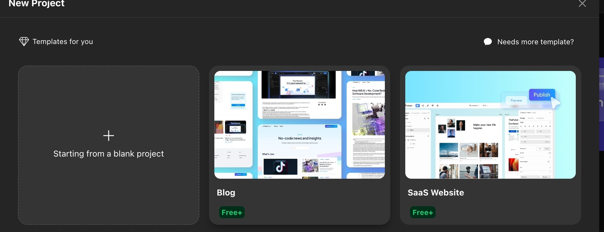
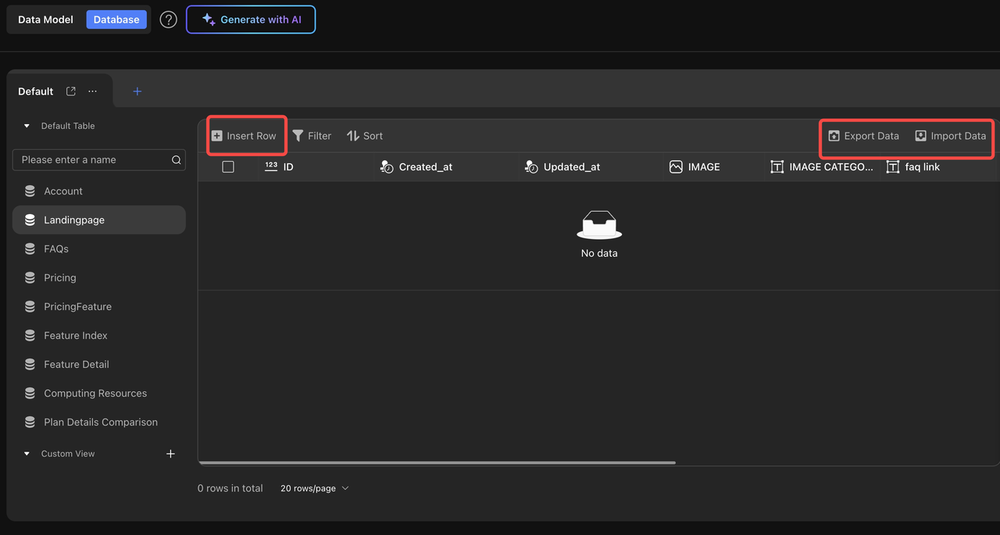
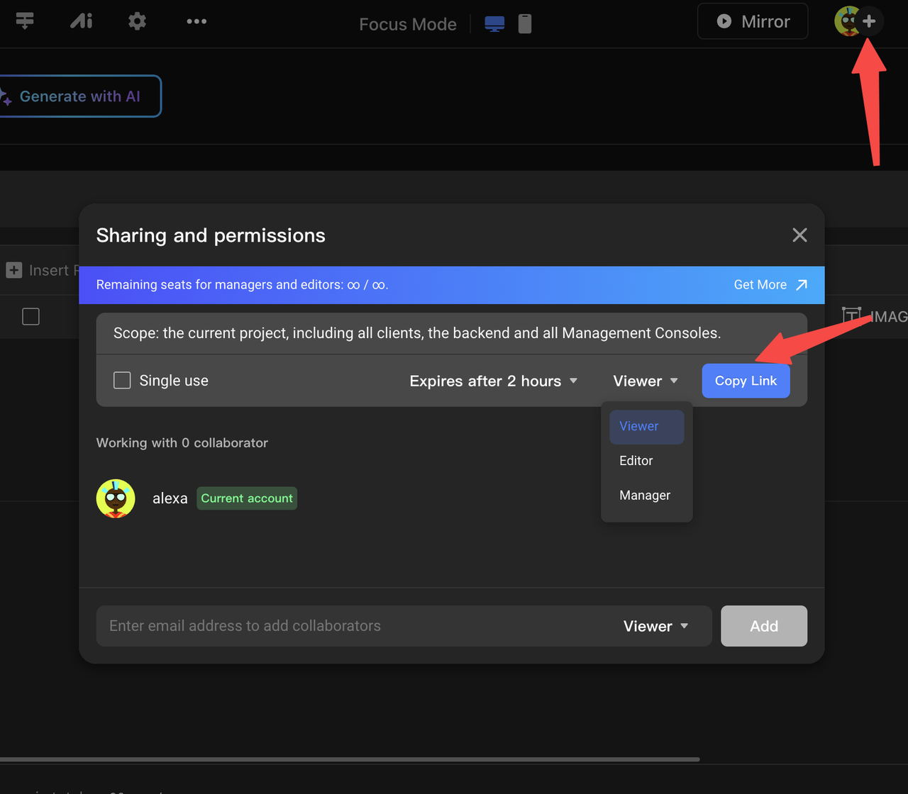
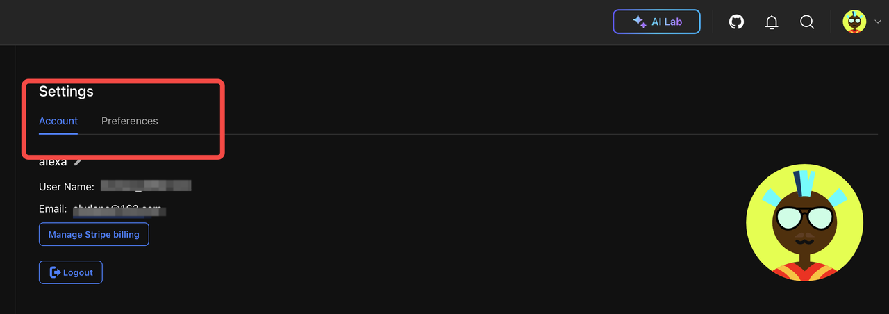
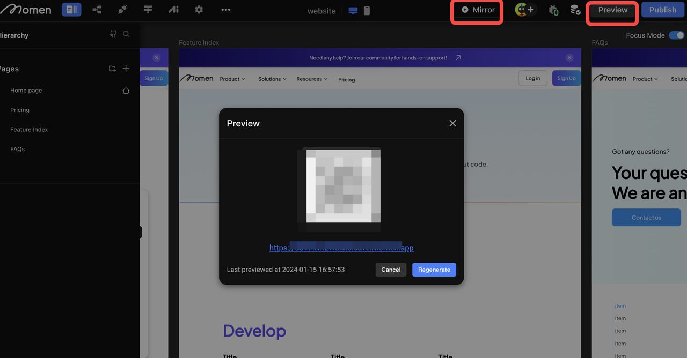

# Quick Start

> Momen is a no-code development platform.&#x20;
>
> The drag-and-drop method effectively reduces the barrier to development and enhances development efficiency.
>
> API integration, custom action flow, and Momen AI enable Momen to have application extension capability and AI functionality.

### How to Create a Project

Enter the user center and click "+ New Project". Here are two options for your new projects:

* Create a blank project: Build your project from scratch.
* Choose a template: Build an app based on the existing template, or directly use it.

<figure><figcaption></figcaption></figure>

<figure><figcaption></figcaption></figure>


Tips:&#x20;

Templates have a lot of pre-set data and business logic. It is recommended to modify and use the templates after familiarizing yourself with Momen.

You can build the UI of mobile and web in one project and use the same backend.


After entering the project, you can switch between mobile and web UI by clicking the development mode next to the project name at the top of the editor.

<figure><figcaption></figcaption></figure>

### Start With Drag and Drop

You can add and move components by dragging and dropping them on the left sidebar.On the right sidebar, you can:

* Styling the design
* Binding the data
* Configuring interactions

<figure><figcaption></figcaption></figure>

### API

Momen provides a RESTful API interface that can access external data, or call third-party integration based on HTTP requests to achieve additional functions.

<figure><figcaption></figcaption></figure>

### ActionFlow

Defining an ActionFlow is equivalent to defining an action that belongs to your own business logic and can be reused throughout the project.

In the ActionFlow, you can get data from your page, call Momen's "get data" action, call a third-party API to get the data, or write your own JS code to execute the processing business logic, and finally output the desired result.

In the ActionFlow, you can also configure branches to execute the corresponding business logic when the conditions are met.

<figure><figcaption></figcaption></figure>

### Custom Modules (coming soon)

Momen's components are element-level, and all components in an application can be implemented by combining and nesting these components. Users can make their own components according to their own needs, and we call these kinds of custom components \[modules].\

### Backend Management: Data Uploading and Managing

#### Create Data Tables

You can create multiple \[Data Tables] for storing data in the \[Data Model].

<figure><figcaption></figcaption></figure>

#### Database Operation

In the database, you have the ability to perform the following operations:

* Insert data
* Delete data
* Update
* Import data in bulk
* Export data in bulk

<figure><figcaption></figcaption></figure>

### Collaboration Invitation: Collaborate as a Team to Build a Project.

You can share your project with peers to create together and provide inspiration for them.

<figure><figcaption></figcaption></figure>

### Your Personal Center

Within the personal center, you can access \[Project Management], \[Account Settings], and \[Searching].\

#### Project Management

Based on project ownership, projects are categorized into: \[My Workspace], and \[Shared Workspace].Each workspace allows different operations based on permissions.

<figure><figcaption></figcaption></figure>

#### Account Settings

By clicking on the account avatar, you can manage basic account information and personal preferences.

<figure><figcaption></figcaption></figure>

#### Debug

Utilize it to verify project configurations for accuracy, ensuring everything is right.

<figure><figcaption></figcaption></figure>

#### Preview: Test And Run Your Project

Utilize \[Mirror] to simulate the effect of the project.

Utilize \[Preview] to test the project on a real environment.

<figure><figcaption></figcaption></figure>

#### Publish

Officially launch your completed project, making it accessible through URL.

Following the \[Preview], assess the project status before using \[Publish] for an official project launch.

You can configure your custom domain while publishing.

<figure><figcaption></figcaption></figure>

### Plan

Select the appropriate project plan based on your requirements and preferences. Each plan offers specific advantages to cater to individual needs.

### About Momen

[Momen](https://momen.app/?channel=blog-about) is a no-code web app builder, allows users to build fully customizable web apps, marketplaces, Social Networks, AI Apps, Enterprise SaaS, and much more. You can iterate and refine your projects in real-time, ensuring a seamless creation process. Meanwhile, Momen offers powerful API integration capabilities, allowing you to connect your projects to any service you need. With Momen, you can bring your ideas to life and build remarkable digital solutions and get your web app products to market faster than ever before.
