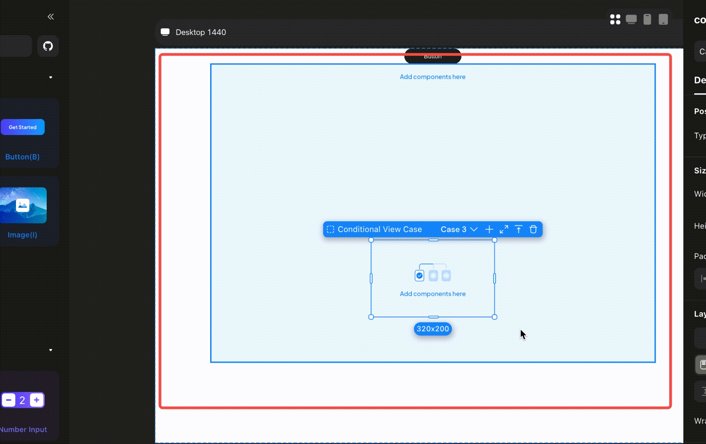

# Application Development and Management

### **Introduction**

In this tutorial, you will learn to develop and manage a web app using Momen.

When developing applications, break down the process into manageable units, each focusing on specific pages or functions. After building a unit, test it thoroughly to ensure it meets design expectations and functions correctly. Once all units are built and individually tested, perform a comprehensive test of the entire project. Involve customers or team members in testing to gather feedback and make any necessary improvements.

### **Planning the construction units of the application**

Taking a personal knowledge payment platform as an example, below are the core functions of the application. We generally recommend dividing the construction units based on each core function.

.jpeg>)

In this scenario, where the course collection's main information is handled by the administrator, developers might first build the administrator's pages, starting with the course creation process. This can be broken down into smaller, manageable units:

* Course Collection Unit: Handle the creation of course collection details such as cover, name, and discount codes.
* Chapter and Course Unit: Add chapter and course names, and integrate course videos.
* FAQ Unit: Populate frequently asked questions and answers related to the course collection.

By following this method, we can break down the unit "creating a new course" into the mentioned subunits and then divide the entire application into individual units.

### **Creating Applications**

You have the option to start from a blank project, or you can choose a template and modify it or use it directly as your foundation.

.png>)

Note:&#x20;

Templates come with numerous data dependencies and pre-designed business logic. It is recommended to acquire a certain level of understanding of Momen before modifying and using these templates.

### **Invite collaborators**

You can share your project with your teammates to collaborate on the creation or to provide them with some creative inspiration.

.jpeg>)

### **Debugging Applications**

#### **Preparing Test Data**

While building an application, having test data is essential.

For instance, with the previously discussed module “Create a New Course,” you first need to design and create the appropriate data model. After completing the page construction and interaction binding in Momen, you need to test the functionality of this module.

For this purpose, you should prepare relevant data such as the name of the course collection and cover images in advance to conduct functional tests. If the data for your designed application is not uploaded through the frontend page construction, you can also add data directly to Momen's database.

#### **Issue Verification**

Utilize the feature below to check if your configurations are correct.

|  |  |
| ------------------------------------------------------------------------ | -------------------------------------------------------------------- |

### **Preview & Mirror**

After completing the unit breakdown, the next step is to build each component progressively. During the construction process, you can review the actual outcomes of your work at any time.

**Mirror:** Click the "Mirror" button to instantly view your building results within the editor. This includes the design display of the pages and their interactions, allowing you to make timely corrections and optimizations.

**Preview:** Click the "Preview" button in the top right corner of Momen's editor to package and generate the latest version of the application.

For web applications, you can directly click the link generated by the mirror to access your web application on a PC. Or you can copy the link and open it in a mobile browser to experience the mobile content of your web application on your phone.

### **Publishing the Application**

Once your project is completed, you can click the "Publish" button to launch your application online.

.jpeg>)

You can also customize the domain of your website.

.png>)

### **Managing Applications**

In the User Center page, you can create new applications. Additionally, you can select an existing application to modify its name or to clone or delete it. You can also view details about the application's computational resource usage.

By subscribing to Additional Clients, you can add multiple clients to your app.

.png>)

