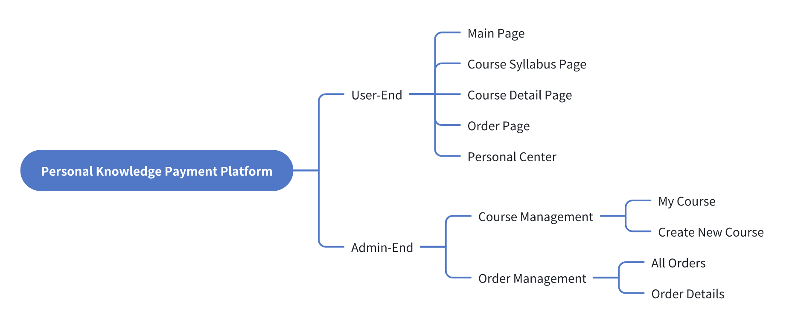

# Product Requirements Gathering

### Introduction

A full lifecycle of application development should include: product requirements gathering, product design, development, deployment, operations, and maintenance, etc.&#x20;

The first step—product requirements gathering—is crucial. Only with clear requirements can you understand how to design and develop. Product requirements gathering includes sorting out what functions your application has, and how are the content and functions are presented on different pages.&#x20;

A "mind map" will be helpful. After you've sorted out the requirements, you can build your data model and pages based on the map.&#x20;

Before we go through product requirements gathering, there are some concepts that you need to understand.

### Staged Progression Approach

Segmented progression lets you pinpoint essential functionalities and subsequently refine your application in alignment with user reaction, market transformation, or business evolution. Attempting to gather all requirements at once can be overwhelming.

For instance, you can plan your product development in different stages:

1\. MVP (Minimum Viable Product): This is the simplest form of your app, including only the core features necessary for operation. The objective of this stage is to expedite the product's entry into the market to test ideas, gather feedback, and find possible improvements.

2\. Version 1.0: After the credibility is established through the MVP, further enhancements are in order. This iteration focuses on user experience and interface advancements and infuses additional features inspired by MVP feedback. It's also a period for solving major problems in the MVP stage.

3\. Version 2.0 (and future iterations): With your user base widening and feedback stockpiling, it will become apparent which further improvements and functionalities are necessary. This might involve augmenting new features, improving existing ones, or diversifying into new markets.

Adopting a staged progression in product development allows for systematic iteration, enhancement, and releases. It helps developers and PMs gather real-world feedback.\

### Planning MVP

The objective of MVP is to identify the key functionality and pressing needs while avoiding unnecessary complexities and peripheral features.Here are some methods for structuring your MVP:

1. Identify the core problem: Clearly define the main issue your application addresses or the main function you want to implement. This directs your focus to essential features.
2. Write User Stories: Create user stories to imagine typical user interactions with your application. For example, "If I were the user, what kind of courses would I want to see? Or what kind of check out process is the fastest?"
3. Prioritize Features: List all envisioned features and rank them by their relevance to the core problem. Focus on the most crucial features.
4. Use Visual Planning Tools: Utilize visual aids like diagrams to map user navigation and the interface experience. These serve in further planning the introduction of features and the user journey.
5. Avoid Feature Bloat: Maintain a tight focus on the primary goal instead of multiple features, ensuring MVP integrity. Additional features can be incrementally added based on the initial testing response.
6. Confirm Technical Feasibility: If you are uncertain about whether the functions you want are feasible, contact us via email or seek advice on our [Discord](https://discord.com/invite/UCyhySSXfz).
7. Implement Feedback Loops: To validate and refine your MVP, incorporate methods for collecting user feedback, such as forms or analytics tools.

\

### Clarify Core Functions

Core functions essentially are the core business logic of the application. Take the personal knowledge payment platform as an example. On the user end, its core functions are the display of course content, course ordering, payment, and course content viewing. On the admin end, the core functions are course content upload, modification, user orders check and sales analysis.

Based on this core function, we can basically sort out the mind map as below to represent the core page and corresponding functions of the application:

<figure><figcaption></figcaption></figure>

#### Refine Core Functionality

After the core functions are determined, the content of each core function is refined. Continue the analysis with the case in the previous step. When refining the core functions, you can search for relevant application software on the Internet for reference, or you can design the core functions based on your own research.For example, the detailed content of the core functions of the client homepage is as follows:

* Home page: personal introduction, course highlights display, course display list, recommendation, login/registration, etc.
* Course content: course cover image, course name, course selling points, price, update date
* Similar logic applies to additional sections.

<figure><figcaption></figcaption></figure>

The detailed core functions of creating a new course on the admin end are as follows:

* Course collections, course collection highlights, cover images, course chapters, and video courses
* Course FAQs and user reviews display
* Coupon codes for promotional courses

\
While refining the core functions, you can present the business logic in the mind map. This version of the mind map is for UI\&UX designers to design high-fidelity prototype diagrams, which are also easier to provide you with clearer ideas when building applications:

<figure><figcaption></figcaption></figure>

### Planning the User Journey

The user journey represents a series of steps or interactions that a user undergoes in your application. By planning these journeys, you can ensure that users are able to achieve their goals quickly by following a predefined route.Here are some examples:

#### Example 1: Register/ Login

Registration/login is one of the essential functions of an application and is also the starting point of user journey. Here is an example of a registration process:

1. User persona: Imagine what kind of persona your user is
2. Application entrance: users search for your application in the browser
3. Open the app: The user opens your webpage and sees the content on the homepage
4. Attract users to take action: Eye-catching registration/login buttons attract users to register accounts.
5. Registration options: The user clicks to register and a new page pops up to display the registration options: email registration, mobile phone number registration, Google login, etc.
6. Additional information: user research during registration, etc.
7. Confirmation and feedback: After successful registration, the user receives SMS notification/email notification
8. Configure personal information: improve user profile information such as avatar, nickname, etc.
9. First-time user experience: When entering the app again, the user’s avatar, nickname, etc. will be displayed in the app.
10. Follow-up reminders: When the product has new features, or the help documents, tutorial links and other resources that users need most, they will be sent to users via email.

#### Example 2: Purchase Courses

Take the knowledge payment platform as an example, this is the user's journey to purchase a course:

1. Course content display: After the user enters the application, they see the core display content of the homepage
2. View course details: If users are interested in a course, they can click on the course to jump to the course details page, where more details of the course can be displayed
3. Purchase a course: There also needs to be an eye-catching purchase button on the course details page, so that users can quickly find and enter the purchase generation order page when they want to purchase the course
4. Purchase discount: On the order page, if your course has a discount option, you can set the input box to fill in the discount code when purchasing, and then display the course amount after the discount
5. Order settlement: When the user confirms the content of the order, she/he can click the generate order button to complete the payment, and after the payment is successful, a success message will be displayed and will direct user to view the purchased course
6. View purchased courses: Click on the purchased course to jump to the course details page, users can view the chapters and course video content
7. After-sales consultation: You can provide common FAQs, and the contact email of the staff to answer users' questions

\
⚠️ Here are a few things to keep in mind when planning your trip:

* Make sure that each step is intuitive and clear, so that your users don't need to jump back and forth
* Provide clear prompts or feedback, such as pop-ups when registration is successful or prompting users to register successfully
* Make it easy to ask for help, such as providing an FAQ or a point to contact us in a prominent place
* Minimize the steps and collect only the necessary information from the user to increase the chances of successful registration/purchase

\
The above examples of user journeys are only references for you. You still need to plan the user journey according to your core functionality and imagine yourself as your user.

If you encounter any issues during the process, feel free to join our [Discord community](https://discord.com/invite/UCyhySSXfz) for assistance.

### About Momen

[Momen](https://momen.app/?channel=blog-about) is a no-code web app builder, allows users to build fully customizable web apps, marketplaces, Social Networks, AI Apps, Enterprise SaaS, and much more. You can iterate and refine your projects in real-time, ensuring a seamless creation process. Meanwhile, Momen offers powerful API integration capabilities, allowing you to connect your projects to any service you need. With Momen, you can bring your ideas to life and build remarkable digital solutions and get your web app products to market faster than ever before.\
\
