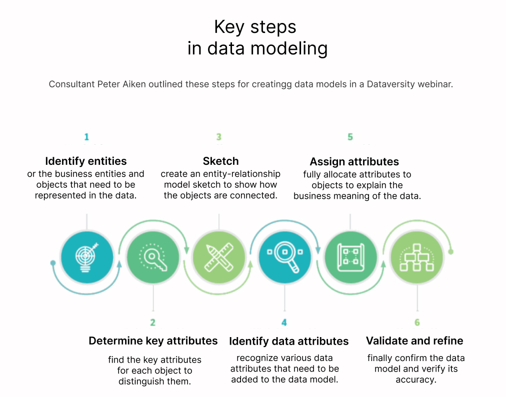

# Basic Application Development Process
Momen is a no-code application development tool, and using Momen for software development also requires following the basic software development process.
1. Requirement Analysis: This is the crucial first step in application development, where you need to clearly outline what you want to achieve before starting.
2. Build Datamodel: This step can be challenging for users with no-code capabilities, as it requires some basic knowledge about data models.
3. Design UI: Design the interface based on product requirements.
4. Development: Use Momen to build the data model, set up the UI, and implement software interactions through behavior configuration.
5. Publish Application
6. Maintain and Manage Application

The following sections will provide a detailed introduction to each step.

## What is an Application
An application is a software tool designed to solve a specific problem, featuring a user interface that allows users to perform various operations, thereby enabling data creation, retrieval, update, and deletion. To build an application, you need to outline a clear logic based on the problem you want to solve, design various data models, complete UI setup, configure event interactions, and finally publish, launch, and manage operations.

## Requirement Analysis
Requirement analysis involves clarifying the functionalities of your application and determining which content and functionalities are presented on which pages. We generally recommend using a [mind map] to organize pages and functionalities, and then proceed to the next step of data model design and page setup based on the organized [mind map].

Before you can clearly outline product requirements, you need to understand the following:

### Versioned Design Approach
Whether for a team or an individual, it is challenging to detail all functional requirements of an entire application at once and start implementation. Additionally, with changes in the market and business, requirements may need to be modified at any time. By planning versions, you can initially focus on providing a core set of functionalities and then gradually enhance and expand your application based on your own planning and actual market/user feedback.

### Clarify Core Functions/Problems
The core functions/problems essentially refer to the core business logic that the application software aims to achieve, i.e., what exactly your application is supposed to do. For example, in a personal knowledge payment platform, the core functions for the user end are course content display, course ordering, payment, and course content viewing; for the platform manager, the core functions are course content upload, modification, user order viewing, and sales viewing. 

### Refine Core Functions
Once the core functions are determined, the next step is to refine the content of each core function. Continuing with the example from the previous step, when refining core functions, you can search for related application software on the internet for reference, examine the content of each core function, and then organize them based on your actual needs. Of course, you can also design your core functions based on your own research findings.


### Plan User Journey
A user journey represents a series of steps or interactions a user takes in your application or website to achieve a specific goal. By planning these journeys, you can ensure that users can achieve their goals conveniently and quickly along a predetermined path.


## Build Data Model
After completing the product requirement analysis, you have decided which functionalities your application software needs. Now it's time to start building the data model. When designing a data model, it is generally recommended to use pen and paper or other visualization software for recording and design. We usually recommend following the design steps below for data model design.



### Identify Objects
Before starting to design the data model, we have generally outlined the business requirement list and the final high-fidelity or low-fidelity diagram of the application. 


### Determine Key Attributes
After identifying the objects, we quickly determine some key attributes for them. In fact, in the previous section of refining core functions, we have basically determined the key attributes of each object. When designing the data model, we need to think about how to accurately name these objects and their key attribute names to distinguish them.

### Add Relationships
Next, we will establish relationships between objects, i.e., tables, to allow them to reference each other's data. At this point, we need to consider two questions:
1. What type of relationship do they have? Is it 1:1, 1:N, or M:N?
2. Which object is the referenced party, and which is the referencing party?

### Build Data Model in Momen
The data model is the core of building an application. We generally recommend that you design the data model using a UML diagram and confirm that there will be no significant changes before entering Momen to build your data model.

## Design User Interface
User interface and interaction design include interface design (UI) and user experience (UX).

"UI" stands for "User Interface." When we talk about UI, we refer to the specific interface that users see and use when interacting with software, websites, or applications. The key to UI is the visual design and layout of the interface. It includes buttons, text, images, input fields, etc., on the screen. A good UI design should be aesthetically pleasing, intuitive, and clear, allowing users to navigate and interact with the product easily.

"UX" stands for "User Experience." UX covers a broader scope, referring to the overall experience of users when using a product. This includes not only the operation of the interface but also the user's feelings, efficiency, and satisfaction when using the product. The goal of UX design is to ensure that the product is not only easy to use but also provides a pleasant experience for users during use.
Therefore, two points can be summarized that you should pay attention to when designing application software:

- The application software should look aesthetically pleasing and consistent to highlight your features and brand.
- It should be easy to understand and operate. If you are not a professional designer, we suggest you refer to various design platforms or already launched applications for inspiration.

### Build UI in Momen
Momen provides a self-developed visual Editor and a dozen components, allowing pixel-level restoration of designs in design drafts, helping you design your application with a what-you-see-is-what-you-get approach. For details, please click [【Build UI】](../design/readme.md).
You can add and move components by dragging on the left side, and design styles, bind data, and add interactions in the right toolbar.


## Configure interactions to Implement Data CRUD
After completing the data model design and setup, UI design and setup, it's time for the most important event configuration to implement data CRUD.
### Build Interactions and Data Operations in Momen
Click on each component or page, and check the right configuration bar - behavior to configure corresponding events for them. For a specific list of behaviors, please click [【Actions Configuration】](../actions/readme.md) and [【Data】](../data/readme.md).

## Publish Application and Maintenance
Once you have completed all application development or setup, you need to launch your application so that it can be seen and used by users. For publishing applications on Momen, please see [【Application Deployment】](../deployment_scale/app_deployment.md).

## 👉To develop your application in Momen, please continue reading [【Build Apps with Momen】](build.md)
```