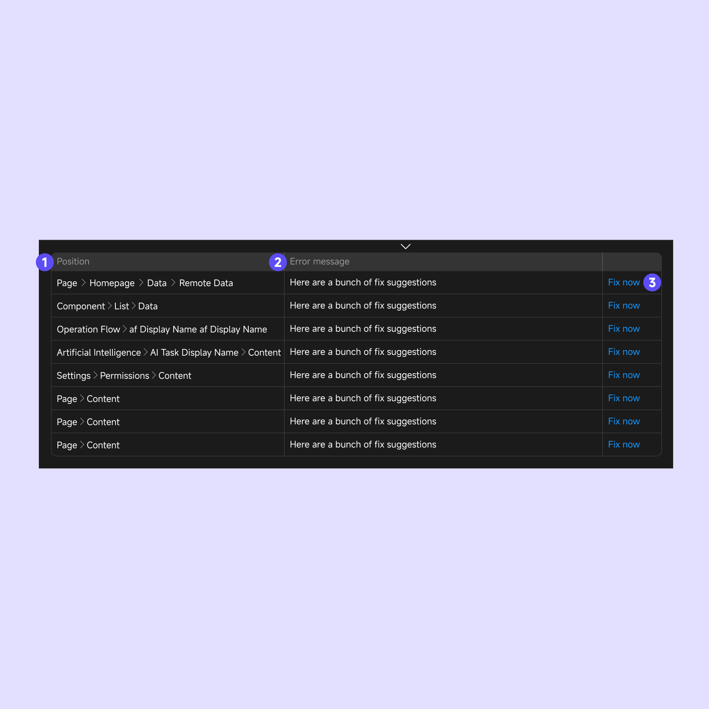
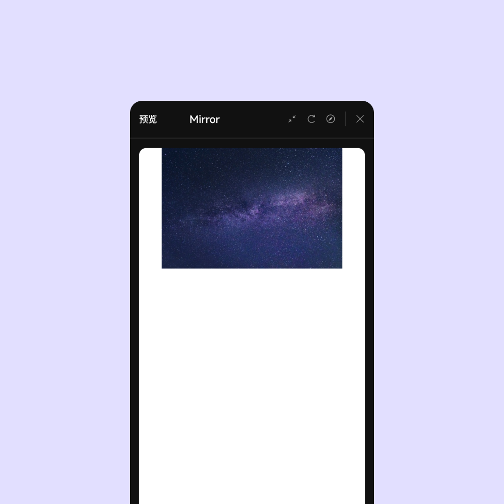

# Introducing the Momen Editor
The Momen Editor is divided into a navigation bar, functional core area, and additional sections such as the left sidebar, right sidebar, and toolbar when a page in the navigation bar is selected. The left sidebar is used for adding and managing pages and components, while the right sidebar is for detailed page and component configuration. Click the provided links for more detailed information.

## Navigation Bar: Feature Access and Project Management

The navigation bar allows you to switch between canvas contents, access various functional panels, and open general project settings. Below is a detailed introduction to its components:

###  Return to Personal Center

Click the “Momen” logo in the top-left corner to return to your personal center.

### Feature Access

When you enter the editor, the “Page” tab is selected by default. Click other tabs to access different configuration panels.

You can click the link below to view the detailed introduction of the corresponding function：  
 [Data](../data/data_model.md)  
 [API](../data/api.md)  
 [Actionflow](../actions/actionflow/basics.md)   
 [AI](../actions/ai/ai.md)

### Error Notifications

If configuration errors occur during editing, the navigation bar displays an error notification. Click it to see detailed error information at the bottom of the editor:
	1.	Location: View the path to the error.
	2.	Error Message: Description of the issue.
	3.	Fix: Click to navigate directly to the error location.

    
    

### Sharing and Permissions

To share your project or view collaborators, click the “Sharing and Permissions” icon in the navigation bar. Note that sharing and collaboration features are available only in the Premium version or higher.

Roles and Permissions:
	1.	Owner: Full project permissions, including creation.
	2.	Manager: Can edit, manage collaborators, and clone the project.
	3.	Editor: Can edit project content.
	4.	Viewer: Read-only access to the project.

    
    

### Mirror

Click the Mirror icon in the navigation bar to quickly preview your project during editing.

    
    

### Backend Update

After modifying data models, APIs, workflows, or ZAI, click the Backend Update button in the upper-right corner to apply changes immediately. For live projects, backend updates are sufficient if only backend configurations are modified.

### Project Publishing

Once your web application is complete, deploy it by clicking the Publish button. Before publishing:
	1.	Preview the latest version to generate a QR code and link for testing.
	2.	After confirming the app works as expected, click Publish to deploy.

    
    

## Toolbar: Editing Actions and Resources

The toolbar includes essential tools for editing and useful resources. Below are its features:

### Canvas Selection and Movement

The canvas defaults to Edit Mode (shortcut: **V**), allowing element selection and editing. Switch to Move Mode (shortcut:  **H**) to drag the canvas without selecting elements. For temporary movement, hold  **Spacebar** and drag with the mouse.

### Shortcuts

View all available shortcuts by clicking the Shortcuts icon in the toolbar.

### Help

Access tutorials, documentation, and connect with the community through the Help section.

### Canvas Zoom

Adjust the canvas zoom level freely. Common shortcuts include:

**Zoom In**: **⌘ +**  

**Zoom Out**: **⌘ +**  

Reset to 100%: **⌘ +**

