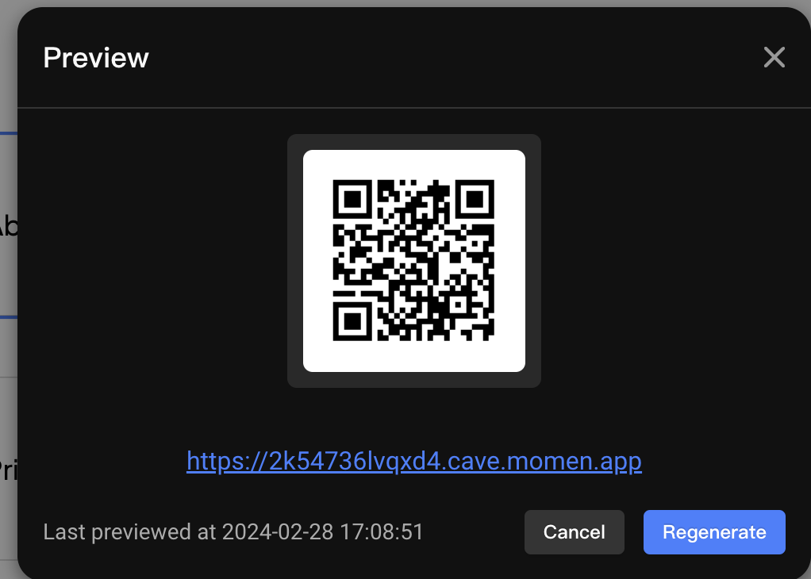

# AI Help Center

## Introduction

The AI Help Center template helps you build a custom support page for your startup. This template efficiently manages your product resources like FAQs and documentation while delivering precise answers to your users by utilizing AI.

---

## I. Basic Project Logic

**Help Center**: When users input a question related to your product, the AI retrieves information from your business data and generates answers based on it.

.png)

.png)

**Resources**: This section organizes all your product resources in one place, ensuring users can easily find the information they need without navigating to multiple locations.

.png)

**Contact Us**: Add your team's contact information here to provide additional support to your users.

.png)

In the **Context** section, you can configure your AI's data source. Momen AI allows you to upload local files, use data from your Momen database, or call third-party APIs to retrieve data for your AI.

.png)

---

## II. How to Create Your AI Apps

### Step 1: AI Configuration

First, access the AI integration interface from the top bar of the Momen editor.

.png)

**Basic Configuration**:  
- Change the name and description of your AI.  
- Choose the model based on your needs. Currently, Momen supports GPT 3.5 and GPT 4.  
  - **GPT 3.5**: Suitable for text-based input.  
  - **GPT 4**: Supports image processing and generates more accurate answers but consumes more [tokens](https://docs.momen.app/ai/app-token-consumption).

**Input Configurations**:  
- Configure single or multiple parameters for the AI interface.  
- Input parameters can be referenced in predefined prompts or used as filtering conditions for your app.

.png)

**Predefined Prompts**:  
- Directly input instructions as your prompt source or reference input parameters.  
- For more details, refer to our guide on [AI Configuration](https://docs.momen.app/ai/ai-configuration), which explains how to write effective prompts.  
- In this template, we used a combination of direct input and parameters as the sources.

.png)

**Contexts**:  
- Context serves as the data source for your AI.  
- Momen supports three ways to integrate your data:  
  1. Select data tables stored in the Momen database.  
  2. Upload local files.  
  3. Call APIs to fetch external data.  

In this template, the Momen AI knowledge base uses data stored in the Momen database, where Momen docs are maintained.

.png)

**Debug and Preview**:  
- Before requesting AI, debug and test to ensure it generates the desired answers.  
- For example, input a question related to Momen to verify if the AI provides accurate responses.

.png)

---

### Step 2: Action Configuration and AI Request

To make your AI functional in the desired location:  
1. Bind your data from the backend to your UI.  
2. Configure the **"Request AI"** action.  

In this template, the **"Request AI"** action is configured on the input box.

.png)

Additionally, configure the navigation action in the **Resources** section to direct users to the relevant resource page.

.png)

You can also customize the UI to make your AI help center more tailored to your brand.

---

### Step 3: Website Preview

After completing all configurations:  
1. Click **"Preview"** in the upper-right corner to generate a preview link.  
2. Verify that everything works as expected.  
3. Once satisfied, publish your project to make it publicly accessible.

---

## About Momen

[Momen](https://momen.app/?channel=docs) is a no-code web app builder that lets you create fully customizable web apps, marketplaces, social networks, AI tools, enterprise SaaS platforms, and more. Iterate and refine your projects in real time for a smooth, streamlined creation process. Momen also offers powerful API integration, making it easy to connect your app to any service. Bring your ideas to life and launch products faster than ever with Momen.
