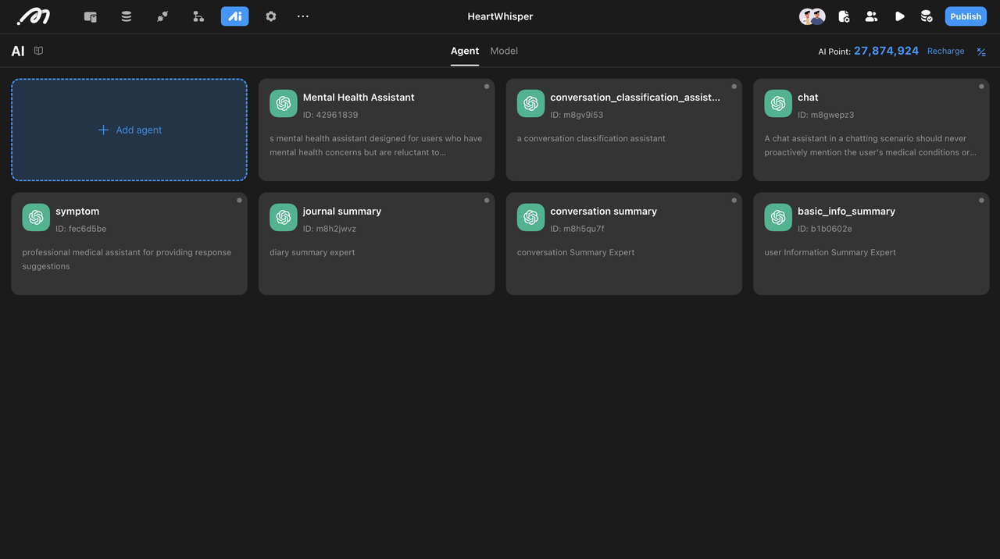

# AI Mental Health Assistant

### Introduction

The "AI Mental Health Assistant" utilizes multiple collaborating agents with continuous memory of user interactions and complex workflows to deliver personalized support for mental health challenges.

### Overview

Here is an overview of how it works:



### Basic Project Operation Logic

#### Data

The template consists of **6 core tables** designed to collect and store essential user data:

**Account**: Default system tables enhanced with fields for user body metrics (e.g., height, weight).

**Medical History**: Stores users' previous medical history.

**Medication Records**: Documents users' past medication history.

**Journal**: Tracks users' daily journal entries.

**Crisis Plan**: Contains professional medical knowledge for AI retrieval; additional professional data can be inserted as needed.

**Conversation Summary**: Stores summaries of each conversation to provide the AI with memory.

<figure><figcaption></figcaption></figure>

#### UI

The template features six main pages:

<figure><figcaption></figcaption></figure>

**\[login/register]** Users can log in or sign up using email as the default method, with options for additional methods configurable in settings.

**\[basic\_info]** User profile page displaying basic metrics and medical history. Users can update their personal data here.

**\[home]** The homepage of the app, aggregating entries from all other pages.

\[journal] Users can update their journal and modify its status. If marked as private, the AI agent will not retrieve the content.

\[chat] A chat interface where users can interact with the AI to receive personalized support.

#### AI Configuration

* **Multi-Agent Architecture**:
  * Design multiple AI agents, each responsible for specific tasks (e.g., summarization, symptom analysis, casual conversation).
  * Configure agents to collaborate seamlessly, optimizing the user experience and ensuring accurate responses.

<figure><figcaption></figcaption></figure>

* **Retrieval-Augmented Generation (RAG)**: Implement RAG to pull relevant information from user data and previous interactions, ensuring personalized responses.

<figure><figcaption></figcaption></figure>

#### Workflow

1. **User Input & Data Retrieval**:
   * Users submit inquiries regarding their health or emotional state.
   * The system retrieves relevant medical history and emotional feedback from the structured database.
2. **AI-Driven Crisis Prediction**:
   * Utilize vector search to match user inputs with existing intervention strategies.
   * Cross-reference symptoms with predefined crisis intervention plans.
3. **Generating Personalized Recommendations**:
   * Analyze user conditions in the context of their history to formulate customized intervention strategies.
4. **Output & User Profile Optimization**:
   * Provide suggestions or adjustments to the user's personal intervention plan.
   * Update the user’s health profile to ensure continuous improvement of future recommendations.
5. **Actionflows for Automation**:
   * Implement Actionflows to automate backend processes, ensuring real-time updates and efficient management of AI agent collaboration.

If you want to learn more about how this template is built, check our [detailed breakdown blog](https://momen.app/blogs/ai-mental-health-assistant/).
