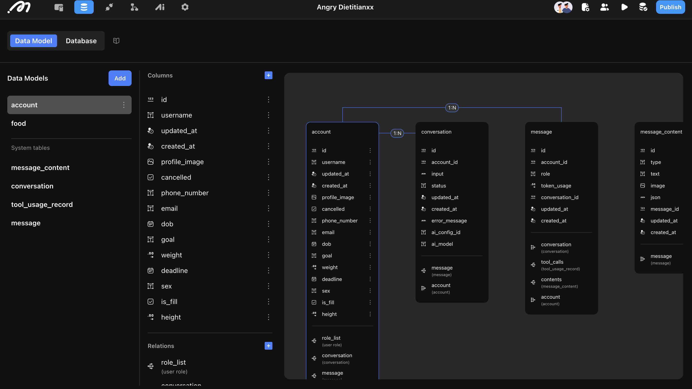

# Angry Dietitian

### Introduction

The "Angry Dietitian" template integrates DeepSeek and GPT-4o to help users track their daily diet and receive personalized suggestions based on their health goals and body data.

### Overview

Here’s a preview of how the template works:



### Basic Project Operation Logic

#### Data

The template consists of 5 core tables, which are default system tables with some additional fields:

【Account】 This table stores user login information. We’ve added 6 fields to store user body data, such as weight, height, and health goals. DeepSeek will use this information when providing personalized suggestions.

【Message Content】 Stores the content of each message from the AI. In this template, it records the reasoning and output of DeepSeek.

【Conversation】 Tracks the status of each conversation, including the user, the AI model, input data, conversation status, and any error messages.

【Tool Usage】 Typically records which tools the AI has invoked, but for this template, this table is not used.

【Message】 Tracks the token usage for each message in a conversation. You can view how many tokens were used by the user, the AI, or the system.

<figure><figcaption></figcaption></figure>

#### Design

The template features three main pages:

**【Sign up/Sign in】** Users can log in or sign up here. The default login method is by username, but other methods can be configured in the settings.

**【Form】** After signing up, users will be directed to this page where they can enter their body data (e.g., weight, height, goals).

**【Roaster】** After filling out the form, users can upload a food photo and press the "Roast" button. GPT-4o analyzes the food, and then DeepSeek (the "Roaster") evaluates the food based on the user's data and health goals.

#### AI

This template uses **two AI agents**:

1. **GPT-4o (The Eye)**: GPT-4o identifies the food in the image, analyzes its type and weight, and outputs the result in a structured JSON format.
2. **DeepSeek (The Roaster)**: DeepSeek takes the processed food data and provides personalized, sometimes harsh, diet suggestions based on the user’s goals.

**Why Two Models?**

We use GPT-4o for image recognition (since DeepSeek cannot process images directly) and DeepSeek for delivering the "dietitian" analysis once the food data is in text form.

<figure><figcaption></figcaption></figure>

### Configuration Guide

#### Data Entry

Users can input their data on the **Form** page. To allow for data modifications, you can add an "Update" button or directly modify the data in the **Account** table. You can also add more fields (e.g., time zone) to the **Account** table and have AI take those into consideration.

#### AI Configuration

- **GPT-4o**: It is pre-integrated into Momen, so you can directly select it when building your agents.
- **DeepSeek**: ⚠️ You must use your own large model when configuring DeepSeek. While the project preview link shows how it works, you’ll need to integrate it manually when creating a project from the template. To set it up, click **"Add Model"**, enter the **URL** of your model service, select the **provider**, and input the **API key** from the developer documentation.

<figure><figcaption></figcaption></figure>

**Note:** Momen currently supports **OpenAI** and **DeepSeek** models. More models will be added in the future.

#### Adjusting Prompts

In this template, DeepSeek acts as a tough, no-nonsense dietitian, but you can modify the prompt to adjust the tone and style of the responses to better match your needs.

For a deeper dive into the development of this project, check out the [live building recap](https://www.youtube.com/live/Voy28dhh0IU?si=8gppAY--G06YM2-o) or our detailed showcase.
