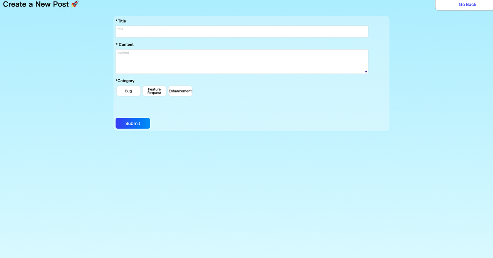

# Feedback Tool: A Nod to Canny

## Introduction

This guide explains how to use Momen's Canny-like Feedback Tool template to build an effective feedback management and product iteration platform. Users can publicly post and vote on feedback for any product, while product teams can track progress and prioritize improvements based on user input.

## Page Overview

### 1. Register/Login

A simple login interface allows users to register when they first access the product.

.png)

### 2. Homepage

.png)

The homepage displays all collected feedback. Users can upvote and comment on each feedback item. The "New" and "Trending" tabs allow sorting by time or popularity. An integrated search box helps users quickly find relevant feedback.

### 3. Feedback Detail

Clicking a feedback card opens the detail page, where users can view the full content and participate in discussions related to that feedback.

.png)

### 4. Create New Posts

Click the "Create a New Post" button to write and submit new feedback.

## Configuring Data

### Step 1: Understand the Data Model

In the upper-left corner of the editor, you can view the structure of the project's data tables. Start by understanding how the main tables relate to the information displayed on each page.

.png)

### Step 2: Manipulate Data in the Database

You can directly add, edit, or delete data in the database. Changes are reflected dynamically on the frontend without additional configuration.

.png)

.png)

## Deploying the Project

### Step 1: Preview

After completing your content and configuration, preview your website. This process usually takes about one minute. Upon successful preview, you will receive a link to a trial version of the site and a corresponding QR code.

.png)

.png)

### Step 2: Publish

If everything looks correct and you have verified all content, click "Publish" to make your website live. After publishing, you will receive an official link to your feedback management platform.

**Congratulations!**  
Your feedback management platform is now ready to use.

---

## About Momen

[Momen](https://momen.app/?channel=blog-about) is a no-code web app builder that enables users to create fully customizable web apps, marketplaces, social networks, AI apps, enterprise SaaS solutions, and more. Iterate and refine your projects in real time for a seamless creation process. Momen also offers robust API integration, allowing you to connect your projects to any required service. Bring your ideas to life and launch your web app products faster than ever with Momen.
