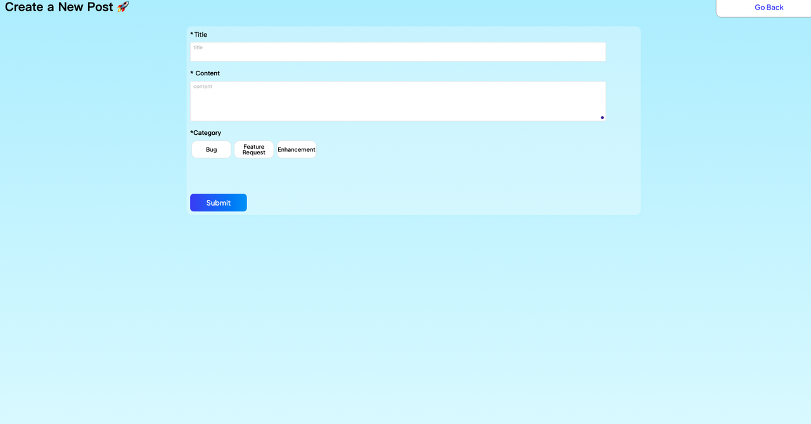

# Feedback Tool, a nod to Canny

### **Introduction**  &#x20;

Users can publicly post and vote on feedback for any product. Meanwhile, the product team can synchronize progress based on user feedback. Serving as a project management tool, this template makes product iteration and feedback collection more effective.

### **I. Page Introduction**

1. **Register/Login**

A simple login interface. Users need to register when they first access the product.

<figure><figcaption></figcaption></figure>

2. **Homepage**

<figure><figcaption></figcaption></figure>

\
The page displays all the feedback collected. On the feedback list, users can upvote and comment on each feedback. By clicking the tab New and Trending, you'll see the feedback sorted in different ways, organized by popularity or time order. An integrated search box provides essential navigational functionality within the list view.

3. **Feedback Detail**

By clicking on the feedback card, you'll be directed to the detail, where the content of the feedback is displayed in detail. Additionally, users can engage in discussions related to this specific feedback.

<figure><figcaption></figcaption></figure>

4. **Create New Posts**&#x20;

By clicking the Create a New Post button, users can write and publish their feedback.

<figure><figcaption></figcaption></figure>

### **II. How to Configure Data**

#### **Step 1: Learn How Data Model Works**

Situated in the upper-left of the editor, we can view that the structure of the project's data tables is available for inspection. The initial need is to comprehend the association between several main tables and their corresponding informational segments displayed on the page.

<figure><figcaption></figcaption></figure>

#### **Step 2: Data Manipulation in Database**

We can directly manipulate data in database. Without the need to modify the frontend, data stored in database is dynamic.

<figure><figcaption></figcaption></figure>

.png>)

### **III. How to Deploy the Project**

#### **Step 1: Preview**

By reaching this stage, you have completed 99% of the content. Now, let's proceed to preview our website. This process typically necessitates an approximate one-minute wait. Upon successful preview, you will obtain a link to a trial version of the webpage as well as a corresponding QR code.

<figure><figcaption>
Pre-release the project
</figcaption></figure>

<figure><figcaption>
Successful Pre-release, publish Button Activated
</figcaption></figure>

#### **Step 2: Publish**

If everything looks good and you have checked for any errors, click on Publish to publish the website. Upon successful publication, an official link to the webpage will be made available.

Congratulations! After completing the aforementioned steps, your Feedback management platform is now ready to operate.

If you encounter any issues during the process, feel free to join our [Discord community](https://discord.com/invite/UCyhySSXfz.) for assistance.

### **About Momen**

[Momen](https://momen.app/?channel=blog-about) is a no-code web app builder, allows users to build fully customizable web apps, marketplaces, Social Networks, AI Apps, Enterprise SaaS, and much more. You can iterate and refine your projects in real-time, ensuring a seamless creation process. Meanwhile, Momen offers powerful API integration capabilities, allowing you to connect your projects to any service you need. With Momen, you can bring your ideas to life and build remarkable digital solutions and get your web app products to market faster than ever before.
