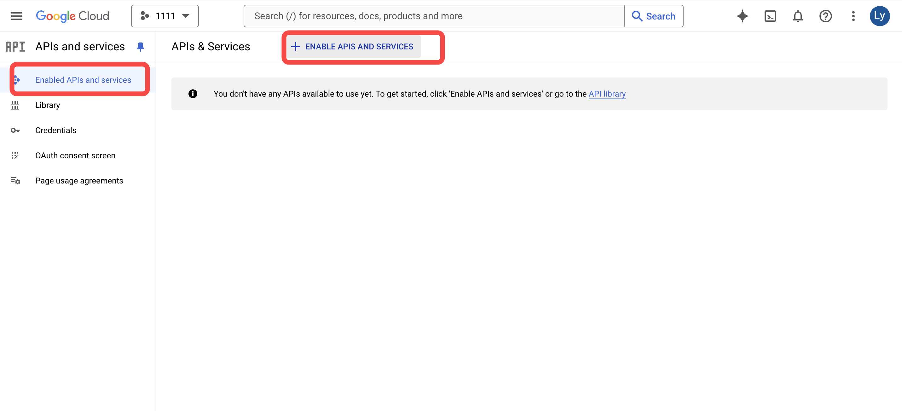

# Mobile Auto Repair AI Scheduler

## Overview

This template provides an end-to-end solution for mobile auto repair scheduling. When a customer initiates a conversation, the assistant AI helps identify the car issue and provides a cost estimate. Subsequently, the scheduler AI books a repair appointment in the vendor’s calendar.

To enable AI-powered scheduling, you must add your own [API key](https://youtu.be/hX4J8898hM0). Detailed configuration instructions are provided below.

> **Note:** Only staff members can access and log in to the dashboard. Assign the necessary permissions in your project settings as described later in this guide.

## Data Model

The following diagram illustrates the basic data model used in this template:

.png)

%20(1).png)

.png)

- **Car Maker to Car Model:** One car maker can have multiple car models (1:N).
- **Repair Category to Repair Item:** One repair category can include multiple repair items (1:N).
- **Cost Estimate:** Generated based on the selected car model and repair items.

---

## Business Logic

This template includes two AI agents: a customer service agent for recording car issues and a scheduling assistant for booking appointments in the vendor's calendar.

### Customer Service Agent

.png)

- Operates during the customer conversation.
- Updates the data table in real time as the conversation progresses.
- Records car models and locations as selected by the user.
- Assesses and updates car issues.

### Scheduling Assistant

.png)

- Activated after an order is created.
- Schedules the repair event in the vendor's calendar.

#### Work Order Statuses

You can customize these status names as needed:

1. **Pending** – Conversation started; gathering information.
2. **Chat to Issue** – User provides information; AI assesses the issue.
3. **To Be Confirmed** – Issue confirmed; awaiting staff approval for the appointment.
4. **Confirmed** – Appointment successfully scheduled.

---

## Configuration Guide

This section explains how to configure the AI agents.

### 1. Customer Service AI

.png)

**Purpose:**  
Collects detailed descriptions of car issues from users, organizes information for mechanics, and estimates repair time and cost.

**Tools:**

- Search for repair items based on user input.
- Retrieve quotes using car model and repair item details.
- Modify and query user work orders.

**Inputs:**  
User messages, `car_model_id`, `work_order_id`.

**Configuration Steps:**

1. **Set up AI tools:**
   - Search repair items.
   - Retrieve quotes based on car model and repair items.
   - Query and update work orders.

   .png)

2. **Configure a knowledge base** for car repair categories and specific issues for the AI to reference.

   > **Tip:**  
   > Use a knowledge base for dynamic, frequently changing information instead of hardcoding data into prompts. This approach eliminates the need to update prompts whenever issues change.

   
   
   

3. **Adjust AI prompts** as needed to refine responses.

---

### 2. Scheduler AI

.png)

**Purpose:**  
Schedules appointments for mechanics.

**Required Data:**  
Google Calendar token.

**Tools:**

- Time zone conversion.
- Distance calculation between locations.
- Query and create Google Calendar events.

**Inputs:**  
Location, preferences, date, time zone, duration.

**Configuration Steps:**

- Set up tools for the AI:
  - Retrieve Google Calendar information.
  - Calculate distances and travel time.
  - Create calendar events.

  .png)

- Adjust prompts as needed for your workflow.

---

## Usage Guide

> **Before you begin:**  
> Configure your own API so the AI can schedule events in your calendar. Adjust permission settings to ensure only staff can manage the dashboard, while users have access only to the conversation page.

### 1. Google Calendar Setup

1. Log in to [Google Cloud Console](https://console.cloud.google.com/).
2. Create a new project.

   .png)

3. Enable the Google Calendar API.

   

4. Create credentials (set redirect URI to [https://developers.google.com/oauthplayground](https://developers.google.com/oauthplayground)).

   
   
   

5. Download the credentials JSON file to obtain your `client_id` and `client_secret`.

   

6. Add your Google account as a test user.

   

7. Obtain the refresh token:
   1. Visit [Google OAuth Playground](https://developers.google.com/oauthplayground/)
   2. Enter your `client_id` and `client_secret`.

      .png)

   3. Click **Authorize APIs** and log in with your Google account.

      .png)

   4. Obtain the `refresh_token`.

      .png)

   5. In Momen’s API module, set the `client_id`, `refresh_token`, and `client_secret` as default values.

### 2. Google Maps Platform Setup

1. Enable the Distance Matrix API in Google Cloud Console.

   .png)

2. Follow the instructions to obtain your API key.

   .png)

3. Add the API key to the AI's configuration in Momen.

   .png)

### 3. Permission Setup

1. Register a new account.

   .png)

2. Edit account permissions in the editor.

   [Watch the permission setup tutorial](https://youtu.be/_s986Zbyp9M)

### 4. Google Auth Refresh Token Automation

The refresh token expires every 24 hours. Set up an automated process to renew it and ensure uninterrupted calendar integration.

---

## About Momen

[Momen](https://momen.app/?channel=blog-about) is a no-code web app builder that enables users to create fully customizable web apps, marketplaces, social networks, AI apps, enterprise SaaS solutions, and more. Iterate and refine your projects in real time for a seamless creation process. Momen also offers robust API integration, allowing you to connect your projects to any required service. Bring your ideas to life and launch your web app products faster than ever with Momen.
