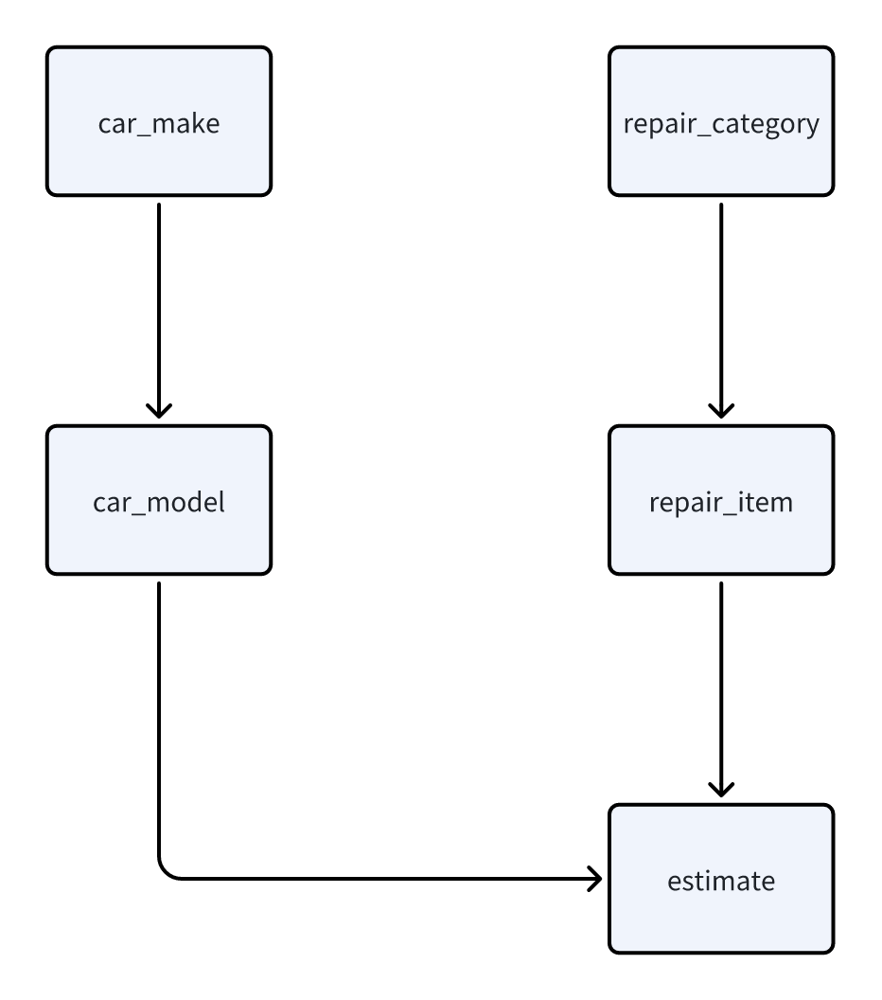
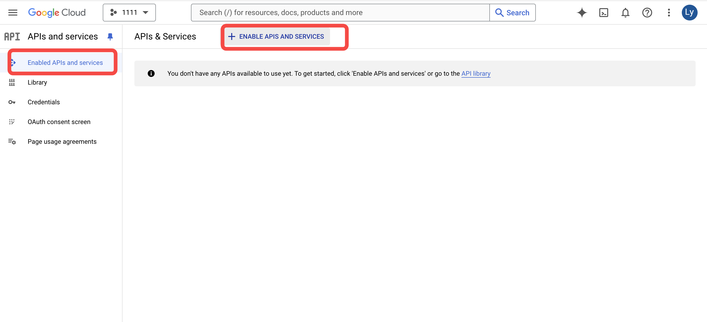
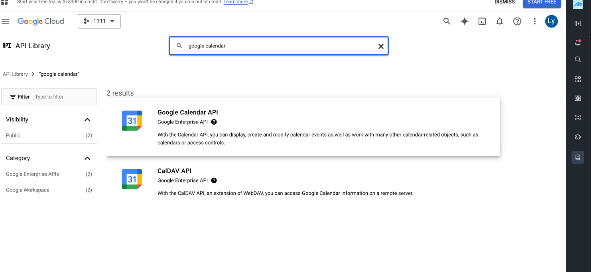

# Mobile Auto Repair Appointment Assistant

### **Overview**

This template follows a simple process. When a customer starts a conversation, the assistant AI helps identify the car issue and provides a cost estimate. After that, the scheduler AI books the repair appointment in the vendor’s calendar.


To enable the AI to schedule appointments in your calendar, you’ll need to add your own API key. Detailed instructions for configuring the API are provided below.





Only staff members can access and log in to the dashboard. You’ll need to assign the necessary permissions in your project settings. Details are provided below.


***

### **Data Model**

Below is the basic data model setting in this template.&#x20;

\

<figure><figcaption></figcaption></figure>

<figure><figcaption></figcaption></figure>

The relation between car maker and car model is 1:N, because one brand could have multiple car models. The relation between repair category and repair item is 1:N because 1 category could have different issues. Based on car model and repair issues, a cost estimate is generated.

***

### **Business Logic**

Here’s the business logic behind the template, which you can also view as its workflow. We have two AI agents in this template. A customer service that help to record user's car issues and a scheduling assistant that helps to make the schedule in vendor's calendar.

**Customer Service**

<figure><figcaption></figcaption></figure>

This is the logic of the customer service AI. This AI works mainly during the conversation. As the conversation progresses, the data table updates in real-time. Car models and locations are recorded as the user selects them, while the AI assesses and updates the car’s issues.

**Scheduling Assistant**

<figure><figcaption></figcaption></figure>

It operates after an order is created, handling the task of scheduling the event for the vendor.

The following is the explanation of different work order status. You can customize the name when you use this template.

1. **Pending** – Conversation starts, gathering information.
2. **Chat to Issue** – User inputs the information and  AI assesses the issue.
3. **To Be Confirmed** – The issue has been confirmed, waiting for staff to confirm the appointment.
4. **Confirmed** – Appointment scheduled successfully.

***

### Configuration Guide

&#x20;This section is the configuration of the AI.

1. **Customer Service AI**

<figure><figcaption></figcaption></figure>

**Purpose**:&#x20;

Gathers detailed descriptions of car issues from the user, organizes information for the mechanic, and estimates repair time and cost.

**Tools**:

* Find repair items based on user input.
* Retrieve quotes using car model and repair item details.
* Modify and query user work orders.

**Input**:&#x20;

User messages, car\_model\_id, work\_order\_id.

**Steps**:

1. Set up tools for the AI:

* Search repair items.
* Retrieve quotes based on car model and repair items.
* Query and update work orders.

<figure><figcaption></figcaption></figure>

2. Configure a knowledge base for car repair categories and specific issues for the AI to query.


Unlike hardcoding data directly into the prompt, a knowledge base is ideal for dynamic, frequently changing information. This approach prevents the need to update the prompt constantly, as the issues may vary each time.


<figure><figcaption></figcaption></figure>

 

<figure><figcaption></figcaption></figure>

 

<figure><figcaption></figcaption></figure>

3. Adjust the AI prompts as needed.

***

2. **Scheduler AI**

<figure><figcaption></figcaption></figure>

**Purpose**: Schedules appointments for mechanics.

**Data**: Google Calendar token.

**Tools**:

* Time zone conversion.
* Calculate distances between locations.
* Query and create Google Calendar events.

**Input**: Location, preferences, date, time zone, duration.

**Steps**:

*   Set up tools for the AI:

    * Retrieve Google Calendar info.
    * Calculate distances and travel time.
    * Create calendar events.

    <figure><figcaption></figcaption></figure>
* Adjust the prompts as needed.

***

### Usage Guide


Before using this template, you'll need to configure your own API so the AI can schedule events in your calendar. Additionally, you’ll need to adjust the permission settings to ensure that only you and your staff can manage the dashboard, while users only have access to the conversation page.

You'll also need to set up the permission setting so that only you and your staff can manage the dashboard, while your users can only access the conversation page.


#### **1. Google Calendar Setup**

1. Log in to Google Cloud Console: [https://console.cloud.google.com/](https://console.cloud.google.com/)
2. Create a new project.&#x20;

<figure><figcaption></figcaption></figure>

3. Enable the Google Calendar API.&#x20;

<figure><figcaption></figcaption></figure>

<figure><figcaption></figcaption></figure>

4. Create credentials (redirect URI: [https://developers.google.com/oauthplayground](https://developers.google.com/oauthplayground)).&#x20;

<figure><figcaption></figcaption></figure>

 

<figure><figcaption></figcaption></figure>

 

<figure><figcaption></figcaption></figure>

5. Download the credentials JSON file to get your client\_id and client\_secret.&#x20;

<figure><figcaption></figcaption></figure>

6. Add your Google account as a test user.&#x20;

<figure><figcaption></figcaption></figure>

7. Get the refresh token:
   1. Visit: [https://developers.google.com/oauthplayground/](https://developers.google.com/oauthplayground/)
   2. Set up the client\_id and client\_secret.&#x20;

<figure><figcaption></figcaption></figure>

3. Click "Authorize APIs" and log in with your Google account.&#x20;

<figure><figcaption></figcaption></figure>

4. Obtain the refresh\_token.&#x20;

.png>)

5. In Momen’s API module, set the client\_id, refresh\_token, and client\_secret as default values.&#x20;

#### **2. Google Maps Platform Setup**

1. Enable the Distance Matrix API in Google Cloud Console.&#x20;

<figure><figcaption></figcaption></figure>

2. Follow the instructions to get your API key.&#x20;

<figure><figcaption></figcaption></figure>

3. Add the API key to the AI's description in Momen.&#x20;

<figure><figcaption></figcaption></figure>

#### **3. Permission Setup**

1. Register a new account.&#x20;

<figure><figcaption></figcaption></figure>

2. Edit account permissions in the editor.&#x20;



**4. Google Auth Refresh Token Setup**&#x20;

The refresh token expires every 24 hours. You'll need to set up an automated process to renew it.

#### About Momen 

[Momen](https://momen.app/?channel=blog-about) is a no-code web app builder, allows users to build fully customizable web apps, marketplaces, Social Networks, AI Apps, Enterprise SaaS, and much more. You can iterate and refine your projects in real-time, ensuring a seamless creation process. Meanwhile, Momen offers powerful API integration capabilities, allowing you to connect your projects to any service you need. With Momen, you can bring your ideas to life and build remarkable digital solutions and get your web app products to market faster than ever before.
