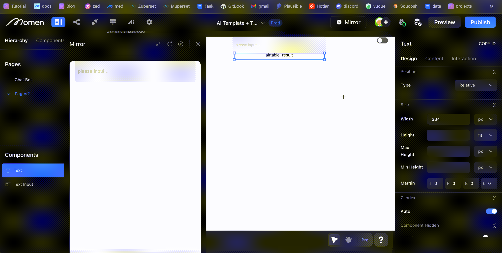

# Airtable

### Introduction

Before starting, please make sure you have read and get yourself familiar with [API Fundamentals](https://docs.momen.app/data/api/api-fundamentals). In this doc, we'll show you how to connect Airtable's API in Momen. By doing this, your app can access external data from Airtable.&#x20;

### Steps

1. #### Generating Your Tokens

Tokens play a critical role in accessing Airtable data, serving as the unique identifier for all operations within Airtable.

<figure><figcaption></figcaption></figure>

Navigate to "Create New Token," provide the necessary details, specify your access scopes, and generate your token. Ensure its security.

<figure><figcaption></figcaption></figure>

2. #### Choosing the Right API

The [Airtable API documentation ](https://airtable.com/developers/web/api/get-record)provides a straightforward explanation for fetching records, simplifying the process of accessing data from Airtable.

3. #### Testing the API in Postman

API documentation often includes "curl" commands, which can be executed in a terminal or imported into Postman for testing.

```SQL
curl "https://api.airtable.com/v0/{baseId}/{tableIdOrName}/{recordId}" \
-H "Authorization: Bearer YOUR_TOKEN"
```

Use the curl command with your specific base ID, table name or ID, and record ID, along with your token for authorization, to import the setup into Postman.

<figure><figcaption></figcaption></figure>

Fill in the required parameters to complete the setup.

<figure><figcaption></figcaption></figure>

<figure><figcaption></figcaption></figure>


4. #### Configuring the API in Momen

After verifying the API's functionality in Postman, the next step is to implement it within Momen, following a similar procedure.Start by creating an API entry and entering Debug mode.

<figure><figcaption></figcaption></figure>

Input the URL and header information as done in Postman.

<figure><figcaption></figcaption></figure>

Upon successful request, Momen will memorize the response, allowing you to save the configuration directly.

<figure><figcaption></figcaption></figure>

<figure><figcaption></figcaption></figure>

Adjust any necessary path parameters by entering Edit mode, specifying the parameter, and naming it appropriately before exiting.

<figure><figcaption></figcaption></figure>

5. #### Calling the API

You are now ready to utilize the configured API, such as retrieving data using a record\_id from an input fieldSwitch the API request type to Mutation to trigger the desired action.

<figure><figcaption></figcaption></figure>

<figure><figcaption></figcaption></figure>

Incorporate a Page Data and Text component on your page, linking the Page Data to the Text component for dynamic content display.

<figure><figcaption></figcaption></figure>

<figure><figcaption></figcaption></figure>

Configure the API to react to changes in the Text Input component, ensuring the "record\_id" field utilizes the input component's value for real-time updates.

<figure><figcaption></figcaption></figure>

<figure><figcaption></figcaption></figure>

When successful, assign a value to Page Data.

<figure><figcaption></figcaption></figure>

We can see the effect in Mirror.

<figure><figcaption></figcaption></figure>


#### **About Momen**

[Momen](https://momen.app/?channel=blog-about) is a no-code web app builder, allows users to build fully customizable web apps, marketplaces, Social Networks, AI Apps, Enterprise SaaS, and much more. You can iterate and refine your projects in real-time, ensuring a seamless creation process. Meanwhile, Momen offers powerful API integration capabilities, allowing you to connect your projects to any service you need. With Momen, you can bring your ideas to life and build remarkable digital solutions and get your web app products to market faster than ever before.
