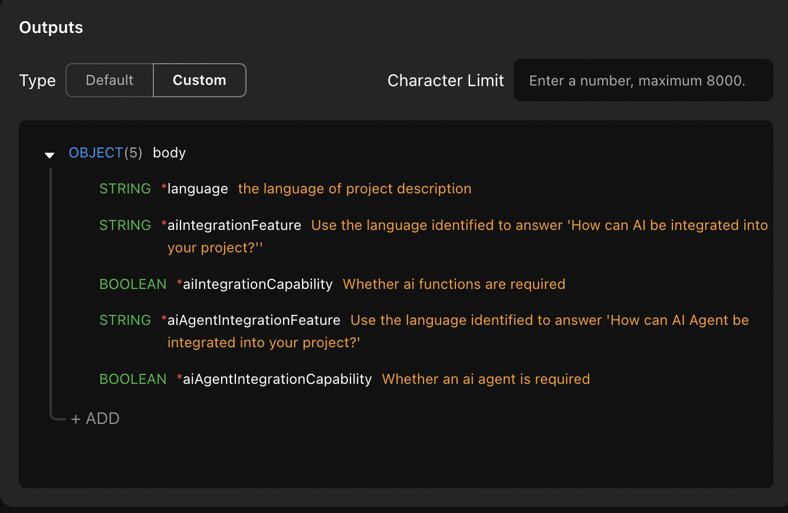

# How to Build an AI Needs Analysis Project?

### Introduction

This document will guide you through building a needs analysis bot using Momen AI. This project helps collect and analyze your customers' needs and provide advice. See how it works on [our website](https://momen.app/ai)!

This guide focuses on configuring AI for your website. For more on UI and interaction design, refer to [User Interface and Interaction Design](https://docs.momen.app/get-started/quick-start/user-interface-and-interaction-design)

### Data Storage

After setting up your UI and data input fields, ensure you have created data and relevant fields for storing information.

### Configure Your AI

Before proceeding, review [AI configuration](https://docs.momen.app/ai/ai-configuration).

Navigate to AI configuration via the top bar in the Momen editor. Click "Create" to configure your AI. Name your AI "Project Analysis Assistant."

<figure><figcaption></figcaption></figure>

<figure><figcaption></figcaption></figure>

Select your AI model.

<figure><figcaption></figcaption></figure>

The input section is where users input their needs. Reference this input in the prompt by clicking the "+" and choosing the input, so the AI can recognize it.

<figure><figcaption></figcaption></figure>

Define your AI's role in the task role section. Here, we set it as Momen's expert. In task details, specify what you want your AI to do. Structure your task details step-by-step to guide the AI in answering. Outline requirements and how the AI should ask questions in task constraints. In this project, we required brief and concise answers. Below is an example prompt.

<figure><figcaption></figcaption></figure>

In the contexts section, choose the data sources you want the AI to use when answering questions. Whether from Momen's database, API, or local files, your AI will retrieve facts from the knowledge base for more accurate and fact-based answers.

<figure><figcaption></figcaption></figure>

Output configuration determines the format of the AI's answers. If you choose the default, the AI will output results based on your input.&#x20;

For example, if there are no output format restrictions in your task constraints, the output could be a number for data calculation or a text for writing an article. If you choose custom, the results will be in JSON format. Define the content to include specific fields and their meanings. The AI will output the results in JSON format, allowing you to read the data like a data table. In this project, we use custom output for a structured answer.

<figure><figcaption></figcaption></figure>

Once all configurations are done, test to ensure it works as expected. Adjust prompts based on the results.

<figure><figcaption></figcaption></figure>

#### Apply Your AI on the Frontend

To receive AI request results, add page data and the necessary parameters. For this case, we added parameters related to two questions the AI will analyze.

<figure><figcaption></figcaption></figure>

Configure actions for the button component. In the action configuration, request AI and set page data. The value of page data would be the content from AI result data. Below is the action configuration in this project.

<figure><figcaption></figcaption></figure>

Preview and publish your project. Done!

<figure><figcaption></figcaption></figure>

If you encounter any issues during the process, feel free to join our [Discord community](https://discord.com/invite/UCyhySSXfz) for assistance.

### About Momen

[Momen](https://momen.app/?channel=blog-about) is a no-code web app builder, allows users to build fully customizable web apps, marketplaces, Social Networks, AI Apps, Enterprise SaaS, and much more. You can iterate and refine your projects in real-time, ensuring a seamless creation process. Meanwhile, Momen offers powerful API integration capabilities, allowing you to connect your projects to any service you need. With Momen, you can bring your ideas to life and build remarkable digital solutions and get your web app products to market faster than ever before.
