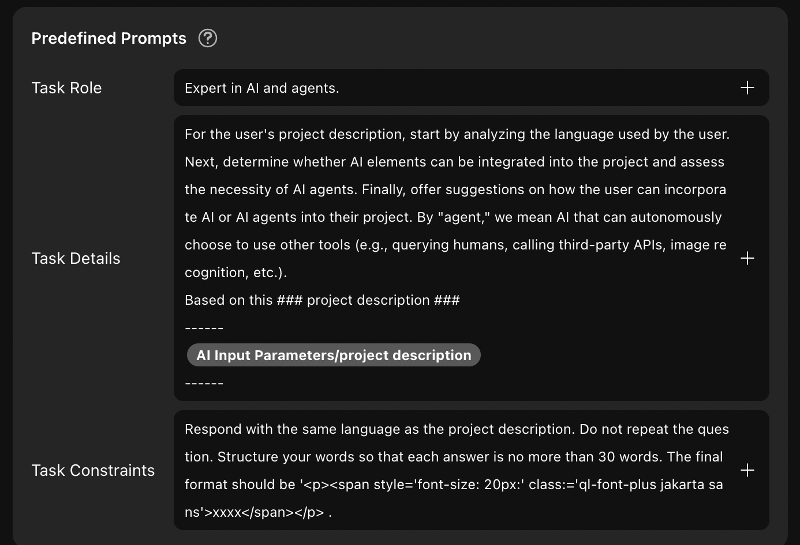

# How to Build an AI Needs Analysis Project

## Introduction

This guide walks you through building a needs analysis bot using Momen AI. The bot collects and analyzes customer needs and provides tailored advice.  
See a live example at [Momen AI](https://momen.app/ai).

For UI and interaction design, see [User Interface and Interaction Design](https://docs.momen.app/get-started/quick-start/user-interface-and-interaction-design).

---

## Step 1: Data Storage

- Prepare your UI and data input fields.
- Create data models and fields to store customer information.  
  This ensures the AI has access to relevant data for analysis.

---

## Step 2: Configure Your AI

- Review [AI configuration](https://docs.momen.app/ai/ai-configuration).
- In the Momen editor, go to AI configuration and click "Create."
- Name your AI (e.g., "Project Analysis Assistant").

- Select your AI model.

- In the input section, reference user input in the prompt by clicking "+" and selecting the input field.

- Define the AI's role and task details.  
  - Set the role (e.g., Momen expert).
  - In task details, outline step-by-step instructions for the AI.
  - Use task constraints to specify requirements (e.g., concise answers).

- In the contexts section, select data sources (Momen database, API, or local files) for the AI to use.  
  This enables fact-based, accurate answers.

- Configure output format:
  - **Default:** AI outputs results based on input (number, text, etc.).
  - **Custom:** Define output as JSON with specific fields for structured results.

.png)

- Test your AI and adjust prompts as needed.

---

## Step 3: Apply Your AI on the Frontend

- Add page data and parameters for the AI request (e.g., parameters for two analysis questions).

- Configure button actions:
  - Request AI.
  - Set page data with the AI result.

---

## Step 4: Preview and Publish

- Preview your project to ensure everything works as expected.
- Publish your needs analysis bot.

---

## About Momen

[Momen](https://momen.app/?channel=blog-about) is a no-code web app builder that enables users to create fully customizable web apps, marketplaces, social networks, AI apps, enterprise SaaS, and more. Momen supports real-time iteration, powerful API integration, and rapid product launch.
