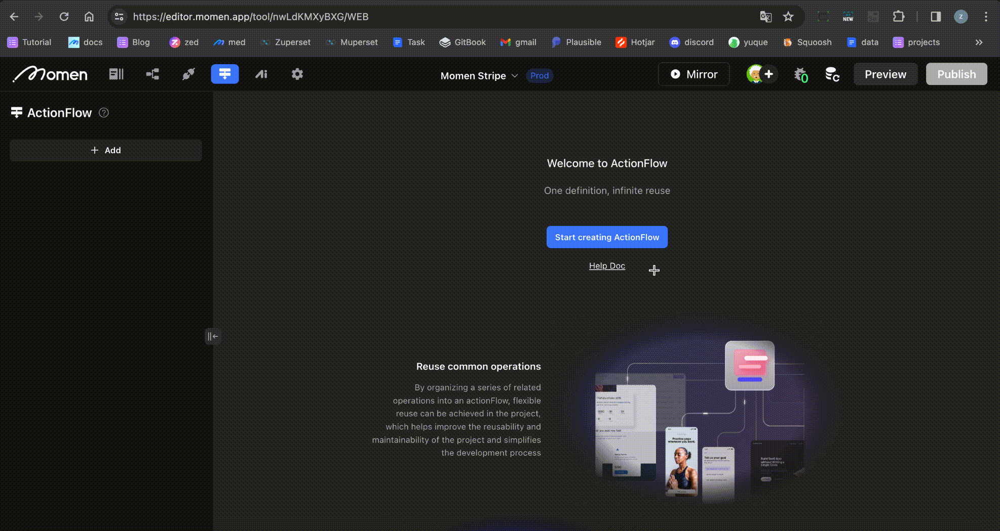
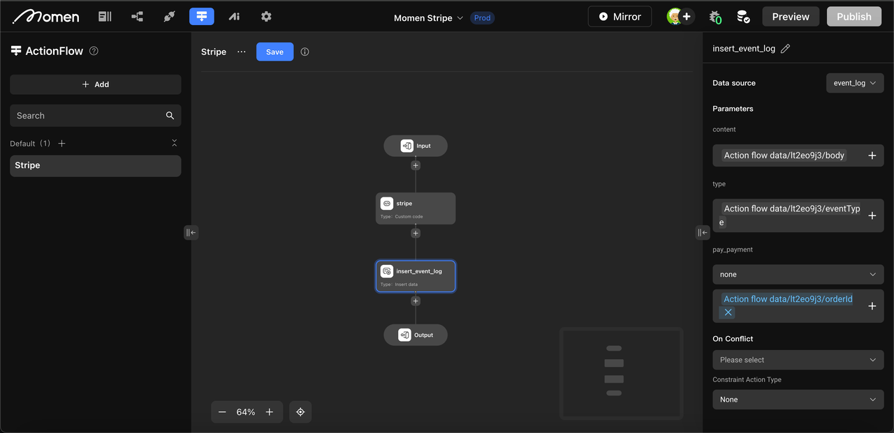
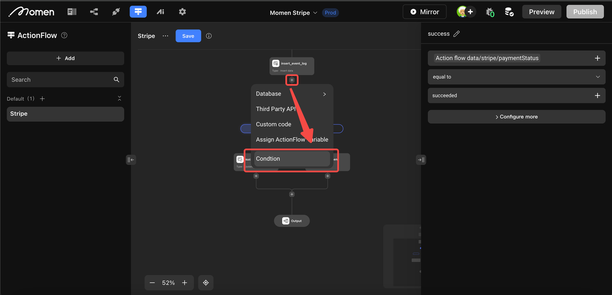
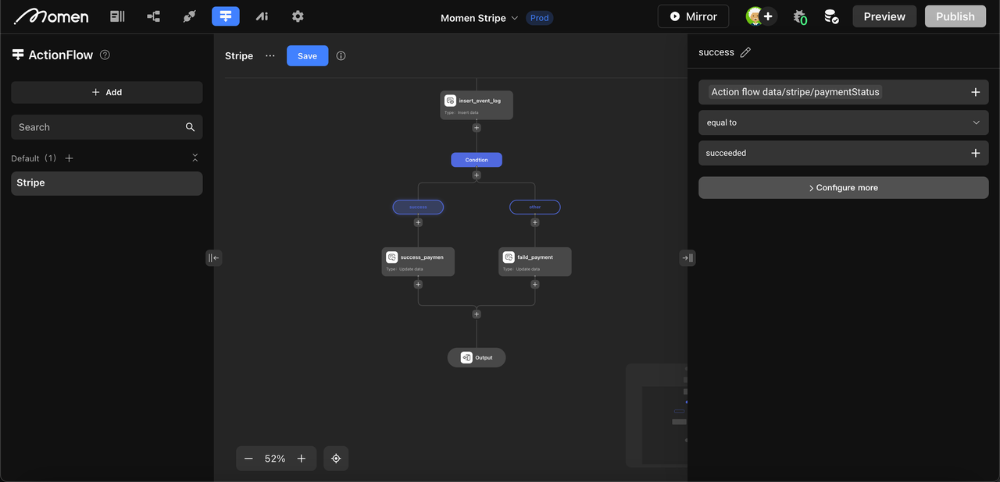
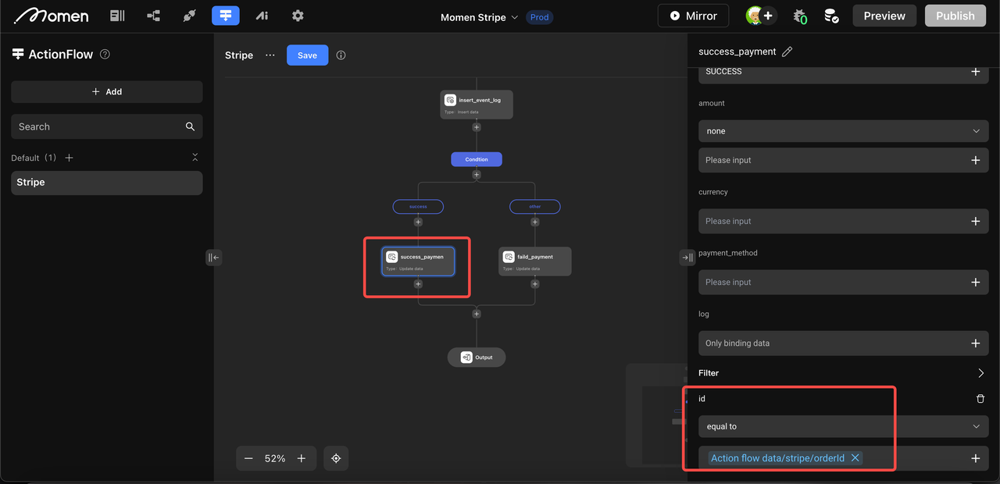
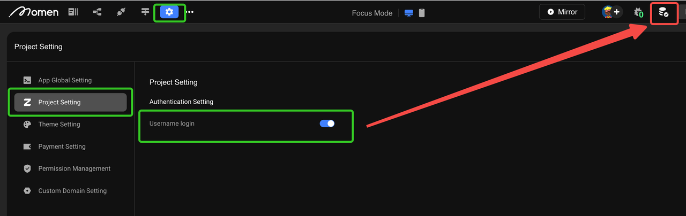
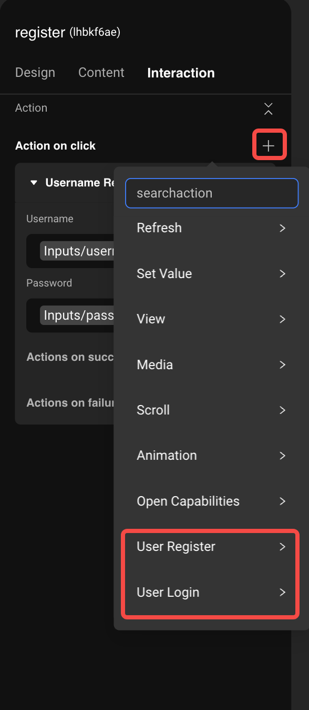
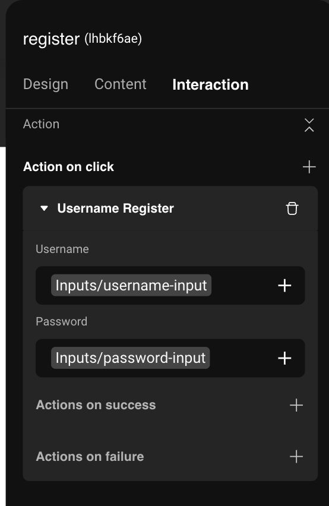
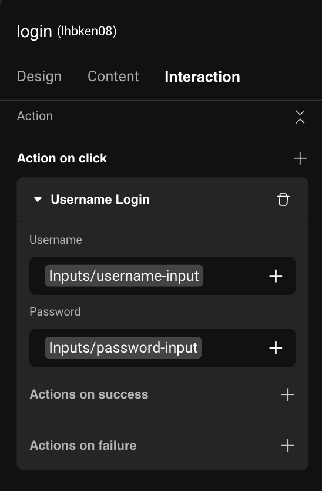
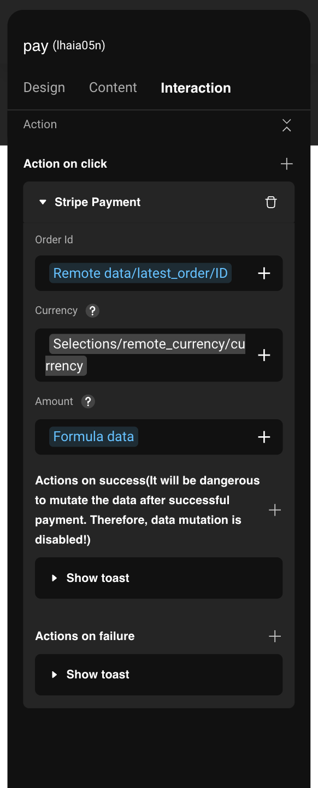

# How to Set Up Payment with Stripe Plugin?

### Introduction

In this document, we will use Stripe's test mode to provide an example of configuring Stripe on Momen. It is recommended to go through the entire payment process in test mode before actual configuration.&#x20;

&#x20;A project example:  [https://editor.momen.app/tool/nwLdKMXyBXG/WEB?code=cLtSsuCGhuPaN](https://editor.momen.app/tool/nwLdKMXyBXG/WEB?code=cLtSsuCGhuPaN)&#x20;

<figure><figcaption></figcaption></figure>

### &#x20;Detailed Steps

1. #### Create a Stripe Action Flow in Momen

And configure Stripe Callback in Trigger.&#x20;

<figure><figcaption></figcaption></figure>

2. #### Configure Webhook in Stripe

You can directly open [https://dashboard.stripe.com/test/webhooks](https://dashboard.stripe.com/test/webhooks), or click Developers -> Webhooks to check the endpoints created.&#x20;

<figure><figcaption></figcaption></figure>

Fill in the Callback URL created earlier in Momen in the EndPoint URL, and add the following two events.

<figure><figcaption></figcaption></figure>

Finally, your page should look like below, then click Add endpoint, Stripe will start listening to the events coming from this Call Back.&#x20;

<figure><figcaption></figcaption></figure>

<figure><figcaption></figcaption></figure>

3. #### Configure Payment Settings in Momen

<figure><figcaption></figcaption></figure>

Stripe PublicKey & Secret key: Can be found in [https://dashboard.stripe.com/test/apikeys](https://dashboard.stripe.com/test/apikeys) (test mode)&#x20;

<figure><figcaption></figcaption></figure>

CallBack URL is the URL we created in the first step, endpoint secret can be found on the Webhook page.&#x20;

<figure><figcaption></figcaption></figure>

Save and deploy the database.&#x20;

<figure><figcaption></figcaption></figure>

<figure><figcaption></figcaption></figure>

4. #### Create an Appropriate Data Model in Momen

Generally speaking, configuring payments is for purchasing, so there will be models like orders.&#x20;

It should be noted that Stripe's orders can be paid multiple times, so if in your logic, an order can only be paid once, some restrictions on the payment logic need to be made (users do not have permission to pay an order that has been paid/a single order may have multiple transaction records).&#x20;

Below is an example of one way to handle this, it's important to note: that different handling methods may have different data models.

* Add a payment data model to record order ID, stripe payment ID, payment status (order\_id, stripe\_payment\_id, status, amount, currency, description, payment\_method), use the payment's id as the order ID for the payment action.
* Add an event\_log data model to record different stages of payment events (content, type, payment\_id, stripe\_payment\_id), such as creation, in progress, failure, success, etc.
* When successful, add an event\_log record, change the payment status to succeeded, stripe\_payment\_id to the returned payment id, change the original order's payment status to paid.&#x20;
* When failed, add an event\_log record, change the payment status to payment\_failed, stripe\_payment\_id to the returned payment id.
* When the return type is other statuses, change the payment's stripe\_payment\_id to the returned payment id, add an event\_log record.

The data model is shown in the following image.&#x20;

<figure><figcaption></figcaption></figure>

5. #### Modify the ActionFlow in Momen

Actually, by now, we can request Stripe's payment interface through the payment call in the action, but we still need to parse and invoke the result of the payment, which will ultimately be completed in the actionflow. First, we need to add a custom code node

```javascript
const body = context.getArg('fz_payment_callback_input');
const eventType = body.type;
const stripeObject = body.data.object;
const stripePaymentId = stripeObject.id;
const orderId = context.getOrderIdByStripePaymentId(stripePaymentId);
const paymentStatus = stripeObject.status;
context.setReturn('eventType', eventType);
context.setReturn('orderId', orderId);
context.setReturn('paymentStatus', paymentStatus);
context.setReturn('body', JSON.stringify(body));
```

The 'fz\_payment\_callback\_input' in the code is a parameter custom-defined inside Momen, it will get the result of this payment given by Stripe, then we divide it into four parameters and return them through the setReturn function defined by Momen, and remember to output these parameters in this step, so they can be used in later steps.&#x20;

<figure><figcaption></figcaption></figure>

The second step is to create an event\_log for this order.

<figure><figcaption></figcaption></figure>

The last step is to modify the corresponding payment order according to the returned status, we need to use Condition.

<figure><figcaption></figcaption></figure>

Then accordingly, perform different actions for different results.&#x20;

<figure><figcaption></figcaption></figure>

<figure><figcaption></figcaption></figure>

6. #### Call Stripe in Momen

To make the call in the web, it is usually done in the event of a button clickIt is important to note that:

1. Users must be logged in before initiating payment, so registration and login actions need to be configured before initiating payment.
2. Configuration steps

a. Open the user login on the settings page and deploy the database.

<figure><figcaption></figcaption></figure>

b. Add registration and login actions to different buttons respectively.&#x20;

<div>

<figure><figcaption></figcaption></figure>

 

<figure><figcaption></figcaption></figure>

 

<figure><figcaption></figcaption></figure>

</div>

After configuring registration and login, we can call Stripe. Following is the configuration interface.&#x20;

<figure><figcaption></figcaption></figure>

1. Order ID: A long integer, the same order can be paid multiple times (not unique), users need to limit the order to be unique in logic to avoid duplicate payments.
2. Currency: Supported currencies 👉[https://stripe.com/docs/currencies#supported-payment-methods](https://stripe.com/docs/currencies#supported-payment-methods)
3. Amount: Needs to be converted to the smallest currency unit 👉([https://stripe.com/docs/currencies#zero-decimal](https://stripe.com/docs/currencies#zero-decimal))
4. Payment method: Only supports bank cards by default, no need to fill in.
5. Actions on success/failure: Configure what actions need to be done when the user succeeds/fails in payment respectively (e.g., show toast).


### About Momen

[Momen](https://momen.app/?channel=blog-about) is a no-code web app builder, allows users to build fully customizable web apps, marketplaces, Social Networks, AI Apps, Enterprise SaaS, and much more. You can iterate and refine your projects in real-time, ensuring a seamless creation process. Meanwhile, Momen offers powerful API integration capabilities, allowing you to connect your projects to any service you need. With Momen, you can bring your ideas to life and build remarkable digital solutions and get your web app products to market faster than ever before.
