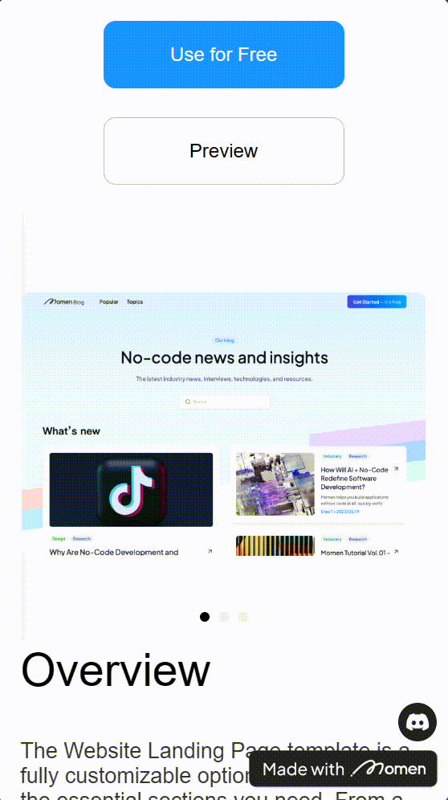

# Horizontal List

### Introduction

Discover how to effectively use Horizontal Lists for dynamic data display in your web applications. Explore attributes, customization options, and essential tips to elevate your web development skills.

### Usage Scenario

Horizontal Lists are used when you need to display multiple pieces of data horizontally.For more information on arrays, read the following documents, which are difficult to understand but suitable for the in-depth use of list-like components.

#### Utilization

1. Top poster (banner bit, rotating image, bulletin board, running light-winning effect).
2. Horizontal page flip.


Tips:

There is no difference between \[Horizontal List] and \[List], except that \[Horizontal List] is for horizontal navigation, while \[List] is vertical.


### Attribute

#### Horizontal Blanks

Horizontal blanks refer to the interval between each column of data. You can find more details on this attribute in the specific "[List](list.md)" documentation.\

#### Clicking on " Paging Enabled" Will Bring up the Following Three Options

1. Autoplay: When turned on, it will automatically play the next item at a default speed (speed modification not available currently).
2. Loop: Use with Autoplay to return to the first item when reaching the last one, creating a looping effect.
3. Indicator Dots: This option displays indicator points at the center of \[Horizontal List]. Style customization for indicator points will be available in the future.

<figure><figcaption></figcaption></figure>

<figure><figcaption></figcaption></figure>


Tips:

Standard posters or banner bits often use a Horizontal List with paging enabled for dynamic content.


### Blank-Container

After clicking on the Horizontal List, you can set the size of the Blank-Container, its background color, and other attributes.

<figure><figcaption></figcaption></figure>

If you encounter any issues during the process, feel free to join our [Discord community](https://discord.com/invite/UCyhySSXfz) for assistance.

### About Momen

[Momen](https://momen.app/?channel=blog-about) is a no-code web app builder, allows users to build fully customizable web apps, marketplaces, Social Networks, AI Apps, Enterprise SaaS, and much more. You can iterate and refine your projects in real-time, ensuring a seamless creation process. Meanwhile, Momen offers powerful API integration capabilities, allowing you to connect your projects to any service you need. With Momen, you can bring your ideas to life and build remarkable digital solutions and get your web app products to market faster than ever before.
