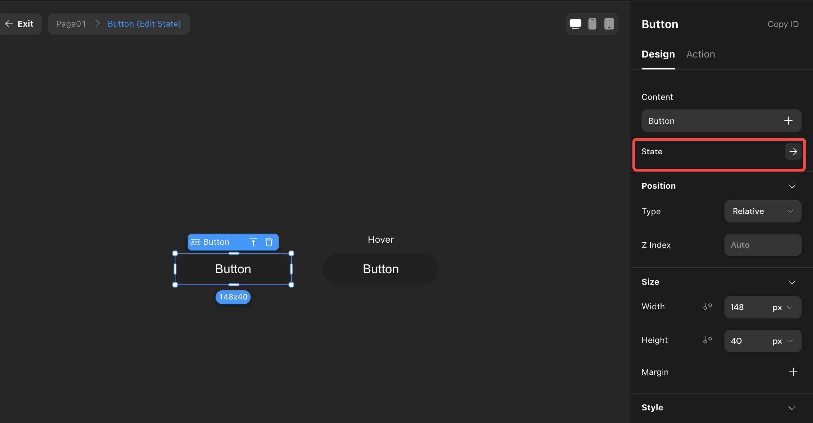

# Image

### Introduction

This tutorial introduces the attributes of image components, as well as how to set up images and bind data.\

### Application

The image component is used to display avatars, product images and more.\

### Image Design & Crop Mode

In the following example, the size of the picture component is 343\*152. When the picture crop mode is "Full Image", the picture will scale proportionally to fit the component, displaying the complete content with a background color outside the image. When the crop mode is "Fill Space", the image will be scaled to entirely fill the component, cropping any excess outside.

<figure><figcaption></figcaption></figure>

### Image Content

#### Local Data

As shown in the image below, when the image source is set to "Local Upload," you can upload images directly by clicking on the image area. The uploaded image will be previewed.

<figure><figcaption></figcaption></figure>

Tips: The size of the uploaded image can not exceed 30000px. The total pixels can not exceed 250 million px (width x height of the image).

Pixels of dynamic images (e.g. GIF images) are calculated as width \* height \* frames; pixels of non-dynamic images (e.g. PNG images) are calculated as width \* height.\

#### Data Binding

Tips:External data can only be bound if it is an image. Only a single image can be bound.Image file formats supported by Momen: jpg, png, svg, webp, gif

\
As shown in the image ⬇️, to bind an image, select "Data Binding," and click the "+" sign.

<figure><figcaption></figcaption></figure>

### SEO Alt Text

You can set alt text for the image component. The alt text functions as tags containing textual information about the image, which can assist search engines in understanding the image's content, helping with website Search Engine Optimization (SEO) to achieve higher rankings.

<figure><figcaption></figcaption></figure>

### Displaying Mock Assets

When the data source is dynamic data, it means it is sourced from a database through remote data or item data and would not show on canvas. However, you can employ mock assets to visualize the image's size and position during development (this is only visible in the Momen editor).&#x20;

As shown in the following image ⬇️, select the type of mock assets displayed in the "Preferences" at the user center.

<figure><figcaption></figcaption></figure>

The two virtual material display styles are shown below:

<figure><figcaption></figcaption></figure>

<figure><figcaption></figcaption></figure>

### Additional Functions of Images

You can zoom in and download, and forward the image by clicking the image on your phone. For more information, please refer to the tutorial [Image Downloading](broken-reference).

\
\
If you encounter any issues during the process, feel free to join our [Discord community](https://discord.com/invite/UCyhySSXfz) for assistance.

### About Momen

[Momen](https://momen.app/?channel=blog-about) is a no-code web app builder, allows users to build fully customizable web apps, marketplaces, Social Networks, AI Apps, Enterprise SaaS, and much more. You can iterate and refine your projects in real-time, ensuring a seamless creation process. Meanwhile, Momen offers powerful API integration capabilities, allowing you to connect your projects to any service you need. With Momen, you can bring your ideas to life and build remarkable digital solutions and get your web app products to market faster than ever before.
