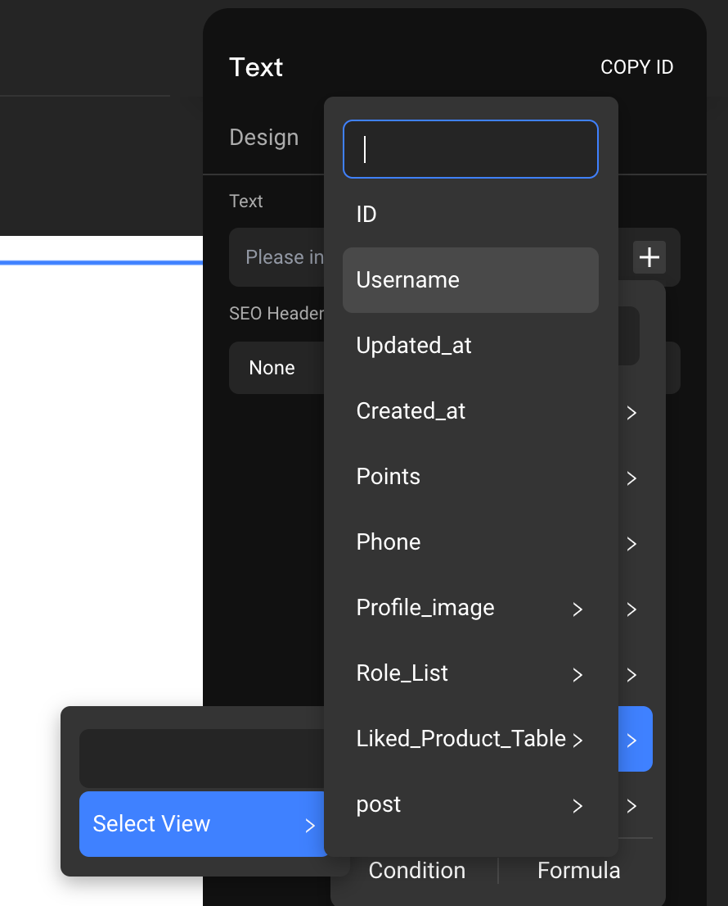

# Select View

### Introduction

Explore the \[Select View] component in Momen's tutorial. Discover its capabilities for intuitive option selection, styling, and versatile applications in web development.\
Select View is a "list-class" component with many of the same features as [List](https://docs.momen.app/component/list).

### Usage Scenario

The Select View component can be used when an 'option' selection is required, and it provides selected/unselected, single/multiple-choice functions.

* Answer Options: blue text on a blue background when selected, black text on a white background when unselected
* Product Category Selection
* Business Type Selection

<figure><figcaption></figcaption></figure>

### Select View Design

Select views can be seen as list with "selection" functionality, and they can be accessed by double-clicking inside the component. The component itself is called the parent container, and its internal container is the child container.

#### Parent Container Design

**Multiple Lines Display Content**

When we want to display the horizontal select view vertically, we can turn on \[Multiple Lines] and set the width of the select view to the same width as each item.

<figure><figcaption></figcaption></figure>

**Other Style Design**

When setting the border radius and background color of the parent container, the style changes are targeted to the outer layer of the component.

<figure><figcaption></figcaption></figure>

* Set container styles: for each item in the select view.

<figure><figcaption></figcaption></figure>

#### Sub-Container

A single sub-container can be edited by double-clicking the \[Select View] component. This sub-container encompasses two views: the \[Normal View] and the \[Select View]. Modifications to both views co-occur only when adjusting the container size. All other aspects, such as style and data, must be configured separately.

* Normal view: This view represents the appearance of the option when it is not selected.
* Select view: This view defines how the option appears when it is selected.

<figure><figcaption></figcaption></figure>

It's important to highlight that when choosing the view within the \[Button] component, specifically \[Normal View] and \[Select View], the typical approach is to start by adjusting the dimensions (width and height) as well as the background color of the \[Select View].&#x20;

If no background color change is needed, you can set the background color transparency to 0. Subsequently, you can fine-tune the button's style to achieve the desired effect, as illustrated in the following figure. In this setup, options are visually distinguished with a red background and white letters when selected, while unchecked options display a red border with black letters.

<figure><figcaption></figcaption></figure>

💡Tips:

* If the button components in the Normal View and Select View do not meet your business needs, you can also remove them and replace them with other components.
* To edit the Select View configuration itself, click the Preview Area below.

### Select View Contents

The \[Select View] component offers flexibility in data source selection, supporting both local and remote data. You can refer to our "[Data Retrieval and Display](https://functorz.feishu.cn/docx/F9D7dnJ4mondGYxiOQIcZStbnIf)" tutorial for comprehensive details.

#### Local Data

**Add options and default values:** When setting the default value, ensure it corresponds to one of the available options. For instance, if your options consist of "Basketball," "Soccer," and "Badminton," the default value should align with one of these three choices.&#x20;

**Once a default value is designated, the associated option will be automatically selected by default (as demonstrated in the example below, where "Basketball" is the default value).**

<figure><figcaption></figcaption></figure>

💡Tips:

Order of Options: When selecting a view to display options horizontally, the order of options from left to right is determined by the order of the contents of the \[Select View] from top to bottom.

**Binding Option Content**: Double click \[Select View] to enter the sub-container, bind option content for \[Normal View] and \[Select View], click the \[+] sign next to the input box and find "Component Data - Select View - item" to bind option content.

* Normal and selected cases generally display the same content, only the style is not the same, so the general binding content is "Component Data - Select View - item".

<figure><figcaption></figcaption></figure>

#### Remote Data

1. **Prerequisite**: A corresponding options data table is created in the data model.
2. **Add option:** Adjust the data source to "Remote Data" in the content of \[Select View], and select the created data table.
3. **List field & Default value:** You need to select the field to be checked by default and then specify the content of the default value based on the field type and content via inputs/data selection.

* For example: there are two fields in the type table: ID and username.
  * If you set the list field as ID, the default value is the ID of data in the type table.
  * If you set the list field to username, the default value will be the value of the specific username of a piece of data in the type table.

**Bind option content:** After entering the sub-container, establish a binding for the option content within the component responsible for displaying the options.&#x20;

To do this, click on the \[+] sign within the content and locate "Component Data - Select View - Item".

💡Tips:

The purpose of setting the "List Field" after adding remote data to the Select View is to set the default value so that the content and type of the default value correspond to the content and type of the selected field.

### Select View Interaction

**Multiple:** off by default, you can select more than one option when you turn it on.

**Deselectable:** off by default, you can deselect the selected option by clicking it again.

**Treat empty as all**: on by default, it doesn't have any significance at present, so it can be ignored.

**Keep choice during refresh:** off by default, if the component is refreshed after opening, the original selection will still be kept.

**Item click actions:** after selecting an option, you can configure other interactive behaviors according to the business situation.

<figure><figcaption></figcaption></figure>

### Results of Select View

#### Single Select

**Single Select of Local Data**

If your \[Select View] comprises three options in its local data, such as "Football," "Basketball," and "Badminton," selecting an option will result in the quoted value being the specific choice you made. When referencing the data from the \[Select View] using \[Inputs], it will reflect the value of the selected option.

<figure><figcaption></figcaption></figure>

\
**Single Select of Remote Data**

When working with remote data from a database table, this data often consists of multiple fields. To make the most of this data within a select view, you must specify which field from the remote data should be bound as an option when setting up the binding. Additionally, it's crucial to clarify which field from the remote data you intend to use when dealing with selection results.

**Example** Scenario:&#x20;

Select the category of the products to be uploaded

Fields in the Product Category table: ID, Category Name, Category Sort, Status

Fields in the product table: product name, category name, category name ID, product price, etc.

* When you add product data to the product table using the Mutation to fill in the product category name, we bind the "Inputs - Select View - Category Name Field".
* If you are creating a one-to-many relationship between a product category table and a product table, and you need to record the category ID in the product table, the data bound to the corresponding field when you add data is "Inputs - Select View - ID".

<figure><figcaption></figcaption></figure>

#### Multiple Select

Multiple Select means that the result of the selection is not a single value but a set of data, which we call \[array].

**Multiple Select of Local Data**

If you select the view's local data, there are three options: "Soccer", "Basketball" and "Badminton".

The result of multi-selecting the first two options is an array of \[ "Soccer", "Basketball"].

To add selected multiple data to a data table using Mutation, you need to open the \[List Mutation] mode of Mutation and set the data source to \[Inputs - Select View]. As shown in the following figure, when you insert an account, you need to fill the name field with the result of multiple selections, so click the Set button next to the name field and click "Switch".

<figure><figcaption></figcaption></figure>

**Multiple Select of Remote Data**

If the remote data for the select view is derived from the product table in the database, as shown in the image below, selecting multiple product categories equates to choosing multiple pieces of data.

<figure><figcaption></figcaption></figure>

When adding multiple selected data to a data table using the Mutation, it's necessary to activate the \[List Mutation] mode within the Mutation and set the Source Data to "Inputs - Select View." Since each selected data contains multiple fields, you must specify which field should receive the contents of selected data.

As depicted in the figure below, click on "Source Data," select one of the required fields in the "Array Field Mapping," and then click the "x" icon in the upper right corner to close the selection. For instance, when configuring specific actions, you should input the results of a multi-selection into the "name" field. To do this, click the "Settings" button next to the "name" field and then select "Switch."

<figure><figcaption></figcaption></figure>

### Usage Examples

Create Option Effects

<figure><figcaption></figcaption></figure>

#### Design Single-Choice Questionnaires

<figure><figcaption></figcaption></figure>

#### Implement Tab Navigation Bars

<figure><figcaption></figcaption></figure>

If you encounter any issues during the process, feel free to join our [Discord community](https://discord.com/invite/UCyhySSXfz) for assistance.

### About Momen

[Momen](https://momen.app/?channel=blog-about) is a no-code web app builder, allows users to build fully customizable web apps, marketplaces, Social Networks, AI Apps, Enterprise SaaS, and much more. You can iterate and refine your projects in real-time, ensuring a seamless creation process. Meanwhile, Momen offers powerful API integration capabilities, allowing you to connect your projects to any service you need. With Momen, you can bring your ideas to life and build remarkable digital solutions and get your web app products to market faster than ever before.
