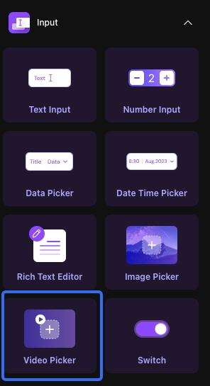

# Video Picker

### **Usage Scenarios**

You can use the Video Picker component when you want to realize the following scenarios:

You need to replace a video that already exists in the project.

Need to upload a video in the project and publish it.

Tips:

The video picker component only supports the upload of a single video clip, which will be displayed on the video picker component after the upload is completed. If you need to upload multiple videos or a single video is too large to be uploaded, it is recommended that you upload it directly in the database; if you just want to display the video, you can use the video component.

After the video is uploaded successfully, click the video picker component again to re-select the video to upload.

Upload video, usually with photos, text, as a dialog process, publish the content of a common combination of information, this time the page will also be placed in the video picker component, the user can publish their own video information.

### **Video Picker Content**

The video picker video source can be locally uploaded or data binding.

When you just want to upload a video, the video source can be set as local upload, and in the generated application, when you click the video picker component, it will automatically open the cell phone album or computer folder to select the video content.

When you want to display the original uploaded video and need to update this video, set the video source as data binding, then through the remote data binding of the video content that already exists in the database, in the generated application, you can directly view the uploaded video through the video picker component, when you click on the component, it will automatically open the cell phone album or computer folder to select the content of the video.

.jpeg>)

Tips:

When you click the video picker to select the video, the cell phone will call the video in the phone album by default, and the computer will call the video in the system folder by default.

### **Output Configuration**

The video picker belongs to the input class component, if the video type field is defined in the data table, when adding or updating the data, you can find the video picker data in the "Inputs" data for data binding, and the result of the binding is the content of the video that the video picker component selects to upload. In order to find its data accurately, it is recommended to rename the component.

.png>)

### **Video Picker Interaction**

#### **Disable Preview**

The default is off, enabling the Disable Preview button means that when uploading a video through the video picker, the video content will not be displayed after the upload is successful.

Tips:

Disable preview here means that the video picker component can't preview, but the preview feature that comes with the phone can be used as usual.

#### **Show Loading Animation When Requesting**

Off by default, on means that when uploading a video through the video picker, there will be a dialog box showing a loading spinning animation.

.png>)

Tips:

When uploading a video there will be a compression animation, the loading animation refers to the compressed upload loading animation

If you encounter any issues during the process, feel free to join our [Discord community](https://discord.com/invite/UCyhySSXfz) for assistance.​​​​

### **About Momen​​​​​​**

[Momen](https://momen.app/?channel=blog-about) is a no-code web app builder, allows users to build fully customizable web apps, marketplaces, Social Networks, AI Apps, Enterprise SaaS, and much more. You can iterate and refine your projects in real-time, ensuring a seamless creation process. Meanwhile, Momen offers powerful API integration capabilities, allowing you to connect your projects to any service you need. With Momen, you can bring your ideas to life and build remarkable digital solutions and get your web app products to market faster than ever before.​​
