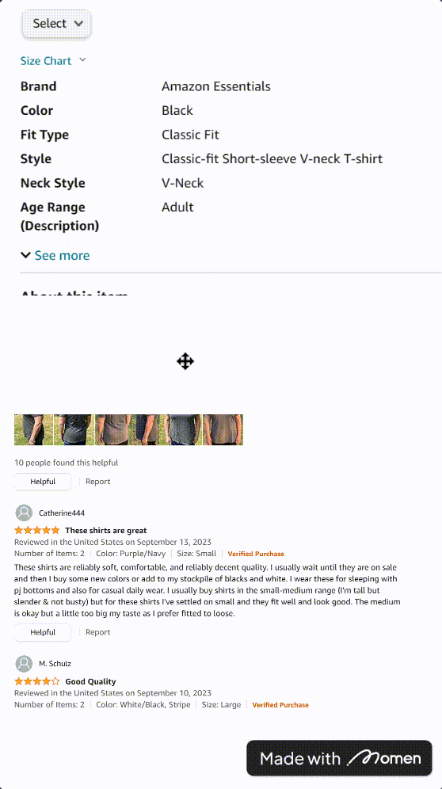

# View

### Introduction

In this comprehensive guide, we will navigate through the versatile landscape of View Components. These essential tools empower you to craft seamless layouts, enable both horizontal and vertical scrolling, and effortlessly incorporate visual dividers into your web pages.\

### Usage Scenario

View components in Momen are versatile tools that find their utility in various scenarios:

1. Creating Wholes with Specific Layouts: Use view components to group multiple elements together and apply a specific layout or style to the entire group. This eliminates the need for nesting view components outside each element.
2. Horizontal Scrolling: When you need a web area to scroll horizontally, view components come in handy.
3. Vertical Scrolling: Similarly, view components are useful when you want an area of the web to scroll vertically.
4. Divider Lines: View components can be employed to create divider lines, adding structure to your design.


Tips:

Appropriate use of view components eliminates the need to nest view components outside each component to form a whole.


### Utilization

1. #### Creating Wholes with Views

Example：

a.  In an activity booking template on an activity details page, use a view to group elements like activity pictures, titles, and taglines. Set the view background to white and enable hover effects for a cohesive look. This approach reduces redundancy in configurations.

b.  Build a custom navigation bar with buttons composed of images and text. Place the image and text components inside a view to streamline button creation and simplify jump behavior setup.

<figure><figcaption></figcaption></figure>

2. #### Horizontal Scrolling

Example:

a.  Design a category selection area for a shopping app's homepage. Place category components into a Content View and enable horizontal scrolling using the \[Has scroll X] interaction.

<figure><figcaption></figcaption></figure>

b.  Enable horizontal scrolling for wide images that don't fit the screen's width entirely. Place the image inside a view and enable \[Has scroll X].

<figure><figcaption></figcaption></figure>

Special Situation:&#x20;

The \[Has scroll X] of the view has horizontal display area characteristics&#x20;

i. The position or width of the component that needs to be displayed in the \[Content View] needs to be beyond the width of the \[Content View] itself, as shown in the following figure, the right area where the purple button is located&#x20;

ii. Only the content on the right side of the original width of the view can be displayed by sliding horizontally. The figure shows that the purple button can be displayed by sliding to the right, but the orange button can not be displayed by sliding to the left.

<figure><figcaption></figcaption></figure>

3. #### Vertical Scrolling

Example: &#x20;

Combine product reviews and details on one page. Utilize vertical scrolling with the \[Has scroll Y] interaction to navigate these sections separately.

<figure><figcaption></figcaption></figure>

Special Situation:&#x20;

The \[Has scroll Y] of the view has a vertical display area feature&#x20;

i. The position or height of the component that needs to be displayed in the \[Content View] must exceed the height of the \[Content View] itself, as shown in the figure below, where the green button is located in the lower area.&#x20;

ii. Only the content below the original height of the view can be displayed by vertical scrolling. The figure shows that the green button can be displayed by sliding down, but the gray button can not be displayed by sliding up.

<figure><figcaption></figcaption></figure>

4. #### Divider Line

Example: &#x20;

i. Insert a Content View component on your page and customize its background color, often gray. Place it in the desired position. &#x20;

ⅱ. For horizontal dividing lines, set the view's width to at least 355 and its height to 2. For vertical dividing lines, the width should be at least 2, and the height should exceed 25. Adjust these values as needed for your design.  &#x20;

ⅲ. Effect:

<figure><figcaption></figcaption></figure>

If you encounter any issues during the process, feel free to join our [Discord community](https://discord.com/invite/UCyhySSXfz) for assistance.

### About Momen

[Momen](https://momen.app/?channel=blog-about) is a no-code web app builder, allows users to build fully customizable web apps, marketplaces, Social Networks, AI Apps, Enterprise SaaS, and much more. You can iterate and refine your projects in real-time, ensuring a seamless creation process. Meanwhile, Momen offers powerful API integration capabilities, allowing you to connect your projects to any service you need. With Momen, you can bring your ideas to life and build remarkable digital solutions and get your web app products to market faster than ever before.
