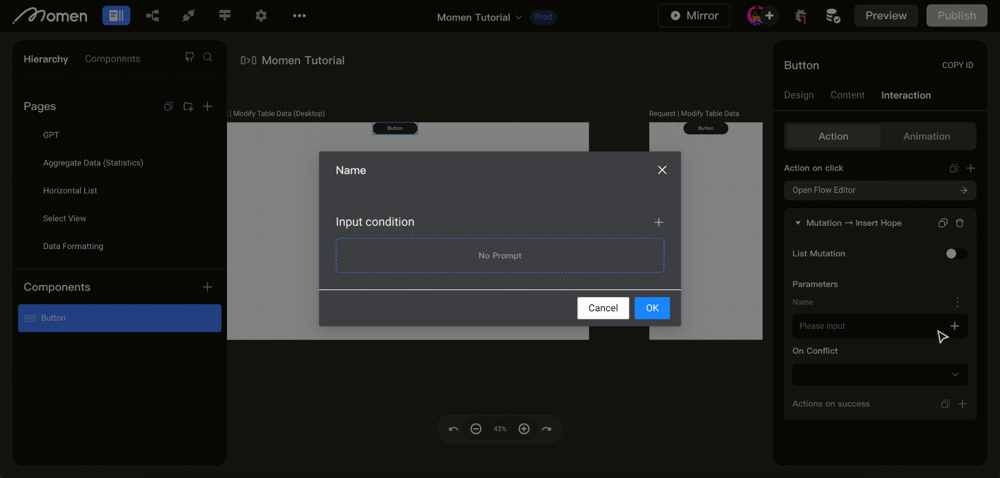

# Request | Mutation

### **Introduction**

In this tutorial, we'll explore Request and Mutation concepts with a focus on data manipulation techniques, including insertion, updates, and deletions. We'll also cover data validation and other crucial aspects. Join us on this journey of learning and practical application.

**Before reading this, it is recommended to familiarize yourself with** [**Data Input and Modification**](https://functorz.feishu.cn/wiki/LvZkwbXiHiJUihkyMBmcp3yXnrh?table=tblh1DUKHIF0XWJ0\&view=vewIDy64vP)**.**

There are three ways to modify data in a data list: insert, update, and delete.

### **Action Introduction**

1. Insert: Add data to the database.
   1. Single insert
   2. List Mutation
2. Update: Update the data in the database that meets the filtering criteria.
3. Delete: Deletes data in the database that meets the filter criteria.

### **Operation Guide**

**Single Add/Update/Delete**

Click the component that needs to be configured with the \[Mutation] action, and add the action in its action.

Add actions in the following order: Action > Action on Click > Request > Mutation > Insert/Update/Delete Account.

And bind or input the data to be inserted, updated, or deleted in the corresponding action.

<figure><figcaption></figcaption></figure>

#### **List Mutation**

<figure><figcaption></figcaption></figure>

Click on the component that requires \[Mutation] action configuration and add the action to its list of actions.

The sequence for adding actions is as follows: Action > Action on Click > Request > Mutation > Insert Account > Open List Mutation Button > Add Data Source > Click the three-dot button next to the newly added field and choose "Switch."

<figure><figcaption></figcaption></figure>

### **Actions on Success**

The action added here is triggered when the \[List] data is read successfully.

* Indeed, as long as the reading action is executed without errors, it is considered successful, irrespective of whether any data is actually retrieved during the process.
* For example, if you have remote data for the student table and set a condition to find a student named "Paul," but there is no student with that name in the data table, the result will be null, but the action is still considered successful.

💡Tips:

The \[Actions on Success] step is of utmost importance as it ensures that the previous steps have successfully acquired the required data or completed their tasks. For example, when using filtering to determine the existence of a user's account, if the result of a successful query yields no data, indicating that the account does not exist, you can then trigger additional actions accordingly.

### **Action Configuration Item Description**

<figure><figcaption></figcaption></figure>

### **Insert Validation When Inserting/Updating Data**

When inputting/updating data, you can configure rules for data validation when binding data.

<figure><figcaption></figcaption></figure>

As depicted in the image above, after incorporating the Mutation action for the Button, when adding enrollment records to the enrollment form, you have the option to append validation rules for each required data field. Simply click on the "three dots" on the right side to add validation. A configuration window will appear, allowing you to set the desired conditions as demonstrated below:

* Determine whether the input content is empty or not.
  * For instance, when configuring the input box for entering a name, you can set up a non-empty check for the input box to ensure that the user has entered a name when it's required to be filled in.
* Verify if the input content follows the email format rules.
  * For example, when setting up an email input box, you can apply email format validation to ensure the input matches the criteria for a valid email address.
* Validate if the input aligns with phone number format requirements.
  * For instance, when setting up a phone number input box, you can apply phone number format validation to ensure that the entered value adheres to the designated phone number rules.
* Check if the input content complies with content audit criteria to identify any illegal content.
  * When configuring an input box for entering text or an image selector, you can set up content audit validation to ensure that the content provided does not contain any prohibited or illegal material.
* Verify if the input content complies with custom regular expression rules.
  * When configuring an input box that requires users to input content adhering to specific custom rules (e.g., mandating uppercase letters in usernames), you can set up the corresponding regular expression for validation.

If you encounter any issues during the process, feel free to join our [Discord community](https://discord.com/invite/UCyhySSXfz) for assistance.

### **About Momen​​**

[Momen](https://momen.app/?channel=blog-about) is a no-code web app builder, allows users to build fully customizable web apps, marketplaces, Social Networks, AI Apps, Enterprise SaaS, and much more. You can iterate and refine your projects in real-time, ensuring a seamless creation process. Meanwhile, Momen offers powerful API integration capabilities, allowing you to connect your projects to any service you need. With Momen, you can bring your ideas to life and build remarkable digital solutions and get your web app products to market faster than ever before.​​
