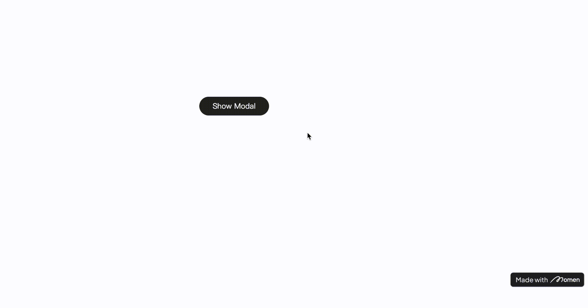
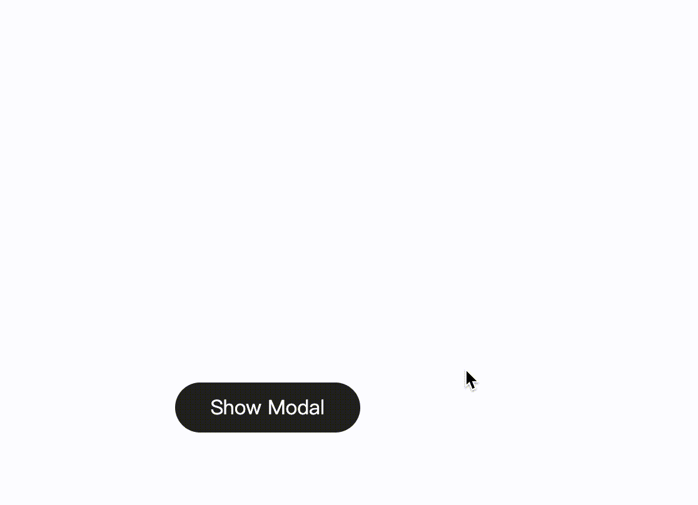

# Toast & Modal｜Show Modal

### **Introduction**

In this tutorial, you will discover the versatile functionality of modals in Momen, offering both default and custom modes for seamless interaction. Learn how to tailor modal content, control window dimensions, and effortlessly close modal dialogs.

### **Action Brief**

There are two modes available for displaying modals, default and custom.

Default

You can configure the title, content, cancel text, confirm text and the interaction action after confirming.

Custom

After entering the editing mode, you can drag and drop other components into the blank container to customize the editing.

Click the modal view in the "Preview" area below, you can edit the width, height, position and other properties of the modal window.

In **Interaction**, you can turn on the "Close on click overlay" button, after checking this option, you can hide the dialog by clicking anywhere in the modal window.

Newly added components in the modal view can add Hide modal action.

💡Tips:

Modal Limitation 🚫: When triggering the modal action within a \[List] component, direct access to the component data is restricted. To overcome this, employ the \[Set Page Data] action, transferring the component data to page data. This process allows subsequent utilization of specific list item data within the modal.

### **Configuration Guide**

### **Default Mode**

Action on Click > Toast\&Modal > Show Modal> Default > Enter dialog box content > Modify Cancel/Confirm Text

<figure><figcaption></figcaption></figure>

### **Sample Scenario**

<figure><figcaption></figcaption></figure>

### **Custom Mode**

#### **Operation Guide**

Action on Click> Toast\&Modal > Show Modal > Custom > Enter Edit Mode

**Step 1.** Add a Show Modal and change the mode to Custom.

<figure><figcaption></figcaption></figure>

**Step 2.** Resize the Modal Window

Click to enter the editing modal, and adjust the size and position of the dialog box in the "Preview" interface below.

<figure><figcaption></figcaption></figure>

**Step 3**. Build the Modal Content

Build the components of the dialog in the Focus View (upper area).

<figure><figcaption></figcaption></figure>

**Step 4.** Configure the Way to Close Modal Windows

* Enable the "Click on Close Overlay" button in the right attribute bar of the "Preview" screen.
  * Effect: The modal window will be closed even when you click the outer area of the dialog box.

In the "Focus View" screen, add the "Edit Mode" action to the button.

Path: Action on Click > Toast & Modal > Hide Mode> Modal-View

Effect: When the button is clicked, the dialog box will be closed.

|  |  |
| ------------------------------------------------------------------------------------------------------------------------- | ------------------------------------------------------------------------------------------------------------ |

### **Sample Scenarios**

<figure><figcaption></figcaption></figure>

If you encounter any issues during the process, feel free to join our [Discord community](https://discord.com/invite/UCyhySSXfz) for assistance.​​​

### **About Momen​​​​​**

[Momen](https://momen.app/?channel=blog-about) is a no-code web app builder, allows users to build fully customizable web apps, marketplaces, Social Networks, AI Apps, Enterprise SaaS, and much more. You can iterate and refine your projects in real-time, ensuring a seamless creation process. Meanwhile, Momen offers powerful API integration capabilities, allowing you to connect your projects to any service you need. With Momen, you can bring your ideas to life and build remarkable digital solutions and get your web app products to market faster than ever before.​​
