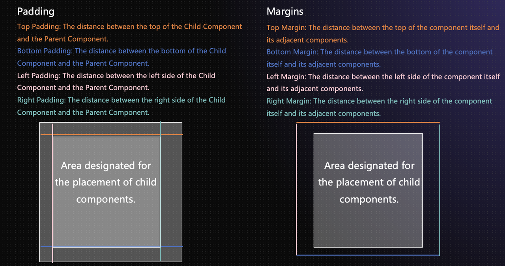
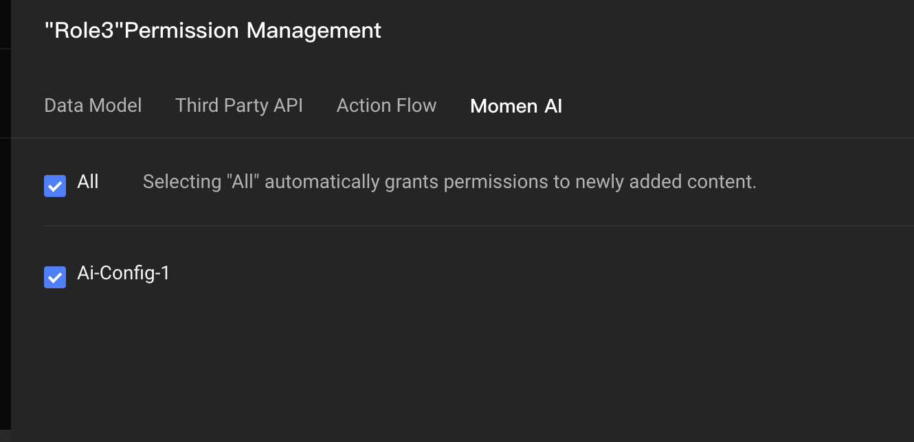
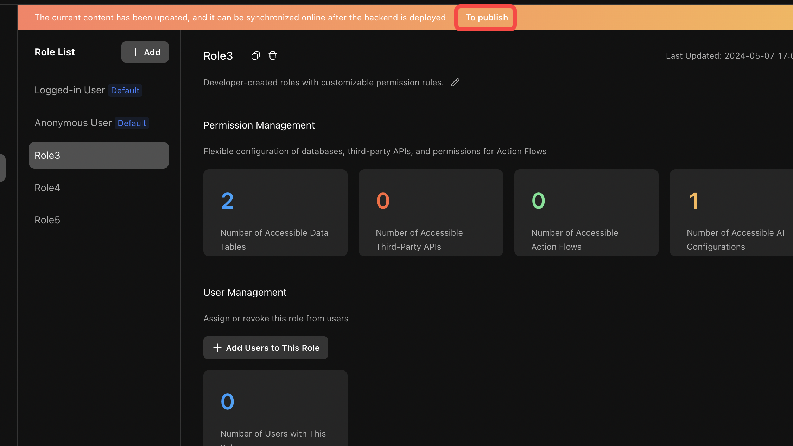
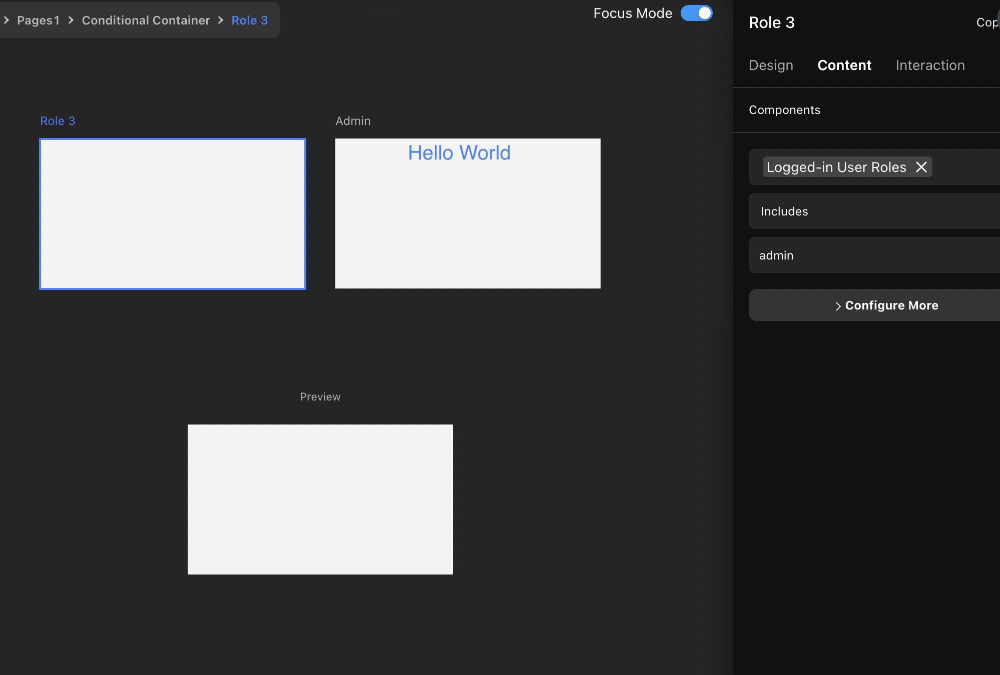
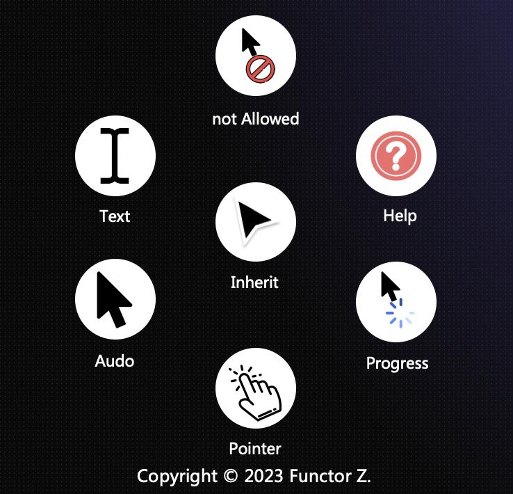

# Layout

### Introduction

In this tutorial, you'll learn how to build responsive websites using Momen, and as part of that, we also introduce webpage layout design principles.We'll cover key concepts like relative and absolute positioning, flexible layouts, and more, helping you design pages that work across different platforms.\

### Multi-Platform Development

After creating a webpage project on the Momen editor, you can design web pages for both desktop and mobile platforms concurrently. While planning the design, keep the specifications of both platforms in mind.\

#### Separate Configuration for Desktop and Mobile Layouts

Desktop and mobile interfaces have different page sizes, resulting in distinct layouts for each platform. As demonstrated in the video below ⬇️, to meet the requirements of different layout styles for desktop and mobile interfaces. Within Momen's editor, dragging a component onto the desktop interface makes it appear simultaneously on the mobile page. You can then adjust the sizes and positioning for both platforms individually.

If you modify the size or position of a component on the mobile platform, a "layout breakpoint" between the two versions may occur. At this point, you can adjust the page layout according to the mobile interface's page size.

For the same component, across different platforms, you may modify the layout properties like the component's positioning method, location, size, padding, margins, and corner radius. Any other changes to attributes and behavior will take effect simultaneously on both ends.

{% embed url="https://files.gitbook.com/v0/b/gitbook-x-prod.appspot.com/o/spaces%2FNNm75vAys0CMwBUdWsgC%2Fuploads%2FcXlSYcl8U9DsOXrakhP0%2F%E5%A4%9A%E7%AB%AF%E5%B8%83%E5%B1%80.mp4?alt=media&token=9931e334-134a-4c88-b923-486dce8be123" %}

### Layout

#### Relative Positioning

Relative positioning means setting a position concerning other components like parent or sibling components. For example, centering a child component relative to its parent.The specific layout positioning methods are detailed in the section below on【Flexible Layout】.

<figure><figcaption></figcaption></figure>

#### Parent and Child Components

If Component A contains Component B, then A is the parent component, and B is the child component. In the illustration below, a view contains three buttons. Thus, the view is the parent component, and the three buttons are its child components. The three buttons are sibling components to one another.

In a flexible layout, you can modify the child components' positions through the right sidebar properties of the parent component.

<figure><figcaption></figcaption></figure>


Tips:&#x20;

In relative positioning, components cannot be arbitrarily adjusted; consideration must be given to the positions of their parent and sibling components. Although this limits freedom, it offers more convenient layout and ensures good performance across pages of different sizes.


#### Absolute Positioning

Absolute positioning liberates a component from other components' constraints, allowing placement in any desired position. It often involves setting coordinates, referred to as coordinate positioning.

<figure><figcaption></figcaption></figure>


Tips:&#x20;

In absolute positioning, components can be adjusted freely without considering other components. This offers a high degree of freedom but at the cost of more complicated layout design, often requiring the calculation of coordinates. Additionally, it might be less adaptable to different window sizes.


Absolute positioning consists of four directional alignments: top-left, top-right, bottom-left, and bottom-right. The illustration below shows the top-left position method. Clicking on the coordinate lines next to T, L, R, or B you can to switch the directional alignment.

<figure><figcaption></figcaption></figure>

#### Length Units

【px】: Fixed width/height in pixel values.

【%/fraction】: A percentage of the parent component or a fraction of the whole, changing with the size variations of the parent component.

【Adaptive】: Adjusts the width/height according to the amount of content within the component.

【Maximum/Minimum, Width/Height】: When setting a component's width or height as "percentage," "fraction," or "adaptive," you can also define the maximum/minimum width/height. Ensures the child component maintains a specific value in extreme situations (e.g., large or small pages).

#### Length Setting Example

Percentage refers to the relative length compared to the parent component's width or height, ranging from 0% to 100%. For instance, if a button's height is set to 50% and the parent component's height is 500px, the button's height will be 250px.

<figure><figcaption></figcaption></figure>

Fraction describes the percentage length of the remaining width or height of the parent component, ranging from 0 to 1. Suppose the parent component's height is 500px, and 140px of that height is already occupied by two buttons. Therefore, the remaining height is 360px. If the third button is set to 0.5 fraction, then its height will be 360 x 0.5 = 180px.

<figure><figcaption></figcaption></figure>

#### Padding/ Margins

【Padding】: Sets the spacing between the child component and the parent component.【Margin】: Sets the spacing between the component itself and its sibling components.

<figure><figcaption></figcaption></figure>

#### Flexible Layout

> When a component's positioning method is set to "relative," the following layout modes can be utilized for quick layout operations on the page content:

**Alignment and Arrangement**

<figure><figcaption></figcaption></figure>

**Distribution**

When the parent component's alignment and arrangement are set to a horizontal layout with centering, the distribution of the child components under different distribution modes is as follows:

<figure><figcaption></figcaption></figure>

**Line Wrapping**

<figure><figcaption></figcaption></figure>

**Overflow**

When the child components placed within the parent component exceed the parent component's width, the parent component's "overflow" mode can be adjusted according to business requirements.

<figure><figcaption></figcaption></figure>

**Spacing**

When the distribution mode of the 【parent component】 is set to "start," custom spacing distances can be set for the 【child components】.

<figure><figcaption></figcaption></figure>

### Cursor Styles

As depicted in the illustration below ⬇️, in various interactive contexts, we can show to the users that a particular component possesses specific interactive behavior through the style of the cursor:

<figure><figcaption></figcaption></figure>

【Inherit】: Based on the OS (e.g., Mac, Windows default cursors)

【Audo】: Basic arrow cursor

【No Cursor】: Hides cursor

【Pointer】: Hand-shaped, indicating clickable elements

【Help】:Question mark, for assistance

【Not-allowed】: Prohibits clicking

【Text】: Indicates text input

\
If you encounter any issues during the process, feel free to join our [Discord community](https://discord.com/invite/UCyhySSXfz) for assistance.\

### About Momen

[Momen](https://momen.app/?channel=blog-about) is a no-code web app builder, allows users to build fully customizable web apps, marketplaces, Social Networks, AI Apps, Enterprise SaaS, and much more. You can iterate and refine your projects in real-time, ensuring a seamless creation process. Meanwhile, Momen offers powerful API integration capabilities, allowing you to connect your projects to any service you need. With Momen, you can bring your ideas to life and build remarkable digital solutions and get your web app products to market faster than ever before.
