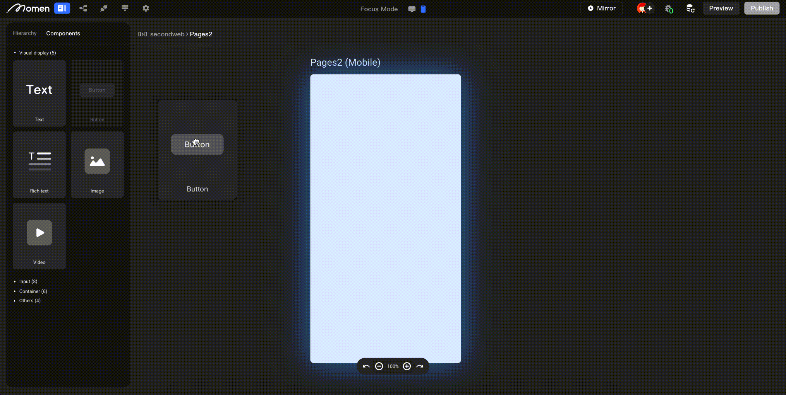
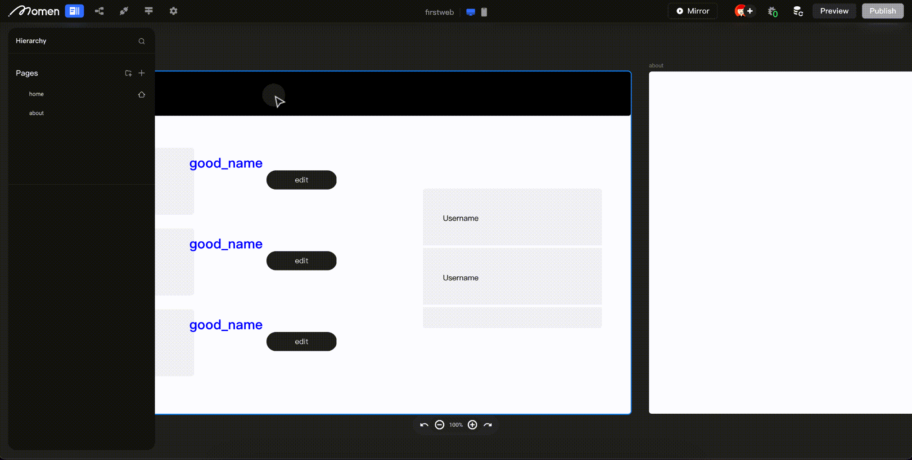
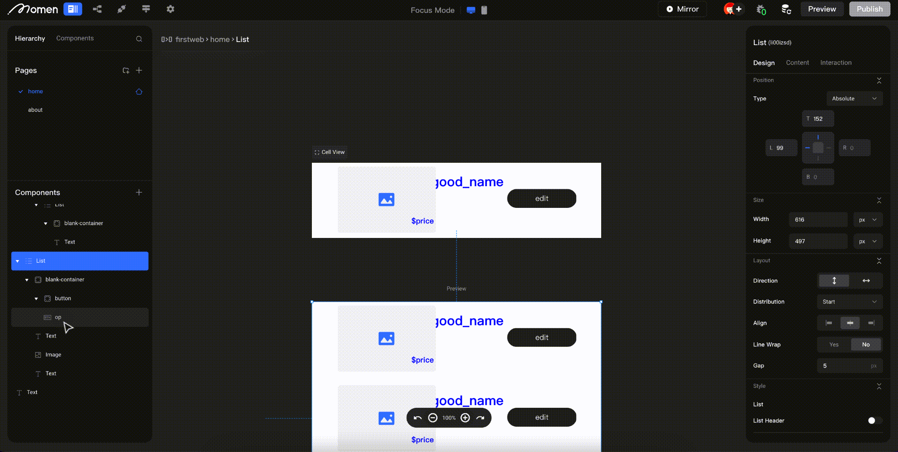
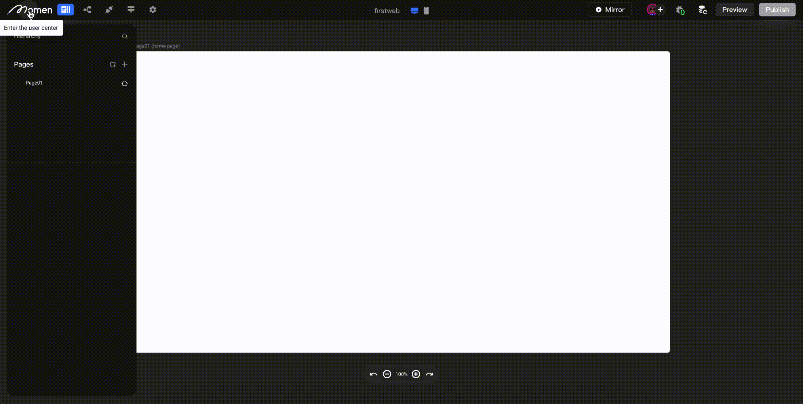
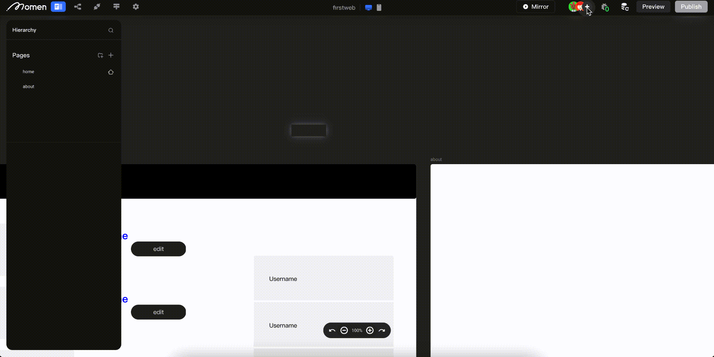
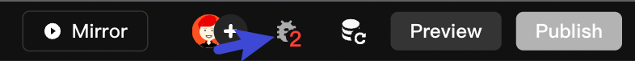
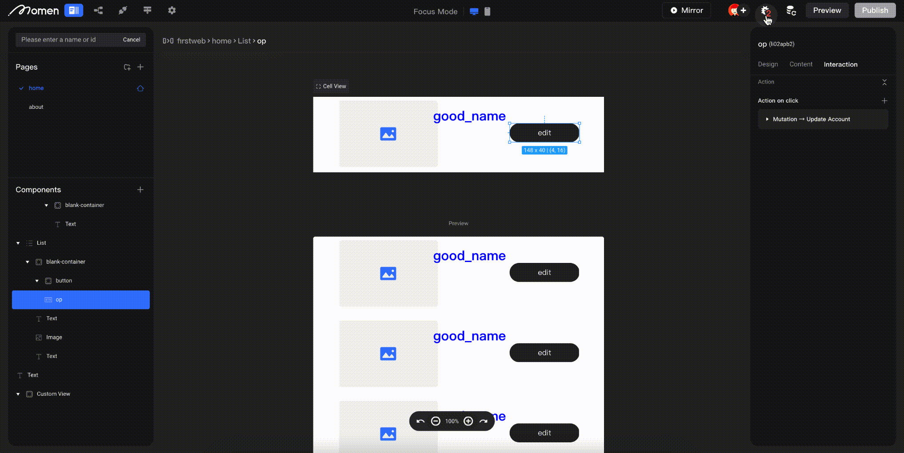
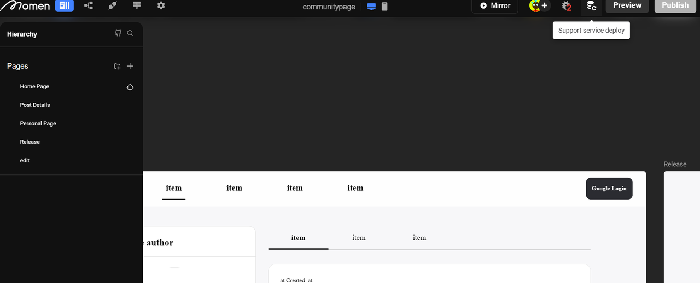
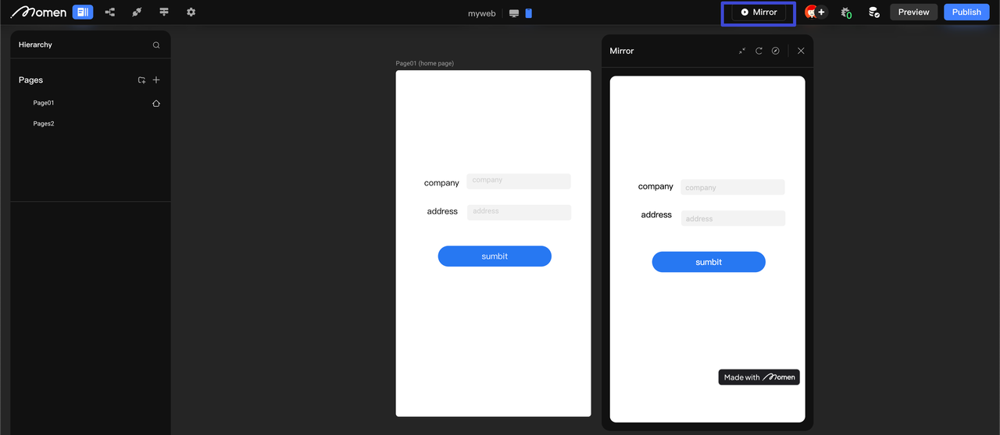
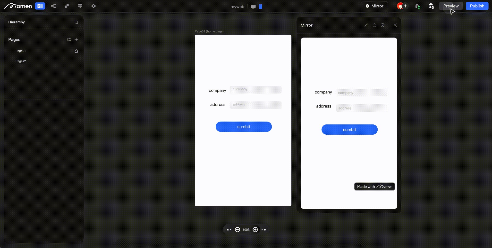

# Editor Overview

### Introduction

Learn to edit your interface effortlessly using Momen. This tutorial covers adding pages, editing styles, group organization, database deployment, and more. This section covers the logic of the hierarchy that is structured on your page as you add components to it, as well as the steps to bind the data.\

### Learn How Focus Mode Works

**Page:** Double-click the page to enter 【Focus Mode】, and double-click on the background to exit \[Focus Mode].&#x20;

**Component:** Double-click enter into the page, and you can nest other components. Enter and exit in the same way as described above

<figure><figcaption></figcaption></figure>

**Return to the previous level:** In the editing interface, the \[Breadcrumb Navigation Bar] is located in the upper left corner. In addition to displaying the current page hierarchy, it also has a jump function. You can click on a certain level to directly jump to the corresponding level for editing.

<figure><figcaption></figcaption></figure>

### Pages and Components Operations

#### Adding Pages

To add a new page, you can do so by:

Click on the "Add Page" button on the left side of the editor to add a new page.

<figure><figcaption></figcaption></figure>

#### Page Grouping

When there are too many pages, you can use the \[Grouping] function to organize related pages.&#x20;

Create page group: Click on the page list on the left side of the editor, and then click on the "Add Page Group" button to add a new group.

<figure><figcaption></figcaption></figure>

Add page to a group: You can add a page to a group by right-clicking on the page in the page list on the left side of the editor, selecting \[Add To Group], and choosing the desired group.

<figure><figcaption></figcaption></figure>

Alternatively, you can right-click on the desired page and select \[Add Page to Group], and then choose the group you want to add it to.

<figure><figcaption></figcaption></figure>

#### Page Reordering

To change the order of pages, simply drag and drop them into the desired position.

<figure><figcaption></figcaption></figure>

💡 Tips: Clicking on a page name in the page list will move the selected page to the center of the screen, making it easier to find.

#### Modifying Page Styles

After selecting the desired page, the properties panel for that page will appear on the right side of the editor. Here you can make changes to the basic information on the page in terms of its style, content, and interaction.

* Click the top of the right sidebar to modify the page name.
* Click "Design" on the right sidebar to configure the background color, background image, and bottom space of the page.
* Click "Content" on the right sidebar of the page to configure the top navigation bar, link data, page data, remote data, and third-party API data (if API is configured).
* Click "Interaction" on the right side of the page to configure page sharing, page load/unload behavior.

<figure><figcaption></figcaption></figure>

#### Adding Components

Double-click the page to enter \[Focus Mode], and the \[Components] panel will appear on the left. Click on the button as shown below and access component library.

<figure><figcaption></figcaption></figure>

After selecting the desired component, you can drag and drop it onto the page to edit it.

<figure><figcaption></figcaption></figure>

<figure><figcaption></figcaption></figure>

#### Component Search

The component search is located on the left side of the page. Click the search button and enter the component ID to quickly jump to the corresponding component, as shown in the image:

<figure><figcaption></figcaption></figure>

💡 Tips:&#x20;

"Search Component by ID" is a commonly used function during debugging. The component ID can be obtained in the upper right corner of the "Properties Panel". In most cases, the system error message will include the "component ID", so you can quickly find the problem location by searching.

<figure><figcaption></figcaption></figure>

#### Adjusting Layer Relationships

By default, newly added components will be placed above old ones. When you need to adjust their layering relationship, double-click the page to enter \[Focus Mode], then drag and adjust the layering relationship in the left \[Component Tree]. But you can only adjust the hierarchical relationship of the "sibling" components, and you can't adjust the components inside a container class component to the outside of the component in this way.

<figure><figcaption></figcaption></figure>

#### Modifying Component Styles

Similar to editing pages, to change the style of a component, you need to select the component and make changes in the properties panel on the right side component bar.

<figure><figcaption></figcaption></figure>

⚠️ Note: Some users may still see the page properties panel on the right side of the editor. Please check to make sure that you are in Focus Mode or that you have selected a component.\

### Personal Center Settings

#### Project Settings

Click the logo to enter \[Personal Center], right click and select the project that you want to modify

* Edit the Project Name
* View Project Details
* Sharing and Permissions
* Clone Project
* Deleting Projects
* Remove Watermarking (arithmetic upgrade)

<figure><figcaption></figcaption></figure>

#### Personal Preferences

Click the logo in the upper left corner to enter the personal center, hover your mouse over the avatar in the upper right corner and select Personal Preferences.

* Dynamic data display full path
* Display mock assets

<figure><figcaption></figcaption></figure>

### Data Model and Database Operation

Click the \[Data Model] button on the upper left corner of the editor to open the data model operation interface. Select "Data Model" on the upper left corner of the operation interface to add or modify the structure of the data table, and select "Database" to add, import or modify the data in the data table. After adding the data table, you need to perform \[Support Service Deploy] to make the data table effective.

<figure><figcaption></figcaption></figure>

### Third-party API Configuration

Click the \[Third-Party API] button in the upper left corner of the editor to open the API configuration interface, and click the \[Add] button in the upper right corner of the configuration interface to add and adjust third-party APIs.

<figure><figcaption></figcaption></figure>

### ActionFlow

Click the \[ActionFlow] button in the upper left corner of the editor to open the ActionFlow configuration interface. Click the \[Create] button in the upper right corner of the configuration interface to create a behavior flow, in which you can configure the input, call the methods of obtaining, updating and other operations of the database data, write a block of code (JS), and call the third-party APIs to achieve more complex behavioral logic. After the ActionFlow is created, you need to click the \[Save] button in the upper right corner of the configuration interface to save it, and after saving, you need to click the \[Support Service Deploy] button in the editor interface for the behavior flow to take effect.&#x20;

Next to the \[Create] button in the upper right corner of the configuration interface of the behavior flow, there is a trigger configuration button, click this button, you can configure the "Callback" and "Timing Trigger" in the trigger configuration interface.

<figure><figcaption></figcaption></figure>

### Project Settings

Click the \[Settings] button on the upper left corner of the editor to open the project settings interface, where you can configure the project as follows:

* Application global settings: set the home page, project background color, global data, and the behavior of the application when it finishes loading
* Log-in Settings: Set the login method of the application.&#x20;
  * User name and password login&#x20;
  * E-mail login&#x20;
  * Mobile phone number login&#x20;
  * WeChat login&#x20;
  * Enterprise WeChat Login&#x20;
  * Single Sign-On (SSO)
* Theme color configuration: configure common colors (RGB/hexadecimal colors)
* Payment Settings: Configure stripe payment.
* Permission Management
* Customized domain name settings
* Script Injection Setting

<figure><figcaption></figcaption></figure>

### Sharing and Collaboration

💡 Tips: The "Sharing and Collaboration" feature is only available for the Personal Edition and above.

Hover over the editor's avatar in the upper right corner, and it will turn into an "Invite Collaborators" button. You can click it to generate a project-sharing link and choose "Editable" or "Viewable" as needed.

<figure><figcaption></figcaption></figure>

After sharing, the members who joined the project will be displayed below the editing link, and you can always remove members.

<figure><figcaption></figcaption></figure>

\

#### Error collector

During the project building process, there may be configuration errors. The error collector in the upper right corner can automatically find configuration errors. In addition to triggering the Validation process actively, every time you click on "Preview", such a validation process will be triggered again to ensure the correctness of the project as much as possible.

<figure><figcaption></figcaption></figure>

When there is an error during the configuration process, the error will be displayed in the "Alarm Area" at the bottom of the screen, and an expression mark "!" will be prompted and appeared next to the component with an error. You can click on the expression mark to expand the "Alarm Area" and click on the right to quickly find the error location and make adjustments to correct the error.

<figure><figcaption></figcaption></figure>

### Update the Backend

After making changes to the data model, API, or ActionFlow, you need to click the \[Support Service Deploy] button in the upper right corner of the editor to make these changes take effect.&#x20;

When you have not modified the style of the page or local data, but only modified the configuration of the data model, API or ActionFlow, you do not need to click \[Preview] to generate the latest application, you only need to click the editor in the upper right corner of the \[Support Service Deploy] button to update the back-end, the process normally takes less than 5s to complete, which can greatly improve the efficiency of application development.

<figure><figcaption></figcaption></figure>

### Mirror

"Mirror" is a temporary effect for you to grab a first taste of what your project would look like before pushing it to live. If you want to generate an application, you still need to click "Preview" when you want to test it out, and then, click on the \[Publish] button to push it to live when making sure everything is on track

Mirror can simulate the effects of different devices by dragging the border, or you can click the icon button in the upper right corner of "Real-time Preview" to open a new window.

<figure><figcaption></figcaption></figure>

### Preview

As mentioned earlier, "Mirror" is a temporary effect. If you want your application to be really generated, you need to click "Preview".&#x20;

At this time, you need to wait 2-3 minutes. The system will generate the frontend, backend, and backend code of the project based on your configuration, and help you complete the necessary processes for server deployment, API update, CI/CD, etc. This process may be relatively slow for the first time. Please wait patiently for the system to generate.

<figure><figcaption></figcaption></figure>

💡 Tips: If the generation fails, you can click the "error message" prompt, copy it, and submit your error code to [Momen's Discord Community](https://discord.com/invite/UCyhySSXfz). We will help you solve it as soon as possible.\

### Publish

Successful "Preview" only generates the application. However, if you want your users to start using the application, you need to go through the release process. This part has been explained in detail in the "[Deploying Your App](https://docs.momen.app/ui-design/editor/deploying-your-app)" section.\

### About Momen

[Momen](https://momen.app/?channel=blog-about) is a no-code web app builder, allows users to build fully customizable web apps, marketplaces, Social Networks, AI Apps, Enterprise SaaS, and much more. You can iterate and refine your projects in real-time, ensuring a seamless creation process. Meanwhile, Momen offers powerful API integration capabilities, allowing you to connect your projects to any service you need. With Momen, you can bring your ideas to life and build remarkable digital solutions and get your web app products to market faster than ever before.
