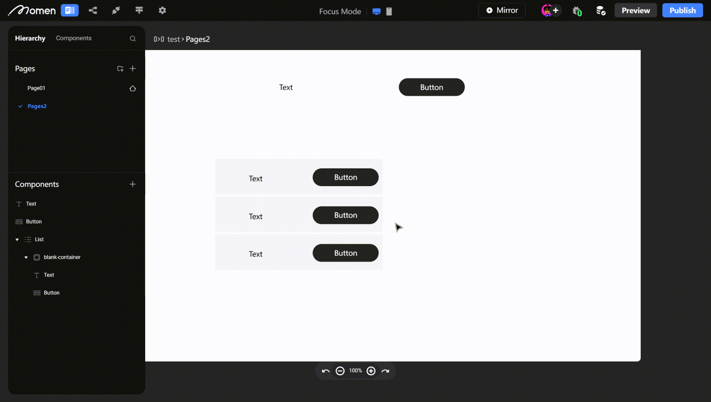

# Shortcut Actions

### Introduction

By mastering Momen's shortcuts, you can shave time off your development processes and unlock your full creative potential on the platform. Our guide will walk you through each shortcut key and provide detailed explanations.\

### Moving Canvas

When you need to move the screen to the desired page position, you can do so by:

**Windows**: hold down the 【space】 key + hold down the mouse 【left】 button and drag, or use 【Shift】 + mouse scroll wheel to move left and right.

**Mac**: hold down the 【space】 key + hold down the mouse 【left】 button and drag, or use two fingers on the 【trackpad】 to move, or use 【Shift】 + mouse scroll wheel to move left and right.

<figure><figcaption></figcaption></figure>

**Windows**: 【Shift】 + mouse scroll wheel to move left and right

**Mac**: 【Shift】 + mouse scroll wheel to move left and right

<figure><figcaption></figcaption></figure>

### Quick editing of components

As shown in the figure below, when using components such as 【View】, 【List】, and 【Conditional Container】 that can be clicked to enter the inner layer for editing, you no longer need to double-click to enter the component. You can directly select other components inside the component for editing using shortcut keys.

**Windows**: press 【control】 + 【left mouse button】

**Mac**: press 【command】 + 【left mouse button】

<figure><figcaption></figcaption></figure>

### Browser interface zoom

When you need to zoom in on a specific editing detail

**Windows**: hold down 【control】 + 【mouse scroll wheel】 to zoom in on the screen

**Mac**: hold down 【control】 + 【mouse scroll wheel】 or use gestures on the 【trackpad】 to zoom in on the screen

<figure><figcaption></figcaption></figure>

### Copying

Pages and components in pages can be copied.

**Windows**: after selecting the component, press 【control】 + 【c】 or right-click the mouse to copy.

**Mac**: after selecting the component, press 【command】 + 【c】 or use two fingers on the 【trackpad】 to copy. After successful copying, a message will appear at the top of the screen saying _copied to clipboard_.

<figure><figcaption></figcaption></figure>

### Cutting

Any component/page can be cut, which is equivalent to copying the component data to the clipboard and deleting the original component.

**Windows**: after selecting the component, press 【control】 + 【x】 or right-click the mouse to cut.

**Mac**: after selecting the component, press 【command】 + 【x】 or use two fingers on the 【trackpad】 to cut.Tips: When the cut component is dependent, the dependency needs to be removed before cutting.\

### Pasting

After successful copying or cutting, click on the container (such as a page or list item) to paste, and you can paste multiple times.

#### Paste directly on the current page

After copying/cutting, just click on the page to paste (supports multiple pastes).

<figure><figcaption></figcaption></figure>

#### Paste page content into a component

Copy the page content, enter the component, click on 【Container View】 to select the container, and then paste.

<figure><figcaption></figcaption></figure>

#### Cross-page pasting

When you need components with the same style, you can copy the component to achieve quick editing.\

#### Paste page

When you need multiple pages with similar functions, you can copy the page to achieve quick editing, and you can also copy multiple pages by selecting them in batches. In non-focus mode, click on the blank background of the editor to paste.

💡 Tips: Note that you must select the container to paste successfully. After selecting the container, a blue selection box will appear, displaying the coordinates and dimensions.

<figure><figcaption></figcaption></figure>

**Windows**: Press 【control】+【v】; or right-click and select "paste" with the mouse.

**Mac**: Press 【command】+【v】; or right-click and select "paste" with the mouse.A message will appear at the top of the screen saying "pasted from clipboard" after a successful paste.

<figure><figcaption></figcaption></figure>

### Multiple selection and batch operations

Sometimes you may need to "batch move" or "batch copy" components. You can select multiple components in two ways:

1\. **Windows**/**Mac**: hold down the mouse 【left】 button and drag to select the components.

2\. **Windows**/**Mac**: hold down the 【shift】 key and click the mouse 【left】 button to select the components/pages.

<figure><figcaption></figcaption></figure>

After selecting multiple components, you can batch move, copy/cut/paste, and adjust the position relationship between components using the layout control in the right toolbar. From left to right, they are:

1\. Align all to the left.

2\. Align all to the center.

3\. Align all to the right.

4\. Fill all horizontally within the selected area.

5\. Align all to the top.

6\. Align all vertically and horizontally to the center.

7\. Align all to the bottom.

8\. Fill all vertically within the selected area.

<figure><figcaption></figcaption></figure>

### Undo and redo

When you make a mistake, you can use the undo shortcut key to "rollback."

💡 Tips: You can only undo to the last save, and if you haven't saved for a long time, the system will automatically save, which may prevent you from undoing.

**Windows**: press 【control】 + 【z】 or click the 【Undo】 button at the bottom of the screen to undo. Press 【control】 + 【y】 or click the 【Redo】 button at the bottom of the screen to redo.

**Mac**: press 【command】 + 【z】 or click the 【Undo】 button at the bottom of the screen to undo. Press 【command】 + 【y】 or click the 【Redo】 button at the bottom of the screen to redo.

<figure><figcaption></figcaption></figure>

### About Momen

[Momen](https://momen.app/?channel=blog-about) is a no-code web app builder, allows users to build fully customizable web apps, marketplaces, Social Networks, AI Apps, Enterprise SaaS, and much more. You can iterate and refine your projects in real-time, ensuring a seamless creation process. Meanwhile, Momen offers powerful API integration capabilities, allowing you to connect your projects to any service you need. With Momen, you can bring your ideas to life and build remarkable digital solutions and get your web app products to market faster than ever before.
